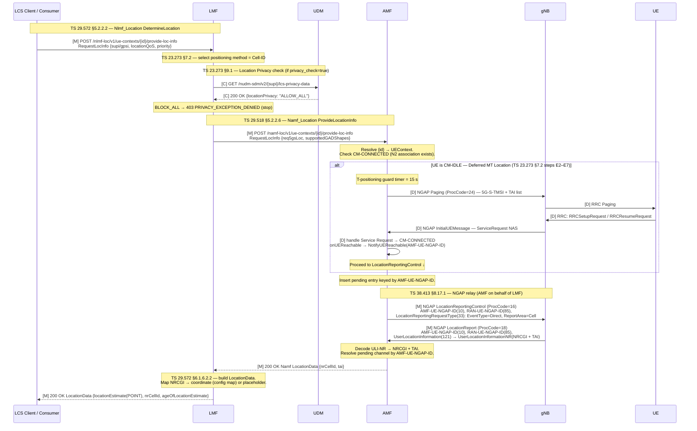

# Procedure: DetermineLocation (Nlmf_Location — UE Cell-ID Positioning)

**Spec:** TS 23.273 §6 (architecture) · §7.2 (UE positioning) · §9.1 (location privacy) · TS 29.572 §5.2.2.2 (Nlmf_Location DetermineLocation) · TS 29.518 §5.2.2.6 (Namf_Location producer) · TS 38.413 §8.17.1 (NGAP LocationReportingControl / LocationReport) · TS 23.501 §6.2.18 (LMF) · TS 29.503 §5.2.2 (Nudm_SDM lcsData) · TS 29.510 §6.1.6.3.3 (NRF NFType=LMF)
**Status:** ✅ Implemented (Cell-ID + Deferred MT Location + Location Privacy)
**Primary NF:** LMF (Nlmf_Location producer)
**Other NFs involved:** AMF (Namf_Location producer + NGAP relay to RAN), gNB, UE, LCS Client (5GC-internal consumer of Nlmf)

## Context

The **Location Management Function (LMF)** is the 5GC NF responsible for UE positioning
(TS 23.501 §6.2.18). It lives entirely in the core network and reaches the RAN **only
through the AMF acting as an NGAP relay** — the LMF never has a direct N2 (NGAP/SCTP)
association to the gNB.

This procedure implements **Cell-ID positioning (TS 23.273 §7.2)**, **Deferred MT Location
paging-then-locate (TS 23.273 §7.2 steps E2–E7)**, and **Location Privacy (TS 23.273 §9.1)**.
The serving cell of the UE (its NRCGI + TAI, reported by the gNB) is returned as the location
estimate. LPP/NRPPa and GMLC remain deferred (see *Out of scope*).

Two NFs participate:

- **LMF** (`nf/lmf/`, SBI port 8012, Prometheus 9113): hosts the `Nlmf_Location`
  `DetermineLocation` endpoint. On request it calls the AMF's `Namf_Location` producer to
  obtain the UE's current serving cell, maps NRCGI→coordinates, and returns `LocationData`.
- **AMF** (`nf/amf/`, existing SBI port 8001): hosts a new `Namf_Location` producer
  endpoint. On receipt it builds and sends an **NGAP LocationReportingControl** (ProcCode=16)
  to the UE's serving gNB, then blocks until the matching **NGAP LocationReport**
  (ProcCode=18) arrives, decodes `UserLocationInformationNR` → NRCGI + TAI, and returns it.

### Endpoints

| Service | Producer | Endpoint |
|---|---|---|
| `Nlmf_Location` | LMF (:8012) | `POST /nlmf-loc/v1/ue-contexts/{ueContextId}/provide-loc-info` |
| `Namf_Location` | AMF (:8001) | `POST /namf-loc/v1/ue-contexts/{ueContextId}/provide-loc-info` |

`{ueContextId}` is the UE identifier (`imsi-<digits>` SUPI, or a 5G-GUTI form) the consumer
supplies. The AMF resolves it to an active UE context to obtain the `AMF-UE-NGAP-ID` /
`RAN-UE-NGAP-ID` pair and the serving gNB association.

## Specifications

| Topic | Reference |
|---|---|
| LMF functional description | TS 23.501 §6.2.18 |
| Location services architecture | TS 23.273 §6 |
| UE positioning procedure | TS 23.273 §7.2 |
| Nlmf_Location DetermineLocation (stage 3) | TS 29.572 §5.2.2.2 |
| LocationData / RequestLocInfo data model | TS 29.572 §6.1.6.2.2 |
| Namf_Location ProvideLocationInfo (AMF producer) | TS 29.518 §5.2.2.6 |
| NGAP LocationReportingControl / LocationReport | TS 38.413 §8.17.1 |
| NRF registration NFType=LMF | TS 29.510 §6.1.6.3.3 |

## NF interaction overview

```
LCS Client ──Nlmf_Location──▶ LMF ──Namf_Location──▶ AMF ══NGAP (N2 relay)══▶ gNB
                              │                       ▲                         │
                              │◀──── LocationData ────┘◀── NGAP LocationReport ─┘
```

- **Nlmf_Location** (SBI, mTLS+HTTP/2): LCS Client / requesting NF → LMF.
- **Namf_Location** (SBI, mTLS+HTTP/2): LMF → AMF (LMF is the consumer here).
- **NGAP N2** (SCTP): AMF ↔ gNB. The AMF is the only NF with an N2 association; it relays
  the positioning control and report on behalf of the LMF.

## Sequence Diagram

Each message is annotated with its governing TS section. `[M]` = mandatory step in the
Cell-ID flow; `[C]` = conditional; `[D]` = deferred MT Location (paging sub-flow).



## Information Elements

### Nlmf_Location request — `RequestLocInfo` (LCS Client → LMF, TS 29.572 §6.1.6.2.x)

| IE | Type | M/O | Notes |
|---|---|---|---|
| `supi` | string | C | UE permanent identity; one of `supi`/`gpsi` identifies the UE |
| `gpsi` | string | C | Generic public subscription identifier (alternative to `supi`) |
| `locationQoS` | object | O | Requested accuracy / response-time class (`hAccuracy`, `vAccuracy`, `responseTime`) |
| `priority` | enum | O | `LCS_Priority`: `HIGHEST_PRIORITY` / `NORMAL_PRIORITY` |
| `supportedGADShapes` | array | O | GAD shapes the client can decode; MVP returns `POINT` |

> Carried in the path as `{ueContextId}`; body conveys the QoS/priority. MVP uses `supi`.

### Namf_Location request — `RequestLocInfo` (LMF → AMF, TS 29.518 §6.1.6.2.x)

| IE | Type | M/O | Notes |
|---|---|---|---|
| `req5gsLoc` | boolean | M | Request 5GS location (TAI + NRCGI of the serving cell) |
| `reqCurrentLoc` | boolean | O | Request the current (not last-known) location → triggers fresh NGAP report |
| `supportedGADShapes` | array | O | GAD shapes the consumer accepts |

### Namf_Location response — `LocationData` (AMF → LMF) / Nlmf response (LMF → LCS), TS 29.572 §6.1.6.2.2

| IE | Type | M/O | Notes |
|---|---|---|---|
| `locationEstimate` | object | M | `GeographicArea`: `{shape:"POINT", point:{lat, lon}}` for MVP |
| `nrCellId` | string | C | Serving cell, NRCGI rendered as hex (36-bit cell id) |
| `tai` | object | C | Tracking Area Identity `{plmnId:{mcc,mnc}, tac}` |
| `ageOfLocationEstimate` | integer | O | Minutes since the estimate; `0` for a fresh report |
| `positioningDataList` | array | O | Methods used; MVP reports `cellID` |

Example MVP body:

```json
{
  "locationEstimate": { "shape": "POINT", "point": { "lat": 0, "lon": 0 } },
  "nrCellId": "000000010",
  "ageOfLocationEstimate": 0
}
```

> For Cell-ID, `lat`/`lon` are derived from a config map `plmn→cell→coord`; when no entry
> exists, `lat=0, lon=0` is an acceptable placeholder (the authoritative output is `nrCellId`).

### NGAP LocationReportingControl — ProcedureCode 16 (AMF → gNB, TS 38.413 §8.17.1, §9.2.x)

UE-associated, class-1-less control message; carried on the existing N2 association.

| IE (id) | M/O | Notes |
|---|---|---|
| AMF-UE-NGAP-ID (10) | M | AMF-side UE association id |
| RAN-UE-NGAP-ID (85) | M | gNB-side UE association id |
| LocationReportingRequestType (33) | M | `EventType = Direct (0)` (report once now); `ReportArea = Cell (0)` |

### NGAP LocationReport — ProcedureCode 18 (gNB → AMF, TS 38.413 §8.17.1)

| IE (id) | M/O | Notes |
|---|---|---|
| AMF-UE-NGAP-ID (10) | M | Correlation key for the pending request map |
| RAN-UE-NGAP-ID (85) | M | gNB-side UE association id |
| UserLocationInformation (121) | M | `UserLocationInformationNR` → **NRCGI** (PLMN + 36-bit cell id) + **TAI** (PLMN + TAC) |
| LocationReportingRequestType (33) | O | Echo of the requested reporting type |

## Error / cause table

| Trigger | NF | HTTP | Cause | Behaviour |
|---|---|---|---|---|
| `{ueContextId}` has no UE context in the AMF | AMF | 404 | `CONTEXT_NOT_FOUND` | Namf_Location rejected; LMF propagates failure to LCS Client |
| UE is **CM-IDLE** — paging initiated, UE responds | AMF | — | — | AMF pages UE (NGAP Paging ProcCode=24); waits T-positioning (15 s); on Service Request falls through to LocationReportingControl |
| UE is **CM-IDLE** — paging timeout (T-positioning 15 s) | AMF | 504 | `UE_NOT_REACHABLE` | UE did not respond to paging; `pendingLocPage` channel closed; error returned |
| No NGAP LocationReport before timeout | AMF | 504 | `LOCATION_FAILURE` | Pending channel closed on `ctx` deadline; failure result returned |
| gNB returns failure / cannot determine cell | AMF | 504 | `POSITIONING_DENIED` / `UNSPECIFIED` | Decoded error relayed as failure |
| Subscriber location privacy = `BLOCK_ALL` (UDM lcsData) | LMF | 403 | `PRIVACY_EXCEPTION_DENIED` | LMF refuses to disclose location; AMF is never called. Ref: TS 23.273 §9.1 |
| UDM unreachable during privacy check | LMF | — | — | Fail-open: location proceeds (warning logged) |
| Missing mandatory IE in the request body | LMF / AMF | 400 | `MANDATORY_IE_MISSING` | Request rejected before any NGAP signalling |
| UE not identifiable (`supi`/`gpsi` both absent) | LMF | 400 | `MANDATORY_IE_MISSING` | Rejected at the Nlmf producer |
| LMF cannot reach AMF / AMF discovery fails | LMF | 504 | `LOCATION_FAILURE` | Returned to LCS Client |

> Cause/status names follow TS 29.572 §6.1.x and TS 29.571 ProblemDetails; where a 3GPP
> cause string is not pinned down for Cell-ID MVP it is noted as `[VERIFY: clause unclear]`.
> `[VERIFY: clause unclear]` — exact ProblemDetails `cause` enum for positioning timeout in
> TS 29.572 (vs. generic `TIMED_OUT`) to be confirmed against the Rel-17 YAML.

## Implementation notes (for the NF developer)

- **LMF NF** (`nf/lmf/`): root-module member (no per-NF `go.mod`; imports
  `github.com/.../5gc-rel17/...`), template Dockerfile shape, SBI :8012, Prometheus :9113.
  Wire into CI docker matrix, root `Makefile` `NFS :=`, and `docker-compose.yml`
  (service + `pcap-lmf` sidecar, `profiles: [core]`). Add `lmf` to `gen-pki.sh`.
- **NRF registry**: add `NFTypeLMF NFType = "LMF"` and `NFTypeGMLC NFType = "GMLC"`
  constants to `nf/nrf/internal/registry/registry.go`. LMF registers with service
  `nlmf-loc` (TS 29.510 §6.1.6.3.3).
- **AMF Namf_Location producer**: new handler on the existing :8001 SBI server,
  `POST /namf-loc/v1/ue-contexts/{id}/provide-loc-info`. Resolve `{id}` → `UEContext`;
  require CM-CONNECTED (an N2 association with a `RAN-UE-NGAP-ID`).
- **Pending-request correlation**: `sync.Map` keyed by `AMF-UE-NGAP-ID` → `chan LocationResult`.
  The Namf_Location handler (1) inserts the channel, (2) builds + sends NGAP
  LocationReportingControl, (3) blocks on the channel with a `ctx` timeout (recommend a
  dedicated positioning timeout constant with a TS doc comment). The NGAP LocationReport
  handler looks up the channel by `AMF-UE-NGAP-ID`, decodes `UserLocationInformationNR`,
  and resolves it. Always `defer` deletion of the map entry to avoid leaks on timeout.
- **NGAP builder/decoder**: builder for LocationReportingControl (ProcCode=16, EventType=Direct,
  ReportArea=Cell); decoder for LocationReport (ProcCode=18) extracting NRCGI (PLMN + 36-bit
  cell id) and TAI (PLMN + TAC). Keep the NGAP code in the AMF reference-point package,
  separate from SBI handlers (anti-pattern: mixing SBI and N2 in one handler).
- **NRCGI rendering**: NRCGI hex string for `nrCellId`; coordinate mapping via a config map
  (`plmn → cell → {lat,lon}`). Absent mapping → `POINT` with `lat=0,lon=0`.
- **Logging**: `logging.NewProcedureLogger(ctx, "DetermineLocation")`. `nf=LMF`/`AMF`;
  `interface` = `Nlmf` / `Namf` / `N2`; `spec_ref` per step (e.g. `TS 38.413 §8.17.1`).
  Conditional fields: `supi`, `amf_ue_ngap_id`, `ran_ue_ngap_id`, `result`, `cause`,
  `duration_ms`.
- **Metrics**: `fivegc_lmf_locate_total{result}` on :9113.

## Out of scope (deferred — follow-up tasks LMF-003+)

- LPP / NRPPa relay for E-CID / OTDOA / NR-ECID / GNSS (TS 38.413 §8.17.2, TS 37.355).
- Nlmf_Location EventSubscription / periodic / area-of-interest (TS 29.572 §5.2.3).
- CancelLocation (TS 29.572 §5.2.2.5).
- GMLC integration / N56 interface (TS 29.515).
- Fine-grained privacy exception lists (`lcsPrivacyExceptionList` per-service-class). Current impl enforces `ALLOW_ALL` vs `BLOCK_ALL` only.
- Nlmf_Broadcast service for OTDOA assistance (TS 29.572 §5.3).
- LocationContextTransfer during handover (TS 23.273 §7.8).

## Validation approach

- **Unit (in-process):** the LocationReportingControl builder encodes to a valid NGAP PDU
  that round-trips through the free5gc/ngap decoder (IEs 10/85/33 present, EventType=Direct,
  ReportArea=Cell). The LocationReport decoder extracts NRCGI + TAI from a captured
  `UserLocationInformationNR`. DetermineLocation handler maps a known NRCGI → expected
  `LocationData`.
- **Functional (godog, ≥3 scenarios):** happy path (200 + `nrCellId`); UE-not-found → 404
  `CONTEXT_NOT_FOUND`; gNB-location-failure / timeout → failure result. AMF pending-map
  correlation tested with a simulated async LocationReport.
- **NRF registration:** LMF registers as `NFType=LMF` with service `nlmf-loc`; discoverable
  by the LCS Client / consumer.
- **mTLS + HTTP/2:** both Nlmf and Namf endpoints set `TLSConfig` (`NextProtos: ["h2"]`)
  before `http2.ConfigureServer` and require client certs (TS 29.500 §4.4, TS 33.501 §13).
- **E2E (UERANSIM):** `make ueransim` → register UE + PDU session → POST
  `/nlmf-loc/v1/ue-contexts/imsi-001010000000001/provide-loc-info` → expect the serving NRCGI/TAI
  and a non-zero lat/lon in the response (`scripts/validate-ueransim-mod.sh location`).
  **Note:** stock UERANSIM v3.2.8 gNB has **no** LocationReportingControl handler — it logs
  *"Unhandled NGAP initiating-message"* and never replies, so the flow times out. The gNB
  patch `tools/ueransim/patches/0040-location-reporting.patch` (LMF-006) adds
  `receiveLocationReportingControl()`, which answers with a Cell-ID-level LocationReport. Build it
  with `make ueransim-build-only`.

## Coordinate synthesis & live monitoring (LMF-006)

Cell-ID positioning carries only the serving cell (NRCGI/TAI) on the N2/NGAP wire — no lat/lon.
The LMF synthesizes a WGS84 coordinate from the serving cell via a **mobility model**
(`nf/lmf/internal/server/mobility.go`): a deterministic, bounded, per-SUPI walk anchored at the
cell's configured base coordinate (`cell_coordinates` / `default_coordinate` / `mobility` in
`nf/lmf/config/dev.yaml`). Values are artificial but exhibit realistic, continuous motion; the
authoritative output remains the serving cell. The horizontal accuracy is reported in
`locationEstimate.uncertainty` (metres).

The management portal exposes a **UE Location** page (live Leaflet map + table, auto-poll 3 s)
backed by `GET /api/v1/location/summary` and `/location/ue/{supi}`, which act as an LCS client of
the LMF over mTLS. CM-IDLE/unreachable UEs are listed with their 3GPP cause.
