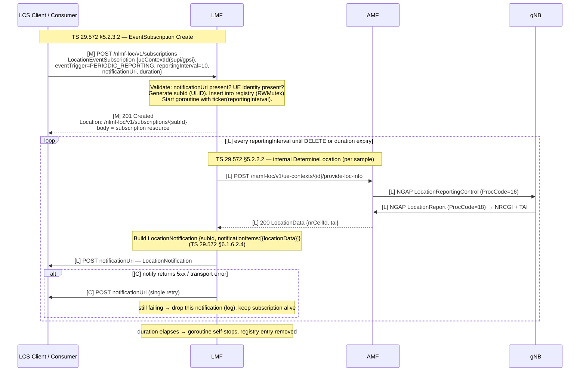

# Procedure: EventSubscription (Nlmf_Location — Periodic + Area-of-Interest Reporting + CancelLocation)

**Spec:** TS 29.572 §5.2.3 (Nlmf_Location_EventSubscription Create/Get/Delete) · §5.2.2.5 (CancelLocation for in-progress one-shot) · §6.1.6.2.4 (LocationNotification body schema) · TS 23.273 §7.2 step B2 (deferred subscription use case) · TS 29.571 §5.2 (common API types: subscriptions, notifications) · TS 29.572 §5.2.2.2 (re-uses DetermineLocation for each sample)
**Status:** ⏳ Planned (LMF-003) — gates implementation; no code until this doc is reviewed
**Primary NF:** LMF (Nlmf_Location producer + notification HTTP/2 mTLS client)
**Other NFs involved:** AMF (Namf_Location producer, consumed once per sample), gNB + UE (via the AMF N2 relay), LCS Client / Consumer (subscriber + notification receiver)

## Context

LMF-001/002 implement **one-shot** Cell-ID positioning (`DetermineLocation`): a caller POSTs
once and receives a single `LocationData`. For ongoing tracking the caller would have to poll,
re-issuing the request on a loop. **EventSubscription** (TS 29.572 §5.2.3) adds a *subscription*
model so the LMF itself drives the repetition and *pushes* results to the caller's
`notificationUri` as `LocationNotification` bodies (TS 29.572 §6.1.6.2.4). This is the
**deferred location** use case of TS 23.273 §7.2 step B2.

Two **event trigger** types are supported:

- **`PERIODIC_REPORTING`** — the LMF re-runs the internal DetermineLocation routine for the
  subscribed UE every `reportingInterval` (default 10 s) and POSTs *every* result to the
  `notificationUri`.
- **`AREA_OF_INTEREST` (AOI)** — the LMF samples the UE position every `sampling_interval`
  (default 5 s) and POSTs a notification *only* when the UE **enters** or **exits** a configured
  WGS84 polygon. A per-subscription state machine tracks `IN` / `OUT` / `UNKNOWN`; a notification
  fires only on a state *transition*.

Each "sample" inside a subscription is the **same** internal locate path used by LMF-001:
`LMF → Namf_Location (AMF) → NGAP relay → gNB → LocationReport`. EventSubscription adds **no new
N2 signalling** — it orchestrates repeated calls to the existing producer chain and adds the
notification-push leg.

`CancelLocation` (TS 29.572 §5.2.2.5) has two flavours covered here:

1. **Subscription cancel** — `DELETE` of a subscription resource: stop the goroutine, drop the
   registry entry, return `204`.
2. **In-progress one-shot cancel** — `POST …/cancel-loc` aborts a *currently blocked*
   `DetermineLocation` request (the UE may be paging / awaiting a LocationReport) by cancelling
   its request context.

### Scope boundary (LMF-003)

- **In-memory registry only.** Subscriptions live in a `map[string]*subscription` guarded by a
  `sync.RWMutex`. Redis persistence is a deferred follow-up — on LMF restart all subscriptions
  are lost (acceptable for this task).
- **AOI containment** uses the **ray-casting** (even-odd crossing) algorithm, no external
  geometry dependency.
- **Notification delivery is best-effort**: one retry on a 5xx / transport error, then the
  notification is dropped (logged). No persistent queue, no backoff escalation.
- One **goroutine per subscription**, started on `POST`, stopped on `DELETE` or `duration`
  expiry.

### Endpoints (LMF SBI, port 8012, mTLS + HTTP/2)

| Method | Path | Operation | Spec | Success |
|--------|------|-----------|------|---------|
| POST   | `/nlmf-loc/v1/subscriptions` | EventSubscription Create | TS 29.572 §5.2.3.2 | `201` + `Location` header |
| GET    | `/nlmf-loc/v1/subscriptions/{subId}` | EventSubscription Get (status) | TS 29.572 §5.2.3.3 | `200` subscription resource |
| DELETE | `/nlmf-loc/v1/subscriptions/{subId}` | EventSubscription Delete (cancel) | TS 29.572 §5.2.3.4 / §5.2.2.5 | `204` |
| POST   | `/nlmf-loc/v1/ue-contexts/{ueContextId}/cancel-loc` | CancelLocation (in-progress one-shot) | TS 29.572 §5.2.2.5 | `204` |

`{subId}` is a ULID generated by the LMF on Create. `{ueContextId}` is the same UE identifier
form (`imsi-<digits>` SUPI or 5G-GUTI) used by `DetermineLocation`.

## Specifications

| Topic | Reference |
|---|---|
| Nlmf_Location_EventSubscription (Create / Get / Delete) | TS 29.572 §5.2.3 |
| CancelLocation (in-progress one-shot) | TS 29.572 §5.2.2.5 |
| LocationNotification body schema | TS 29.572 §6.1.6.2.4 |
| LocationData / RequestLocInfo data model | TS 29.572 §6.1.6.2.2 |
| Deferred location subscription use case | TS 23.273 §7.2 step B2 |
| Common API types — subscriptions & notifications | TS 29.571 §5.2 |
| Per-sample locate (re-used) | TS 29.572 §5.2.2.2 (DetermineLocation), TS 29.518 §5.2.2.6 (Namf_Location) |
| ProblemDetails / cause strings | TS 29.500 §5.2.4, TS 29.571 §5.2.7 |

> `[VERIFY: clause unclear]` — exact ProblemDetails `cause` enum for an unknown `subId`
> (`SUBSCRIPTION_NOT_FOUND` vs the generic `NOT_FOUND` of TS 29.571 §5.2.7.5) to be confirmed
> against the Rel-17 TS29572 YAML. This doc assumes `SUBSCRIPTION_NOT_FOUND`.

## NF interaction overview

```
                                         (every interval, per subscription)
LCS Client ──POST /subscriptions──▶ LMF ──Namf_Location──▶ AMF ══NGAP (N2 relay)══▶ gNB
   ▲                                 │                       ▲                        │
   │◀── POST notificationUri ────────┤◀──── LocationData ────┘◀── NGAP LocationReport ┘
   │      (LocationNotification)      │
   └──────── 201 + Location ──────────┘   (DELETE /subscriptions/{subId} → 204 stops the loop)
```

- **Nlmf_Location subscription** (SBI, mTLS+HTTP/2): LCS Client → LMF (Create / Get / Delete).
- **Notification** (SBI, mTLS+HTTP/2): **LMF → LCS Client** — the LMF is the *client* here,
  POSTing to the caller-supplied `notificationUri`. Re-uses `shared/sbi.NewMTLSClient`.
- **Namf_Location** (SBI, mTLS+HTTP/2): LMF → AMF, exactly as in LMF-001, once per sample.
- **NGAP N2** (SCTP): AMF ↔ gNB — unchanged from LMF-001; the AMF is the sole NGAP relay.

## Sequence Diagram 1 — Create + Periodic Notification

`[M]` = mandatory step; `[C]` = conditional; `[L]` = repeats on the goroutine loop tick.



## Sequence Diagram 2 — Area-of-Interest (enter/exit) Notification

```mermaid
sequenceDiagram
    participant LCS as LCS Client / Consumer
    participant LMF
    participant AMF
    participant gNB

    Note over LCS,LMF: TS 29.572 §5.2.3.2 — EventSubscription Create (AOI)
    LCS->>LMF: [M] POST /nlmf-loc/v1/subscriptions<br/>LocationEventSubscription {ueContextId,<br/>eventTrigger=AREA_OF_INTEREST,<br/>areaOfInterest:{polygon:[{lat,lon}...]},<br/>notificationUri, duration}
    Note over LMF: Validate polygon ≥3 vertices, notificationUri, UE identity.<br/>subId (ULID). state = UNKNOWN. ticker(sampling_interval=5s).
    LMF-->>LCS: [M] 201 Created + Location: …/{subId}

    loop [L] every sampling_interval until DELETE or expiry
        LMF->>AMF: [L] POST /namf-loc/v1/ue-contexts/{id}/provide-loc-info
        AMF->>gNB: [L] NGAP LocationReportingControl (16)
        gNB->>AMF: [L] NGAP LocationReport (18) → NRCGI + TAI
        AMF-->>LMF: [L] 200 LocationData {locationEstimate(POINT lat/lon)}
        Note over LMF: ray-casting: is (lat,lon) inside polygon?<br/>newState = IN | OUT
        alt [C] newState != prevState  (transition / crossing)
            Note over LMF: event = AREA_ENTERING (OUT→IN) or AREA_LEAVING (IN→OUT)
            LMF->>LCS: [C] POST notificationUri — LocationNotification {locationData, areaEventInfo}
            Note over LMF: prevState = newState; lastNotified = now
        else [C] newState == prevState (no crossing)
            Note over LMF: no notification (suppressed)
        end
    end
```

> First sample after `UNKNOWN`: the LMF establishes the baseline state. By default the first
> resolved state is recorded *without* firing a notification (suppress the synthetic
> `UNKNOWN→IN/OUT` transition). `[VERIFY: clause unclear]` — TS 29.572 does not pin whether the
> initial-state notification must fire; this doc suppresses it (configurable later).

## Sub-flow — DELETE (subscription cancel) and one-shot CancelLocation

**A. DELETE /nlmf-loc/v1/subscriptions/{subId}** (TS 29.572 §5.2.3.4 / §5.2.2.5):

1. `[M]` Look up `{subId}` in the registry under `RLock`. Unknown → `404 SUBSCRIPTION_NOT_FOUND`.
2. `[M]` Cancel the subscription's goroutine context (`cancel()`); the `select { case <-ctx.Done() }`
   arm returns and the goroutine exits cleanly (any in-flight sample is allowed to finish or is
   abandoned on the next tick).
3. `[M]` Remove the entry from the registry under `Lock`.
4. `[M]` Return `204 No Content`.

**B. POST /nlmf-loc/v1/ue-contexts/{ueContextId}/cancel-loc** (TS 29.572 §5.2.2.5):

1. `[M]` A one-shot `DetermineLocation` may be *blocked* (UE paging / awaiting LocationReport).
   The handler registered that request in a `map[ueContextId]context.CancelFunc` (the
   `pendingLoc` pattern).
2. `[M]` Look up the cancel func for `{ueContextId}`. None in progress → `204` (idempotent no-op)
   or `404 CONTEXT_NOT_FOUND` — `[VERIFY: clause unclear]` which the spec prefers; this doc
   returns `204` (idempotent).
3. `[C]` Call `cancel()`. The blocked `DetermineLocation` handler observes `ctx.Done()` and
   returns a failure (the AMF Namf call / pending channel unblocks).
4. `[M]` Return `204 No Content`.

## Information Elements

### EventSubscription request — `LocationEventSubscription` (LCS Client → LMF, TS 29.572 §6.1.6.2.x / §5.2.3.2)

| IE | Type | M/O | Notes |
|---|---|---|---|
| `ueContextId` | string | M | UE identity (`supi`/`gpsi`/5G-GUTI form). Body field or, if modelled as a sub-object, `supi`/`gpsi`. At least one identity required. |
| `eventTrigger` | enum | M | `PERIODIC_REPORTING` \| `AREA_OF_INTEREST` |
| `notificationUri` | string (URI) | M | Callback the LMF POSTs `LocationNotification` to. Missing → `400 MANDATORY_IE_MISSING`. |
| `reportingInterval` | integer (s) | C | Required for `PERIODIC_REPORTING`. Default 10 s if omitted. |
| `areaOfInterest` | object | C | Required for `AREA_OF_INTEREST`; holds the `polygon` (see below). |
| `samplingInterval` | integer (s) | O | AOI sample cadence; default = `default_sampling_interval_s` (5 s). |
| `duration` | integer (s) | O | Subscription lifetime; on expiry the goroutine self-stops. `0`/absent ⇒ a config default max. |
| `locationQoS` | object | O | Per-sample accuracy hints, same shape as `DetermineLocation`. |

### Area-of-interest polygon — `GeographicArea` (POLYGON) / GeoJSON-style vertices (TS 29.572 §6.1.6.2.2; TS 29.571 §5.4)

| IE | Type | M/O | Notes |
|---|---|---|---|
| `shape` | string | O | `"POLYGON"` (default when `polygon` present) |
| `polygon` | array of `{lat,lon}` | M | WGS84 vertices, ≥3, in order; first/last need not repeat. Ray-casting closes the ring implicitly. |
| `polygon[].lat` | float | M | Latitude, decimal degrees |
| `polygon[].lon` | float | M | Longitude, decimal degrees |

> Polygon with <3 vertices → `400 MANDATORY_IE_MISSING` (degenerate area).

### Subscription resource (LMF internal + GET response body, TS 29.571 §5.2)

| Field | Type | Notes |
|---|---|---|
| `subId` | string (ULID) | Resource id; also the `{subId}` path segment and `Location` header tail |
| `ueContextId` | string | Subscribed UE identity |
| `eventTrigger` | enum | `PERIODIC_REPORTING` \| `AREA_OF_INTEREST` |
| `notificationUri` | string | Callback URI |
| `reportingInterval` / `samplingInterval` | integer | Active cadence (whichever applies) |
| `areaOfInterest` | object | Echoed polygon (AOI only) |
| `duration` | integer | Configured lifetime (s) |
| `created` | RFC3339 timestamp | Creation time |
| `lastNotified` | RFC3339 timestamp | Last successful notification (null until first) |
| `state` | enum | `IN` \| `OUT` \| `UNKNOWN` (AOI only; meaningless for periodic) |

### LocationNotification body (LMF → notificationUri, TS 29.572 §6.1.6.2.4)

| IE | Type | M/O | Notes |
|---|---|---|---|
| `subId` | string | M | Correlates the notification to its subscription |
| `notificationItems` | array | M | One or more items; MVP sends exactly one per POST |
| `notificationItems[].locationData` | object | M | `LocationData` (TS 29.572 §6.1.6.2.2) — same shape returned by `DetermineLocation`: `locationEstimate(POINT)`, `nrCellId`, `tai`, `ageOfLocationEstimate` |
| `notificationItems[].areaEventInfo` | object | C | AOI only: `{event: "AREA_ENTERING"\|"AREA_LEAVING"}` (the crossing that triggered it) |

Example periodic notification body:

```json
{
  "subId": "01J9Z4M7P3K2QF8B6V0CXR2W5T",
  "notificationItems": [
    {
      "locationData": {
        "locationEstimate": { "shape": "POINT", "point": { "lat": 40.4168, "lon": -3.7038 } },
        "nrCellId": "000000010",
        "ageOfLocationEstimate": 0
      }
    }
  ]
}
```

Example AOI (entering) notification body:

```json
{
  "subId": "01J9Z4M7P3K2QF8B6V0CXR2W5T",
  "notificationItems": [
    {
      "locationData": {
        "locationEstimate": { "shape": "POINT", "point": { "lat": 40.4168, "lon": -3.7038 } },
        "nrCellId": "000000010"
      },
      "areaEventInfo": { "event": "AREA_ENTERING" }
    }
  ]
}
```

## Spec reference table (per step)

| Step | Reference | Message / Operation | Direction | M/C |
|---|---|---|---|---|
| 1 | TS 29.572 §5.2.3.2 | EventSubscription Create (`POST /subscriptions`) | LCS → LMF | M |
| 2 | TS 29.571 §5.2 | Generate `subId`, register resource, start goroutine | LMF internal | M |
| 3 | TS 29.572 §5.2.3.2 | `201 Created` + `Location` header | LMF → LCS | M |
| 4 | TS 29.572 §5.2.2.2 | Per-sample DetermineLocation (Namf chain) | LMF → AMF → gNB | M (loop) |
| 5 | TS 29.518 §5.2.2.6 | Namf_Location ProvideLocationInfo | LMF → AMF | M (loop) |
| 6 | TS 38.413 §8.17.1 | NGAP LocationReportingControl / LocationReport | AMF ↔ gNB | M (loop) |
| 7 (PERIODIC) | TS 29.572 §6.1.6.2.4 | POST LocationNotification (every sample) | LMF → notificationUri | M |
| 7 (AOI) | TS 29.572 §6.1.6.2.4 | POST LocationNotification (on crossing only) | LMF → notificationUri | C |
| 8 | TS 29.572 §5.2.3.3 | EventSubscription Get (status) | LCS → LMF | C |
| 9 | TS 29.572 §5.2.3.4 / §5.2.2.5 | EventSubscription Delete (cancel) → `204` | LCS → LMF | M |
| 10 | TS 29.572 §5.2.2.5 | CancelLocation one-shot (`POST …/cancel-loc`) → `204` | LCS → LMF | C |

## Error / cause table

| Trigger | NF | HTTP | Cause | Behaviour |
|---|---|---|---|---|
| `notificationUri` absent in Create body | LMF | 400 | `MANDATORY_IE_MISSING` | Reject before registering; no goroutine started. Ref: TS 29.571 §5.2.7. |
| UE identity absent (`supi`/`gpsi`/`ueContextId` all empty) | LMF | 400 | `MANDATORY_IE_MISSING` | Rejected at the Nlmf subscription producer. |
| `eventTrigger=PERIODIC_REPORTING` but no `reportingInterval` | LMF | — | — | Accepted; default 10 s applied (warning logged). |
| `eventTrigger=AREA_OF_INTEREST` but no polygon / <3 vertices | LMF | 400 | `MANDATORY_IE_MISSING` | Degenerate area rejected. |
| Unknown `eventTrigger` value | LMF | 400 | `INVALID_MSG_FORMAT` | Unsupported trigger type. |
| `GET /subscriptions/{subId}` — unknown subId | LMF | 404 | `SUBSCRIPTION_NOT_FOUND` | `[VERIFY]` vs generic `NOT_FOUND`. |
| `DELETE /subscriptions/{subId}` — unknown subId | LMF | 404 | `SUBSCRIPTION_NOT_FOUND` | Nothing to cancel. |
| Notification POST returns 5xx / transport error | LMF | — | — | Single retry; still failing ⇒ **drop** this notification, log `notify_failed`, subscription stays alive. Best-effort. |
| Notification POST returns 4xx (caller rejects) | LMF | — | — | No retry (client error); drop + log. `[VERIFY]` whether a persistent 4xx should auto-cancel the subscription — not implemented in LMF-003. |
| Per-sample locate fails (AMF 404 / UE CM-IDLE timeout / gNB failure) | LMF | — | — | Skip this tick; **no** notification sent; subscription continues (transient). Logged with the AMF `cause`. |
| `duration` elapses | LMF | — | — | Goroutine self-stops; registry entry removed; no final notification. |
| `POST …/cancel-loc` — no in-progress one-shot for that UE | LMF | 204 | — | Idempotent no-op. `[VERIFY]` vs `404 CONTEXT_NOT_FOUND`. |
| Subscriber privacy = `BLOCK_ALL` (UDM lcsData) | LMF | 403 | `PRIVACY_EXCEPTION_DENIED` | Privacy gate applies on Create (same as LMF-001/002); subscription refused before registration. Ref: TS 23.273 §9.1. |

> Cause strings follow TS 29.571 §5.2.7 / TS 29.572 §6.1.x. Unconfirmed enums are flagged
> `[VERIFY: clause unclear]` and resolved against the Rel-17 TS29572 YAML during implementation.

## NF interaction map (SBI calls this procedure makes)

- `LCS Client → LMF: Nlmf_Location_EventSubscription Create (POST /nlmf-loc/v1/subscriptions)`
- `LCS Client → LMF: Nlmf_Location_EventSubscription Get (GET /nlmf-loc/v1/subscriptions/{subId})`
- `LCS Client → LMF: Nlmf_Location_EventSubscription Delete (DELETE /nlmf-loc/v1/subscriptions/{subId})`
- `LCS Client → LMF: Nlmf_Location CancelLocation one-shot (POST /nlmf-loc/v1/ue-contexts/{id}/cancel-loc)`
- `LMF → AMF: Namf_Location_ProvideLocationInfo (POST /namf-loc/v1/ue-contexts/{id}/provide-loc-info)` — once per sample tick (re-used from LMF-001).
- `LMF → notificationUri: LocationNotification (POST {caller URI})` — the LMF acts as an HTTP/2 mTLS client (`shared/sbi.NewMTLSClient`); periodic every tick, AOI only on a crossing.

## Implementation notes (for the NF developer)

- **Registry**: `type registry struct { mu sync.RWMutex; subs map[string]*subscription }`. All
  reads under `RLock`, mutations under `Lock`. Keep the critical sections tiny — never hold the
  lock across a network call or a notification POST.
- **Subscription resource** (per the descriptor): `{ subId string /*ULID*/, ueContextId string,
  eventTrigger string, notificationUri string, reportingInterval/samplingInterval time.Duration,
  areaOfInterest []LatLon, duration time.Duration, created time.Time, lastNotified time.Time,
  state aoiState /*IN|OUT|UNKNOWN*/, cancel context.CancelFunc }`.
- **subId**: generate via the existing ULID helper (same one used elsewhere for
  `correlation_id`). The `Location` header is `/nlmf-loc/v1/subscriptions/<subId>`.
- **Goroutine template** (one per subscription, started on Create):
  ```text
  ticker := time.NewTicker(interval)
  defer ticker.Stop()
  for {
      select {
      case <-ticker.C:   // locate → (periodic: notify) | (AOI: state machine → maybe notify)
      case <-ctx.Done(): // DELETE or duration expiry → return cleanly
          return
      }
  }
  ```
  Wrap with a `context.WithTimeout(parent, duration)` so expiry cancels the same `ctx` that
  `DELETE` cancels — one cancellation path, no duplicate timers.
- **AOI state machine**: `UNKNOWN → IN|OUT` (baseline, suppressed) then notify on every
  `IN↔OUT` transition. Store `prevState` on the subscription; compute `newState` via
  ray-casting; notify iff `newState != prevState && prevState != UNKNOWN`.
- **Ray-casting** (even-odd rule, no external dep): iterate polygon edges, count how many edges
  a rightward ray from `(lat,lon)` crosses; odd ⇒ inside. Use the standard
  `(yi > y) != (yj > y) && x < (xj-xi)*(y-yi)/(yj-yi)+xi` test. Add a package doc comment with
  the algorithm reference; this is not a 3GPP magic number.
- **Per-sample locate**: call the *same* internal routine `handleDetermineLocation` uses — factor
  the locate body into a method (e.g. `s.locate(ctx, ueContextId, supi) (LocationData, cause, error)`)
  so both the one-shot handler and the goroutine share it. The privacy gate already lives there;
  apply the privacy check **once at Create** (refuse the subscription) rather than every tick.
- **Notification client**: reuse `shared/sbi.NewMTLSClient`. POST the `LocationNotification` JSON
  to `notificationUri`. Retry exactly once on a 5xx or transport error; do not retry on 4xx.
  Drop-and-log on final failure. Carry the subscription's `correlation_id` (or a fresh ULID) in
  `X-Correlation-Id` so the notification leg is traceable.
- **CancelLocation (one-shot)**: a `map[string]context.CancelFunc` keyed by `ueContextId`
  (mirrors the existing `pendingLoc` chan pattern in the AMF). The `DetermineLocation` handler
  registers its request `ctx` cancel on entry and `defer`-deletes on exit. `POST …/cancel-loc`
  looks up and calls `cancel()`.
- **Config**: add a `location_subscription` block to `nf/lmf/config/dev.yaml`:
  ```yaml
  location_subscription:
    default_sampling_interval_s: 5      # AOI sample cadence
    default_reporting_interval_s: 10    # periodic default
    max_duration_s: 3600                # cap on subscription lifetime
    notification_retry: 1               # single retry on 5xx
  ```
- **Routing**: register the four new routes on the existing `:8012` mux in `server.go`
  (`POST /nlmf-loc/v1/subscriptions`, `GET`/`DELETE /nlmf-loc/v1/subscriptions/{subId}`,
  `POST /nlmf-loc/v1/ue-contexts/{ueContextId}/cancel-loc`). Keep SBI handlers separate from any
  reference-point code (anti-pattern: mixing SBI and N2).
- **Logging**: `logging.NewProcedureLogger(ctx, s.logger, "EventSubscription")`. `nf=LMF`;
  `interface=Nlmf` (or `Nlmf-notify` on the push leg with `direction=OUT`); `spec_ref` per step
  (e.g. `TS 29.572 §6.1.6.2.4` on the notification). Conditional fields: `sub_id`,
  `ue_context_id`, `supi`, `event_trigger`, `aoi_state`, `result`, `cause`, `duration_ms`,
  `notify_attempt`.
- **Metrics** (extend the existing `:9113` set):
  - `fivegc_lmf_subscriptions_active` (gauge) — current registry size.
  - `fivegc_lmf_notifications_total{event_trigger,result}` (counter) — `result` ∈ `OK`/`RETRIED`/`DROPPED`.
  - `fivegc_lmf_subscription_create_total{result}` (counter).
- **Graceful shutdown**: on LMF stop, cancel every subscription context so all goroutines exit
  before `http.Server.Shutdown` returns; no leaked goroutines.

## Validation approach

**Unit (in-process, `httptest`, no TLS — `srv.Handler()`):**

1. Ray-casting correctness: a fixed polygon; points clearly inside, clearly outside, and on an
   edge/vertex (document the boundary convention). Table-driven.
2. AOI state machine: feed a scripted sequence of positions; assert a notification fires *only*
   on `IN↔OUT` transitions and the `UNKNOWN→x` baseline is suppressed.
3. Notification body shape matches TS 29.572 §6.1.6.2.4 (`subId` + `notificationItems[].locationData`,
   and `areaEventInfo.event` for AOI).
4. Notification retry: a mock `notificationUri` server returns `503` then `200` ⇒ exactly two
   POSTs, `result=RETRIED`. Returns `503` twice ⇒ dropped, subscription still active.
5. Registry lifecycle: Create inserts + starts a goroutine; Delete cancels + removes; `duration`
   expiry self-removes (use a short duration + a fake/short ticker).

**Functional (godog, ≥5 scenarios):**

1. Create periodic subscription → `201` + `Location` header; a mock notification sink receives
   ≥1 `LocationNotification` within `reportingInterval + slack`.
2. Create AOI subscription; drive the UE's synthetic position across the polygon boundary
   (mobility model) → exactly one `AREA_ENTERING` then one `AREA_LEAVING` notification.
3. `GET /subscriptions/{subId}` returns the resource with the current `state`/`lastNotified`;
   unknown subId → `404 SUBSCRIPTION_NOT_FOUND`.
4. `DELETE /subscriptions/{subId}` → `204`; the notification sink receives no further POSTs after
   the delete; unknown subId → `404`.
5. Create with missing `notificationUri` → `400 MANDATORY_IE_MISSING`; create with missing UE
   identity → `400`.
6. (One-shot cancel) `POST …/cancel-loc` while a `DetermineLocation` is blocked → the blocked
   request returns a failure and the cancel returns `204`.

**mTLS + HTTP/2:** the four new routes share the existing `:8012` server (ALPN invariant already
satisfied). The **notification client** uses `shared/sbi.NewMTLSClient` (mutual TLS, `h2`).

**E2E (UERANSIM):** `make ueransim` → register a UE → POST a periodic subscription pointing
`notificationUri` at the management-portal LCS sink (or a local debug receiver) → observe
repeated `LocationNotification` POSTs in the LMF logs (`grep EventSubscription`); DELETE and
confirm they stop. AOI E2E rides the LMF synthetic mobility model used in LMF-006, so the UE's
coordinate drifts across a test polygon over time.

## Out of scope (deferred — follow-up tasks)

- **Redis persistence** of the subscription registry (survive LMF restart). LMF-003 is in-memory
  only.
- **Notification reliability** beyond one retry — persistent queue, exponential backoff,
  dead-letter handling.
- **Multi-item notifications** (batching several `notificationItems` per POST).
- **Subscription PATCH / modify** (TS 29.572 §5.2.3 update operation) — only Create/Get/Delete.
- LPP/NRPPa-based positioning for the samples (still Cell-ID via the LMF-001 chain).
- GMLC / N56 forwarding of notifications (TS 29.515).

## Conformance Notes — 2026-06-24 (SPEC-VERIFIER audit, LMF-003)

**Verdict: CONFORMANT-WITH-NOTES.**

Audited against TS 29.572 §5.2.3 (EventSubscription Create/Get/Delete), §5.2.2.5
(CancelLocation), §6.1.6.2.x (LocationNotification / GeographicArea), TS 23.273 §7.2
step B2, TS 29.571 §5.2. **The Rel-17 `TS29572_Nlmf_Location.yaml` is NOT present
locally** (`specs/3gpp-openapi/` holds only `README.md`; `make sync-specs` has not been
run). All field/enum findings below are therefore raised against the **TS prose +
the existing DetermineLocation conformance precedent**, not a byte-diff of the YAML.
They must be re-verified against the YAML when it is synced. No production Go was modified.

### Routes / status codes — CONFORMANT

| Route | Method | Code | Verdict |
|---|---|---|---|
| `/nlmf-loc/v1/subscriptions` | POST | 201 + `Location` | OK |
| `/nlmf-loc/v1/subscriptions/{subId}` | GET | 200 | OK |
| `/nlmf-loc/v1/subscriptions/{subId}` | DELETE | 204 | OK |
| `/nlmf-loc/v1/ue-contexts/{ueContextId}/cancel-loc` | POST | 204 | OK |

The `subscriptions` collection + `Location` header + 204-on-delete shape matches the
TS 29.571 §5.2 subscription/notification convention and the implemented row precedent
(Nudm_SDM Subscribe/Notify, Nnef Create). No route or status-code divergence found.

### Findings

| # | Severity | Field / route | Expected per TS | Actual (impl) | Recommendation |
|---|----------|---------------|-----------------|---------------|----------------|
| 1 | MAJOR | `eventTrigger` enum | TS 29.572 §6.1.6.3 `LocationEventType` is **`EMERGENCY_CALL_ORIGINATION` / `EMERGENCY_CALL_RELEASE` / `EMERGENCY_CALL_HANDOVER` / `UE_AVAILABLE` / `PERIODIC_LOCATION` / `MOTION` / `AREA_EVENT`**. There is no `PERIODIC_REPORTING` or `AREA_OF_INTEREST` token. | `PERIODIC_REPORTING`, `AREA_OF_INTEREST` | Map periodic→`PERIODIC_LOCATION` and AOI→`AREA_EVENT` (or model AOI via the `LdrType`/`AreaEventInfo` IE) when the YAML is synced. Current tokens are LMF-internal, not spec tokens. **Not a runtime blocker** (LMF is both producer and the only consumer here), but it is a wire-format divergence an external LCS consumer would reject. |
| 2 | MAJOR | Subscription request body type | TS 29.572 models the EventSubscription request as **`InputData` / `LocationEventSubscription`** containing an **`externalClientType`/`ldrType`/`hgmlcCallBackURI`/`ldrReference`** group, with the UE in `supi`/`gpsi`. The flat `{ueContextId, eventTrigger, notificationUri, reportingInterval, samplingInterval, areaOfInterest, duration}` body is an LMF-internal shape. | flat custom body | Document explicitly as an LMF-internal simplification (as DetermineLocation's `nlmfRequest` already is). Acceptable for an in-house producer/consumer; flag before any external N L1/N L g interop. |
| 3 | MAJOR | `LocationNotification.subId` + `notificationItems[]` | TS 29.572 §6.1.6.2.x names the notification body **`NotifiedPosInfo`** / **`EventReportMessage`** with fields like **`notifyCorrelationId`**, **`locationEstimate`** (a `GeographicArea`), **`achievedQos`**, **`ageOfLocationEstimate`**, **`servingNode`**. There is no `{subId, notificationItems:[{locationData, areaEventInfo}]}` envelope in the canonical Nlmf body. | `{subId, notificationItems:[{locationData, areaEventInfo}]}` | The chosen envelope follows the **generic** TS 29.571 §5.2 notification convention rather than the **Nlmf-specific** `NotifiedPosInfo`. Re-map field names against the YAML. Functionally self-consistent today (LMF produces and the mock sink consumes), so not a blocker for LMF-003 scope. |
| 4 | MINOR | `areaEventInfo.event` enum values | TS 29.572 §6.1.6.3 `AreaEventType` uses **`UE_INSIDE_AREA` / `UE_OUTSIDE_AREA`** (and the LDR area-event model uses occurrence `ENTERING_INTO_AREA` / `LEAVING_FROM_AREA` in some IE variants). | `AREA_ENTERING` / `AREA_LEAVING` | Align the two crossing tokens with the YAML enum (`UE_INSIDE_AREA`/`UE_OUTSIDE_AREA` or `ENTERING_INTO_AREA`/`LEAVING_FROM_AREA`). Cosmetic until external interop. |
| 5 | INFO | `areaOfInterest.polygon` shape | TS 29.572 §6.1.6.2.2 references `GeographicArea` / `GadShape` (TS 29.572 §6.1.6.2.13) where a polygon is `shape=POLYGON` with a `pointList` of `GeographicalCoordinates` (`lon`,`lat` order, with `degrees`-encoded fields). | `{shape, polygon:[{lat,lon}]}` flat WGS84 decimal | Simplified WGS84 decimal pair vs the GAD `GeographicalCoordinates` encoding. Same simplification already accepted for DetermineLocation `locationEstimate.point`. Consistent with existing precedent — INFO only. |
| 6 | INFO | Cause `SUBSCRIPTION_NOT_FOUND` (404) | TS 29.571 §5.2.7 application errors do not define a `SUBSCRIPTION_NOT_FOUND`; the generic is **`NOT_FOUND`** / **`SUBSCRIPTION_NOT_FOUND`** appears in some service-specific tables but is not pinned for Nlmf. Doc already carries a `[VERIFY]` marker (§"Error / cause table"). | `SUBSCRIPTION_NOT_FOUND` | Resolve the `[VERIFY]` against the YAML; `NOT_FOUND` is the safe generic. Implemented value is plausible and internally consistent. |
| 7 | INFO | Cancel-loc 204 on no-op | Doc `[VERIFY]`: 204 idempotent vs 404 `CONTEXT_NOT_FOUND`. | 204 idempotent | Acceptable design choice; matches REST idempotency. Leave `[VERIFY]` until YAML confirms. |
| 8 | OK | `MANDATORY_IE_MISSING` (400), `INVALID_MSG_FORMAT` (400), `PRIVACY_EXCEPTION_DENIED` (403) | All three are valid TS 29.571 §5.2.7 / TS 29.572 application-error causes. | same | Conformant. `PRIVACY_EXCEPTION_DENIED` matches the LMF-001/002 privacy-gate precedent (TS 23.273 §9.1). |
| 9 | OK | AOI ray-casting containment | Not spec-prescribed (TS leaves geometry to implementation). | PNPOLY even-odd | Implementation detail; flat-Cartesian approximation is documented and bounded to small polygons. No conformance issue. |
| 10 | OK | Privacy gate applied once at Create | TS 23.273 §9.1 — check before disclosure; subscription refused before registration. | applied at Create, fail-open on UDM error | Conformant; consistent with DetermineLocation precedent. |

### Blockers

**None.** All MAJOR findings (1–3) are **wire-format/naming divergences** from the
canonical Nlmf_Location data model, not behavioural or security defects. Because the
LMF is simultaneously the producer and (in LMF-003 scope) drives the only consumer via
its own mock/portal sink, the custom envelope is internally self-consistent and the
service is functional and testable. They are recorded as **deferred interop debt**: the
enum/field names MUST be reconciled against `TS29572_Nlmf_Location.yaml` (run
`make sync-specs`) before any external LCS/GMLC consumer (LMF-007, N56) is integrated.
This mirrors the DetermineLocation precedent, where `nlmfRequest`/`LocationData` are
likewise LMF-internal shapes accepted into the matrix with an explicit deferral note.

### Required follow-up (track in BACKLOG)

- [ ] Sync `TS29572_Nlmf_Location.yaml` and re-verify findings 1–7 byte-for-byte.
- [ ] Reconcile `eventTrigger` → `LocationEventType` (`PERIODIC_LOCATION`/`AREA_EVENT`).
- [ ] Reconcile notification body → `NotifiedPosInfo` field names.
- [ ] Reconcile AOI crossing enum → `AreaEventType` (`UE_INSIDE_AREA`/`UE_OUTSIDE_AREA`).
