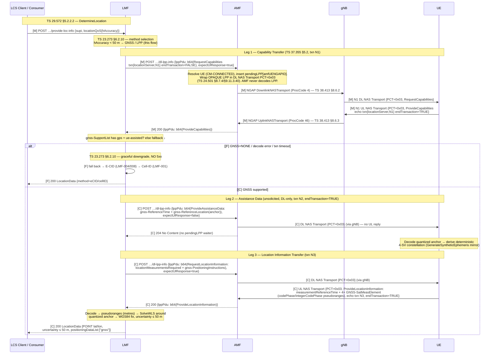

# Procedure: LPPRelay (UE-assisted A-GNSS Positioning — LPP over NAS N1 Relay)

**Spec:** TS 37.355 (LTE Positioning Protocol — LPP; **§4 encoding: ASN.1 BASIC-PER UNALIGNED**, §5.2 LPP transactions, §6.2 LPP-Message envelope, §6.4 common IEs, §6.5.2 A-GNSS positioning IEs) · TS 24.501 §8.7.4 (DL/UL NAS Transport for LPP), §9.11.3.40 (Payload container type IE — value **0x03** = LPP message container), §9.11.3.39 (Payload container IE) · TS 38.413 §8.6.2 (NGAP DownlinkNASTransport), §8.6.3 (NGAP UplinkNASTransport) · TS 23.273 §6.2.10 (GNSS positioning via LPP / A-GNSS), §7.2 (UE positioning procedure — LPP-over-N1 relay path) · TS 29.572 §5.2.2.2 (Nlmf_Location DetermineLocation triggering the LPP sequence) · TS 29.518 (Namf_Location producer — dl-lpp-info relay endpoint) · TS 23.032 §6 (geodetic shape encodings reused by TS 37.355)
**ASN.1 structural reference (authoritative for this doc):** `specs/3gpp-asn1/LPP-PDU-Definitions.asn` — extracted from **TS 37.355 V19.3.0** via the Wireshark project. The A-GNSS subset used here is Rel-9 baseline ASN.1, unchanged through Rel-17; line numbers below cite this vendored file.
**Status:** ✅ LMF-005 core relay implemented (2026-07-01) · ✅ **LMF-009 live-validated (2026-07-05)**: `shared/lpp` REWRITTEN as a spec-faithful TS 37.355 subset in **UNALIGNED PER**, and UE patch `0042` closed the live GNSS E2E loop. Hard requirement met: **zero malformed ASN.1 under tshark 4.6.4 LPP dissection** (golden-PDU oracle + live N2 pcap). See the Live E2E section below.
**Primary NF:** LMF (Nlmf_Location producer + LPP relay layer + GNSS position calc + AMF dl-lpp client)
**Other NFs involved:** AMF (Namf_Location producer + **transparent** N1 NAS relay to/from the UE — must NOT parse LPP bytes), gNB (opaque NAS relay over N2), UE (LPP endpoint — patched UERANSIM with a synthetic GNSS responder), LCS Client / Consumer

## Context

LMF-001/002/006 implement **Cell-ID** positioning (serving cell, ~500 m). LMF-004/008 add
**E-CID** via NRPPa over N2 (~100 m). **LMF-005** added the highest-accuracy tier —
**UE-assisted A-GNSS** using **LPP** (TS 37.355) carried over **N1 NAS**, targeting
**< 50 m CEP50** — with the AMF as a pure transparent relay (TS 23.273 §7.2): DL/UL NAS
Transport, payload container type **0x03**, opaque LPP octet string end-to-end.

**Why LMF-009 rewrites the codec.** The LMF-005 `shared/lpp` encoded via `free5gc/aper`
(ALIGNED PER) and used two **invented** wire messages (a combined
"AssistanceDataAndLocationRequest" and a mock ECEF "SatEphemeris" / pseudorange-in-metres
"Measurement"). TS 37.355 §4 mandates **BASIC-PER UNALIGNED**, and the invented structures do
not exist in the spec's ASN.1 — Wireshark's LPP dissector flags such octets as malformed.
LMF-009 replaces both defects:

- **Wire format:** hand-rolled **X.691 UNALIGNED-PER bit codec** in `shared/lpp` (precedent:
  `shared/nas` is hand-written spec-faithful TLV; `free5gc/aper` implements ALIGNED PER only
  and therefore **cannot** be used for LPP).
- **Message set:** only real TS 37.355 messages (below), structurally verified against the
  vendored ASN.1 module.
- **Live E2E:** UERANSIM UE patch `tools/ueransim/patches/0042-lpp-gnss.patch` (mirrors the
  LMF-008 gNB patch 0041 pattern) answers the three DL legs with spec-encoded UL LPP.

> **Scope is the A-GNSS (GPS, UE-assisted) subset only.** OTDOA/DL-TDOA, DL-AoD, NR
> multi-RTT, sensor and WLAN/Bluetooth methods carried by LPP are **not** in scope. See
> *Out of scope*.

## LPP message set actually used (A-GNSS subset — real TS 37.355 messages only)

The invented combined "AssistanceDataAndLocationRequest" is **removed**. The flow is three
DL legs over the synchronous AMF relay:

| Leg | LPP message | Direction | UL reply? | Purpose | ASN.1 (vendored module) |
|---|---|---|---|---|---|
| 1 | **RequestCapabilities** | LMF → UE | yes | Does the UE support A-GNSS? | `RequestCapabilities` L57, `A-GNSS-RequestCapabilities` L6345 |
| 1 | **ProvideCapabilities** | UE → LMF | — | GNSS support list (GPS) or GNSS=NONE | `ProvideCapabilities` L97, `A-GNSS-ProvideCapabilities` L5875 |
| 2 | **ProvideAssistanceData** | LMF → UE | **no** (unsolicited, DL-only) | Reference time + reference location (serving-cell anchor) — seeds the deterministic constellation | `ProvideAssistanceData` L172, `A-GNSS-ProvideAssistanceData` L3303 |
| 3 | **RequestLocationInformation** | LMF → UE | yes | Request UE-assisted GNSS **measurements** | `RequestLocationInformation` L213, `A-GNSS-RequestLocationInformation` L5853 |
| 3 | **ProvideLocationInformation** | UE → LMF | — | Per-SV code-phase measurements (pseudoranges) | `ProvideLocationInformation` L260, `A-GNSS-ProvideLocationInformation` L5718 |

> **RequestAssistanceData** (UE-solicited assistance) is not used: the LMF pushes assistance
> proactively (TS 37.355 assistance-data delivery is unsolicited and has **no response
> message** — hence leg 2 is DL-only). **Abort**/**Error** message bodies are not built by
> the LMF; a UE-side A-GNSS error is carried inside `ProvideLocationInformation.gnss-Error`
> (see *Error / cause table*).

## Wire contract — message by message

All messages are `LPP-Message` (module L9–15):

```asn1
LPP-Message ::= SEQUENCE {
    transactionID      LPP-TransactionID  OPTIONAL,  -- always sent by both ends here
    endTransaction     BOOLEAN,                      -- the only unconditionally mandatory field
    sequenceNumber     SequenceNumber     OPTIONAL,  -- NEVER sent
    acknowledgement    Acknowledgement    OPTIONAL,  -- NEVER sent
    lpp-MessageBody    LPP-MessageBody    OPTIONAL   -- always sent
}
```

`LPP-MessageBody` (L25) = CHOICE {`c1` (16-way inner CHOICE: 8 real messages + 8 spares),
`messageClassExtension`}. Every message body wraps its IEs in
`criticalExtensions.c1.<message>-r9` (4-way inner CHOICE: r9-IEs + 3 spares).

### LPP transaction handling (TS 37.355 §5.2)

- `LPP-TransactionID` (L42) = `{initiator Initiator, transactionNumber TransactionNumber, ...}`.
  **`TransactionNumber ::= INTEGER (0..255)`** (L54) — the LMF-005 code's 0..262143 was
  WRONG and is corrected by this rewrite. `Initiator` (L48) = extensible ENUMERATED
  {`locationServer`(0), `targetDevice`(1)}.
- Every transaction here is **LMF-initiated**: DL messages carry
  `initiator=locationServer` + an LMF-assigned number (monotonic counter mod 256). The UE's
  response in the same transaction **ECHOES the same transactionID** — same
  `initiator=locationServer`, same number (it does NOT switch to `targetDevice`; that value
  marks UE-*initiated* transactions only).
- `endTransaction=FALSE` on the request legs (RequestCapabilities,
  RequestLocationInformation); `TRUE` on the closing responses (ProvideCapabilities,
  ProvideLocationInformation). **ProvideAssistanceData is a single-message transaction:
  `endTransaction=TRUE`**, no reply.
- `sequenceNumber` and `acknowledgement` (LPP reliable-transport aids) are **never sent**.
- The LMF SHOULD verify the echoed transactionID and **log-warn on mismatch
  (`lpp_txn_mismatch`) without aborting** — AMF correlation remains by AMF-UE-NGAP-ID
  (`pendingLPP`), unchanged from LMF-005.

### Leg 1 — RequestCapabilities (LMF → UE)

`criticalExtensions.c1.requestCapabilities-r9` (`RequestCapabilities-r9-IEs`, L67 — all
fields OPTIONAL) with **only** `a-gnss-RequestCapabilities` present (L6345):

| Field | Value | ASN.1 |
|---|---|---|
| `gnss-SupportListReq` | TRUE | BOOLEAN, mandatory |
| `assistanceDataSupportListReq` | FALSE | BOOLEAN, mandatory |
| `locationVelocityTypesReq` | FALSE | BOOLEAN, mandatory |

`commonIEsRequestCapabilities`, `otdoa-`/`ecid-`/`epdu-` and all r13+/r16+ extension
capabilities: **absent**.

### Leg 1 — ProvideCapabilities (UE → LMF)

`criticalExtensions.c1.provideCapabilities-r9` (`ProvideCapabilities-r9-IEs`, L107 — all
fields OPTIONAL).

**Positive case (GNSS supported):** `a-gnss-ProvideCapabilities` (L5875) present with
`gnss-SupportList` (L5898, SIZE(1..16)) carrying **one** `GNSS-SupportElement` (L5900):

| Field | Presence (module) | Value sent |
|---|---|---|
| `gnss-ID` | mandatory | `{gnss-id gps}` — `GNSS-ID` L6398, extensible SEQUENCE wrapping extensible ENUM {gps(0), sbas(1), qzss(2), galileo(3), glonass(4), …} |
| `sbas-IDs` | OPTIONAL (Cond GNSS-ID-SBAS) | absent (gnss-ID ≠ sbas) |
| `agnss-Modes` | **mandatory** (`PositioningModes` L669) | `posModes` BIT STRING (SIZE 1..8), named bits standalone(0)/ue-based(1)/ue-assisted(2) — send **8 bits `'00100000'B`** (only `ue-assisted` set) |
| `gnss-Signals` | **mandatory** (`GNSS-SignalIDs` L6463) | `gnss-SignalIDs` BIT STRING (SIZE(8)) — send **`'10000000'B`** (bit 0 = GPS L1 C/A per TS 37.355 §6.4 GNSS-SignalIDs field description) |
| `fta-MeasSupport` | OPTIONAL (Cond fta) | absent |
| `adr-Support` | **mandatory** BOOLEAN | FALSE |
| `velocityMeasurementSupport` | **mandatory** BOOLEAN | FALSE |

`assistanceDataSupportList`, `locationCoordinateTypes`, `velocityTypes`: absent.

**GNSS=NONE case (negative mode, `LPP_GNSS_NONE=1`):** `provideCapabilities-r9` with
`a-gnss-ProvideCapabilities` **entirely absent** (legal — every `ProvideCapabilities-r9-IEs`
field is OPTIONAL). The LMF treats *either* an absent `a-gnss-ProvideCapabilities` *or* a
present one with `gnss-SupportList` absent/empty as **GNSS unsupported → fallback to
E-CID/Cell-ID** (TS 23.273 §6.2.10). Patch 0042 emits the "absent" form.

### Leg 2 — ProvideAssistanceData (LMF → UE, unsolicited, no UL reply)

`criticalExtensions.c1.provideAssistanceData-r9` (L182) with **only**
`a-gnss-ProvideAssistanceData` (L3303) present, and inside it **only**
`gnss-CommonAssistData` (L3314) — **`gnss-GenericAssistData` is legally absent** (OPTIONAL,
L3305): no Keplerian navigation model / almanac is sent (see *Synthetic satellite geometry*).

`gnss-CommonAssistData` carries exactly two of its OPTIONAL members:

**`gnss-ReferenceTime`** (L3442):

| Field | Presence | Value |
|---|---|---|
| `gnss-SystemTime` (L3458) | mandatory | see below |
| `referenceTimeUnc` | OPTIONAL (Cond noFTA) | **included** (conservative — no FTA in this flow), value **32**. Scale per TS 37.355 §6.5.2 field description: r = 0.5·(1.14^K − 1) µs `[VERIFY: §6.5.2 scale constants C=0.5, x=0.14 — confirm against spec prose at implementation]` |
| `gnss-ReferenceTimeForCells` | OPTIONAL | absent |

`GNSS-SystemTime` (L3458): `gnss-TimeID = {gps}`;
`gnss-DayNumber INTEGER(0..32767)` and `gnss-TimeOfDay INTEGER(0..86399)` derived from Unix
time as: `gpsSeconds = unixUTC − 315964800 + gpsUtcLeapSeconds` (named constants:
`gpsEpochUnix = 315964800` = 1980-01-06T00:00:00Z; `gpsUtcLeapSeconds = 18`, documented
implementation constant — a real network derives it from the GNSS broadcast);
`gnss-DayNumber = ⌊gpsSeconds/86400⌋` (fits 0..32767 until 2069);
`gnss-TimeOfDay = gpsSeconds mod 86400`. `gnss-TimeOfDayFrac-msec`,
`notificationOfLeapSecond`, `gps-TOW-Assist`: absent.

**`gnss-ReferenceLocation`** (L3533): `threeDlocation` =
`EllipsoidPointWithAltitudeAndUncertaintyEllipsoid` (L433 — **not extensible; all 10 fields
mandatory**), encoding the serving-cell anchor from `nf/lmf/config/dev.yaml`
`cell_coordinates` / `default_coordinate` (Madrid 40.4168 N, −3.7038 E default). Scaling per
TS 23.032 §6 (the shape TS 37.355 reuses field-for-field):

| Field | Encoding rule (TS 23.032 §6) | Madrid anchor value |
|---|---|---|
| `latitudeSign` | north / south | `north` |
| `degreesLatitude` (0..8388607) | `N = ⌊(|lat°|/90) · 2^23⌋` | `3767118` |
| `degreesLongitude` (−8388608..8388607) | `N = ⌊(lon°/360) · 2^24⌋` (floor toward −∞, per TS 23.032 "N ≤ X < N+1") | `−172610` |
| `altitudeDirection` | height / depth | `height` |
| `altitude` (0..32767) | metres | `0` |
| `uncertaintySemiMajor` (0..127) | `r = 10·(1.1^K − 1)` m | `42` (≈538 m — Cell-ID anchor band) |
| `uncertaintySemiMinor` (0..127) | same | `42` |
| `orientationMajorAxis` (0..179) | 2° units | `0` (circle) |
| `uncertaintyAltitude` (0..127) | `r = 45·(1.025^K − 1)` m | `127` (≈990 m — altitude not modelled) |
| `confidence` (0..100) | percent | `68` (1-σ convention, matches E-CID) |

> **Longitude rounding pin:** TS 23.032 specifies floor (toward −∞), giving `−172610` for
> −3.7038°. `shared/nrppa` currently truncates toward zero (`−172609`) — a 1-LSB (≈1.3 m)
> divergence that is harmless there but MUST NOT be replicated: **Go `shared/lpp` and the
> C++ patch both use floor.** Both ends then work from the *same wire-quantized anchor*
> (see the quantized-anchor rule below), so the choice can never desynchronize them.

### Leg 3 — RequestLocationInformation (LMF → UE)

`criticalExtensions.c1.requestLocationInformation-r9` (L223) with exactly two members:

**`commonIEsRequestLocationInformation`** (L766): only the mandatory
`locationInformationType = locationMeasurementsRequired` (ENUM value 1, L795 — UE-assisted:
the UE reports **measurements**, the LMF computes the fix). All OPTIONAL members
(`periodicalReporting`, `qos`, `environment`, …): absent (one-shot request).

**`a-gnss-RequestLocationInformation`** (L5853): the mandatory
`gnss-PositioningInstructions` (L5859):

| Field | Presence | Value |
|---|---|---|
| `gnss-Methods` | mandatory (`GNSS-ID-Bitmap` L6404) | `gnss-ids` BIT STRING (SIZE 1..16), bit 0 = gps — send **8 bits `'10000000'B`** |
| `fineTimeAssistanceMeasReq` | mandatory BOOLEAN | FALSE |
| `adrMeasReq` | mandatory BOOLEAN | FALSE |
| `multiFreqMeasReq` | mandatory BOOLEAN | FALSE |
| `assistanceAvailability` | mandatory BOOLEAN | FALSE (UE may not request more assistance) |

> BIT STRING sizes with variable constraints (`posModes` 1..8, `gnss-ids` 1..16) are pinned
> to **8 bits** in this contract so the Go and C++ golden bytes are deterministic and
> identical; any size in range is spec-legal, but both ends MUST emit 8.

### Leg 3 — ProvideLocationInformation (UE → LMF)

`criticalExtensions.c1.provideLocationInformation-r9` (L270) with **only**
`a-gnss-ProvideLocationInformation` (L5718) present, carrying
`gnss-SignalMeasurementInformation` (L5726; `gnss-LocationInformation` absent — UE-assisted,
the UE never reports its own fix):

**`measurementReferenceTime`** (L5733):

| Field | Presence (module) | Value |
|---|---|---|
| `gnss-TOD-msec` (0..3599999) | mandatory | `((gpsSeconds mod 3600)·1000 + ms)` at measurement time |
| `gnss-TOD-frac` / `gnss-TOD-unc` | OPTIONAL | absent |
| `gnss-TimeID` | mandatory | `{gps}` |
| `networkTime` | **OPTIONAL** (CHOICE, L5738–5788) | **absent** — the module marks it OPTIONAL, so it is omitted (no `nr-r15` leg needed) |

**`gnss-MeasurementList`** (L5793, SIZE(1..16)): **one** `GNSS-MeasurementForOneGNSS`
(L5795): `gnss-ID = {gps}` + `gnss-SgnMeasList` (L5801, SIZE(1..8)) with **one**
`GNSS-SgnMeasElement` (L5803): `gnss-SignalID = {gnss-SignalID 0}` (GPS L1 C/A, L6454),
`gnss-CodePhaseAmbiguity` absent, and `gnss-SatMeasList` (L5810, SIZE(1..64)) with **four**
`GNSS-SatMeasElement` (L5812) entries:

| Field | Presence (module) | Value per SV |
|---|---|---|
| `svID` | mandatory (`SV-ID` L6500, `satellite-id` 0..63) | constellation index i ∈ 1..4 rides as **satellite-id = i − 1** (for GPS, satellite-id = PRN − 1 per TS 37.355 §6.4 SV-ID field description) |
| `cNo` (0..63) | mandatory | **44** (dB-Hz, plausible fixed value) |
| `mpathDet` | mandatory (extensible ENUM notMeasured(0)/low(1)/medium(2)/high(3)) | `low` |
| `carrierQualityInd` | OPTIONAL | absent |
| `codePhase` (0..2097151) | mandatory | sub-millisecond code phase in **2⁻²¹ ms units** — see below |
| `integerCodePhase` (0..127) | OPTIONAL | **always included** by our UE — whole milliseconds |
| `codePhaseRMSError` (0..63) | mandatory | **20** (≈3.0 m) — see below |
| `doppler` / `adr` / r15 ext fields | OPTIONAL | absent |

### Pseudorange encoding (the critical mapping)

`codePhase` + `integerCodePhase` carry the pseudorange in milliseconds of light-travel time
(TS 37.355 §6.5.2 GNSS-MeasurementList field descriptions):

```
c = 299 792 458 m/s   →   1 ms of range = 299 792.458 m
pseudorange_ms = integerCodePhase + codePhase × 2⁻²¹
pseudorange_m  = pseudorange_ms × 299 792.458
resolution     = 2⁻²¹ ms × 299 792.458 m/ms ≈ 0.1430 m
```

Typical MEO slant range 22 000 km ≈ 73.38 ms → `integerCodePhase = 73` fits 0..127.

**UE side (metres → fields):**

```
total_ms         = pseudorange_m / 299792.458
integerCodePhase = floor(total_ms)                        // must be ≤ 127
codePhase        = round((total_ms − integerCodePhase) × 2^21)
                   // if rounding yields 2^21, set codePhase=0 and integerCodePhase += 1
```

**LMF side (fields → metres):**

```
pseudorange_m = (integerCodePhase + codePhase / 2^21) × 299792.458
```

**`codePhaseRMSError`** (INTEGER 0..63): floating-point representation with 3-bit mantissa
`x` and 3-bit exponent `y`: `RMS = 0.5 · (1 + x/8) · 2^y` metres. Value **≈3.0 m** ⇒
`x=4, y=2` (exactly 3.0 m). Packing convention in this contract: **encoded integer
k = 8·y + x = 20** (exponent in the 3 MSBs). `[VERIFY: bit-packing order (exponent-MSB vs
mantissa-MSB) against the TS 37.355 §6.5.2 field-description table at implementation — the
ASN.1 module only constrains the integer range; both ends share the same Go-mirrored
formula, so the choice cannot desynchronize this system, but the documented convention must
match the spec table before conformance is claimed.]`

## Synthetic satellite geometry — reference-location-seeded, both-ends deterministic

**Satellite positions are NOT carried on the wire** (no `gnss-GenericAssistData`, no
navigation model). Both ends independently compute the same deterministic 4-satellite
constellation from `shared/lpp` `gnss.go` **`GenerateSyntheticEphemeris(anchorLat,
anchorLon)`**: satellites at (elevation, azimuth) = {75°,0°}, {60°,90°}, {45°,200°},
{30°,300°}, each at 22 000 km slant range from the anchor (ECEF via the ENU unit-vector
transform already in `gnss.go`).

**Seeding — the quantized-anchor rule:** the seed is the `gnss-ReferenceLocation` the LMF
sent in leg 2, *as encoded on the wire*:

- The **UE** decodes `threeDlocation` → `lat = raw_lat × 90/2^23` (sign from
  `latitudeSign`), `lon = raw_lon × 360/2^24` → feeds `GenerateSyntheticEphemeris`.
- The **LMF** does NOT use its raw config float: it re-decodes its own encoded
  `threeDlocation` and uses the same quantized (lat, lon) for both the ephemeris and the
  WLS initial guess.

Result: **byte-identical geometry on both ends** (no drift from the ≈1.2 m lat / ≈1.8 m lon
quantization steps).

**UE synthetic true position:** deterministic offset from the quantized anchor —
**+25 m north, +15 m east** (applied via the local ENU frame, same math as
`enuUnitVectorToECEF`), with **receiver clock bias +150 m** added to every pseudorange
(i.e., the UE reports `geometric_range_i + 150` m through the codePhase fields). The LMF's
Gauss-Newton WLS (`SolveWLS`) solves the 4-unknown system (position + clock bias) and
converges to the offset point within codePhase quantization (≈0.14 m/SV) — uncertainty
≤ 50 m near the Cell-ID anchor, satisfying the acceptance criterion.

**Go is the source of truth** (tools/ueransim/CLAUDE.md §4): the C++ patch mirrors the Go
math in `shared/lpp/gnss.go` and must byte-match `shared/lpp`'s golden-hex test dumps.

## Endpoints

| Service | Producer | Endpoint | Status |
|---|---|---|---|
| `Nlmf_Location` DetermineLocation | LMF (:8012) | `POST /nlmf-loc/v1/ue-contexts/{ueContextId}/provide-loc-info` | reused (LMF-001) |
| `Nlmf_Location` UL LPP receive (async stub) | LMF (:8012) | `POST /nlmf-loc/v1/ue-contexts/{ueContextId}/ul-lpp-info` | LMF-005 (stub) |
| `Namf_Location` DL LPP send | AMF (:8001) | `POST /namf-loc/v1/ue-contexts/{ueContextId}/dl-lpp-info` | LMF-005; **LMF-009 adds `expectUlResponse`** |
| `Namf_Location` ProvideLocationInfo | AMF (:8001) | `POST /namf-loc/v1/ue-contexts/{ueContextId}/provide-loc-info` | reused (Cell-ID fallback + TAI) |

The LPP payload is the **opaque UPER-encoded LPP-Message** carried as **base64 octets** in a
JSON body (mirrors the LMF-004 `dl-nrppa-info` shape). The AMF treats it as a byte blob;
only the LMF and UE decode it.

### LMF ↔ AMF HTTP body (`dl-lpp-info`)

```jsonc
// POST /namf-loc/v1/ue-contexts/{id}/dl-lpp-info   (LMF → AMF)
{
  "lppPdu": "<base64 UPER-encoded LPP-Message>",  // opaque to the AMF
  "expectUlResponse": true                          // ADDITIVE (LMF-009), default true
}
```

- `expectUlResponse` **true (default)** — LMF-005 synchronous behaviour, unchanged: the AMF
  inserts `pendingLPP[amfUENGAPID]`, sends the DL NAS Transport, blocks until the matching
  UL NAS Transport (PCT=0x03) or `lppTimeout`, and returns **`200 {"lppPdu": "<base64 UL>"}`**.
- `expectUlResponse` **false** (leg 2, ProvideAssistanceData — TS 37.355 assistance delivery
  is unsolicited with no response message): the AMF sends the DL NAS Transport and returns
  **`204 No Content` immediately**, WITHOUT registering a `pendingLPP` waiter. (Decision:
  204, not 200-with-empty-`lppPdu` — an absent body is unambiguous.)

## Specifications

| Topic | Reference |
|---|---|
| LPP encoding — BASIC-PER UNALIGNED | TS 37.355 §4 |
| LPP transactions (transactionID / endTransaction semantics) | TS 37.355 §5.2 |
| LPP-Message envelope + message bodies | TS 37.355 §6.2; module L9–L300 |
| Common IEs (GNSS-ID, GNSS-SignalIDs, SV-ID, shapes) | TS 37.355 §6.4; TS 23.032 §6 |
| A-GNSS positioning IEs (capabilities / assistance / measurements) | TS 37.355 §6.5.2; module L3303–L6503 |
| GNSS positioning method (A-GNSS) | TS 23.273 §6.2.10 |
| LPP over N1 relay path (AMF transparent) | TS 23.273 §7.2 |
| NAS DL/UL NAS Transport for LPP | TS 24.501 §8.7.4 |
| Payload container type IE (**0x03 = LPP**) | TS 24.501 §9.11.3.40, Table 9.11.3.40.1 |
| Payload container IE | TS 24.501 §9.11.3.39 |
| NGAP DownlinkNASTransport / UplinkNASTransport | TS 38.413 §8.6.2 / §8.6.3 |
| Nlmf_Location DetermineLocation | TS 29.572 §5.2.2.2 |
| Namf_Location producer (AMF relay) | TS 29.518 §5.2.2.6 |

## Sequence Diagram — A-GNSS via LPP (3 DL legs, with fallback)

`[M]` = mandatory in the GNSS flow · `[C]` = conditional · `[F]` = fallback path.
Each leg is one `dl-lpp-info` POST; the NAS/NGAP encapsulation (drawn once, leg 1) is
identical on every leg.



## Information Elements

### locationQoS — method-selection input (LCS → LMF, TS 29.572 §6.1.6.2.2)

| IE | Type | M/O | Notes |
|---|---|---|---|
| `hAccuracy` | number (m) | O | **< 50 m ⇒ GNSS/LPP** (this flow). Absent ⇒ operator default (does not select GNSS). |
| `vAccuracy` | number (m) | O | Not used by the 2-D GNSS MVP. |
| `responseTime` | enum | O | Informational in MVP. |

### NAS DL/UL NAS Transport carrying LPP (TS 24.501 §8.7.4) — UNCHANGED by LMF-009

| IE | Value / Type | M/O | Reference |
|---|---|---|---|
| Payload container type | **0x03** = LPP message container | M | TS 24.501 §9.11.3.40, Table 9.11.3.40.1 |
| Payload container | Opaque LPP-Message octets (LV-E, up to 65535 B) — the AMF never parses it | M | TS 24.501 §9.11.3.39 |

> `shared/nas/transport.go` `PayloadContainerTypeLPP uint8 = 0x03` — see the Conformance
> Note below (the backlog's 0x01 was a documented error). DL messages ride ciphered
> (SHT=0x02) post-SMC — **the inner LPP octets are therefore NOT visible in a live N2
> pcap** (see *Validation approach*).

### NGAP NAS Transport (opaque NAS relay, TS 38.413 §8.6.2 / §8.6.3) — UNCHANGED

| Procedure | ProcCode | Direction | Key IEs | Reference |
|---|---|---|---|---|
| DownlinkNASTransport | 4 | AMF → gNB → UE | AMF-UE-NGAP-ID (10), RAN-UE-NGAP-ID (85), NAS-PDU (38) | TS 38.413 §8.6.2 |
| UplinkNASTransport | 46 | UE → gNB → AMF | AMF-UE-NGAP-ID (10), RAN-UE-NGAP-ID (85), NAS-PDU (38) | TS 38.413 §8.6.3 |

No new NGAP procedure — LPP rides the same NAS transport as N1-SM and URSP delivery.

### LPP A-GNSS IE subset (normative for `shared/lpp` — nothing else is built/decoded)

| LPP IE (ASN.1 type) | In message | Sent by us | Module line |
|---|---|---|---|
| `A-GNSS-RequestCapabilities` (3 BOOLEANs) | RequestCapabilities | LMF | L6345 |
| `A-GNSS-ProvideCapabilities.gnss-SupportList` → `GNSS-SupportElement` | ProvideCapabilities | UE | L5875/L5900 |
| `A-GNSS-ProvideAssistanceData.gnss-CommonAssistData` (`gnss-ReferenceTime` + `gnss-ReferenceLocation` only; `gnss-GenericAssistData` absent) | ProvideAssistanceData | LMF | L3303/L3314 |
| `GNSS-SystemTime` (gps day/time-of-day) | ProvideAssistanceData | LMF | L3458 |
| `EllipsoidPointWithAltitudeAndUncertaintyEllipsoid` | ProvideAssistanceData | LMF | L433 |
| `CommonIEsRequestLocationInformation.locationInformationType = locationMeasurementsRequired` | RequestLocationInformation | LMF | L766/L795 |
| `A-GNSS-RequestLocationInformation.gnss-PositioningInstructions` | RequestLocationInformation | LMF | L5853/L5859 |
| `A-GNSS-ProvideLocationInformation.gnss-SignalMeasurementInformation` (`MeasurementReferenceTime` + `GNSS-MeasurementList` → 4× `GNSS-SatMeasElement`) | ProvideLocationInformation | UE | L5718/L5726/L5812 |
| `A-GNSS-ProvideLocationInformation.gnss-Error.targetDeviceErrorCauses` | ProvideLocationInformation (error) | UE | L6353/L6375 |

> Decoders MUST tolerate (skip) any OPTIONAL/extension field a peer adds — UPER extension
> markers and presence bitmaps make this well-defined. **Do not** add OTDOA / sensor / WLAN
> / multi-RTT IEs.

## LMF per-SUPI LPP state machine (states UNCHANGED — leg mapping updated)

States: `IDLE → CAPS_REQUESTED → ASSIST_SENT → MEASURE_RECEIVED → FIXED`, plus `FALLBACK`
(same constants as LMF-005, `nf/lmf/internal/server/lpp.go`).

| From | Event | To | Action |
|---|---|---|---|
| IDLE | method selected = GNSS | CAPS_REQUESTED | **Leg 1**: build `RequestCapabilities` (txn N1, endTransaction=FALSE), POST `dl-lpp-info` (expectUlResponse=true) |
| CAPS_REQUESTED | 200 with `ProvideCapabilities{gps, ue-assisted}` (echo txn N1) | ASSIST_SENT | **Leg 2**: build `ProvideAssistanceData` (txn N2, endTransaction=TRUE), POST with **expectUlResponse=false** → expect 204. Then **Leg 3**: build `RequestLocationInformation` (txn N3, endTransaction=FALSE), POST (expectUlResponse=true) |
| CAPS_REQUESTED | `a-gnss-ProvideCapabilities` absent / no gps / decode error / timeout | FALLBACK | downgrade to E-CID (LMF-004) → Cell-ID |
| ASSIST_SENT | leg-2 POST non-2xx, or leg-3 timeout / decode error / `gnss-Error` | FALLBACK | downgrade; delete pending |
| ASSIST_SENT | 200 with `ProvideLocationInformation` (echo txn N3, ≥1 SatMeasElement) | MEASURE_RECEIVED | decode codePhase fields → pseudoranges (m) |
| MEASURE_RECEIVED | `SolveWLS` OK (≥4 matched SVs, converged) | FIXED | build LocationData, return 200 |
| MEASURE_RECEIVED | < 4 usable SVs / WLS non-convergence | FALLBACK | downgrade; delete pending |
| any | echoed transactionID ≠ sent | (no transition) | **log-warn `lpp_txn_mismatch`, continue** (TS 37.355 §5.2; correlation is by AMF-UE-NGAP-ID) |
| FIXED / FALLBACK | — | (terminal) | return `200 LocationData`, delete state |

> Same `sync.Map` + `defer`-delete pattern as LMF-005/LMF-004. Guard timers per leg are
> enforced by the AMF `dl-lpp-info` HTTP deadline (`lppTimeout`), unchanged.

## Quality / method selection — UNCHANGED

| `hAccuracy` band | Method | Chain |
|---|---|---|
| `< 50 m` | **GNSS / LPP** | this procedure |
| `50 – 200 m` | **E-CID / NRPPa** | LMF-004/008 |
| `> 200 m` or absent | **Cell-ID** | LMF-001 |

**Fallback hierarchy (graceful, no 5xx): GNSS → E-CID → Cell-ID** (TS 23.273 §6.2.10).
Any GNSS-path failure returns `200 LocationData` with the achieved method in
`positioningDataList` — never a `5xx`.

## Simplified WLS GNSS position calculation (reference-location-seeded)

`shared/lpp/gnss.go` (`SolveWLS`, unchanged math) turns the decoded per-SV pseudoranges into
a WGS84 point. What LMF-009 changes is the **seeding model**:

1. **Anchor** = the wire-quantized `gnss-ReferenceLocation` the LMF itself sent in leg 2
   (quantized-anchor rule above) — not the raw config float.
2. **Satellite ECEF positions** `S_i` = `GenerateSyntheticEphemeris(quantizedLat,
   quantizedLon)` — recomputed locally on BOTH ends; never decoded off the wire.
3. **Pseudoranges** `ρ_i` = decoded from `integerCodePhase`/`codePhase` per the mapping
   above (`codePhaseRMSError` available as a per-SV weight; the MVP weights uniformly).
4. Require **≥ 4** matched satellites; Gauss-Newton iterations for ECEF position + clock
   bias (the UE's +150 m bias is solved out); ECEF → WGS84; uncertainty = residual RMS ×
   DOP-like factor, clamped 5–50 m. `positioningDataList` reports `gnss`.

> Deterministic, config-anchored approximation (same philosophy as the LMF-004 AP-position
> and LMF-006 mobility model) — not a GNSS engine. TS 23.273 §6.2.10 leaves the position
> computation implementation-defined; no invented 3GPP constants.

## Spec reference table (per step)

| Step | Reference | Message / Operation | Direction | M/C |
|---|---|---|---|---|
| 1 | TS 29.572 §5.2.2.2 | DetermineLocation (`POST …/provide-loc-info`) | LCS → LMF | M |
| 2 | TS 23.273 §6.2.10 | Method selection (`hAccuracy < 50 m` ⇒ GNSS) | LMF internal | M |
| 3 | TS 37.355 §5.2/§6.2; module L57 | LPP `RequestCapabilities` (txn N1, endTransaction=FALSE) → `dl-lpp-info` | LMF → AMF | M |
| 4 | TS 24.501 §8.7.4 / §9.11.3.40 | DL NAS Transport {PCT=0x03, opaque LPP} | AMF → UE (via gNB) | M |
| 5 | TS 38.413 §8.6.2 / §8.6.3 | NGAP DL/UL NASTransport (opaque relay) | AMF ↔ gNB | M |
| 6 | TS 37.355 §5.2/§6.2; module L97/L5875 | LPP `ProvideCapabilities` (echo N1, endTransaction=TRUE) — gps ue-assisted or GNSS=NONE | UE → LMF | M |
| 7 | TS 37.355 §6.2/§6.5.2; module L172/L3303 | LPP `ProvideAssistanceData` (gnss-ReferenceTime + gnss-ReferenceLocation; txn N2, endTransaction=TRUE, **no UL reply**) — `expectUlResponse=false` ⇒ AMF 204 | LMF → UE | C |
| 8 | TS 37.355 §6.2; module L213/L766/L5853 | LPP `RequestLocationInformation` (locationMeasurementsRequired + gnss-PositioningInstructions; txn N3, endTransaction=FALSE) | LMF → UE | C |
| 9 | TS 37.355 §6.2/§6.5.2; module L260/L5718/L5812 | LPP `ProvideLocationInformation` (measurementReferenceTime + 4× GNSS-SatMeasElement; echo N3, endTransaction=TRUE) | UE → LMF | C |
| 10 | TS 23.273 §6.2.10 | WLS fix over decoded pseudoranges (quantized-anchor seed) | LMF internal | C |
| 11 | TS 29.572 §6.1.6.2.2 | `200 OK` LocationData (GNSS estimate, uncertainty ≤ 50 m) | LMF → LCS | C |
| F | TS 23.273 §6.2.10 | Fallback GNSS → E-CID (LMF-004) → Cell-ID (LMF-001) | LMF internal | F |

## Error / cause table

All GNSS-path failures degrade gracefully — **never a 5xx to the LCS client**.

| Trigger | NF | HTTP / NAS | Cause | Behaviour |
|---|---|---|---|---|
| `hAccuracy ≥ 50 m` (or absent) | LMF | — | — | Method = E-CID/Cell-ID; no LPP sent. TS 23.273 §6.2.10. |
| **GNSS=NONE** — `a-gnss-ProvideCapabilities` absent, or present without a usable gps `gnss-SupportList` entry | LMF | — | — | **Fallback E-CID → Cell-ID** (200, achieved method). Negative mode `LPP_GNSS_NONE=1` exercises this live. |
| UL LPP fails to **decode** (UPER error, unknown message body, spare/extension body) | LMF | drop | `INVALID_MSG_FORMAT` (log) | **Fallback**; state deleted. |
| **Echoed transactionID mismatch** (initiator or number ≠ sent) | LMF | — | — | **Log-warn `lpp_txn_mismatch`, do NOT abort** — process the message (TS 37.355 §5.2; correlation is by AMF-UE-NGAP-ID). |
| **Leg 1 or leg 3 timeout** (no UL NAS Transport PCT=0x03 before `lppTimeout`) | AMF→LMF | 504 | `LPP_RELAY_FAILURE` | LMF **fallback**; `pendingLPP` entry cleaned. |
| **Leg 2 send failure** (`expectUlResponse=false` POST returns non-2xx) | LMF | — | — | **Fallback** (assistance undeliverable). |
| UE replies with `gnss-Error.targetDeviceErrorCauses` (`assistanceDataMissing`, `thereWereNotEnoughSatellitesReceived`, `undefined` — module L6375) | LMF | — | — | **Fallback**; error cause logged. |
| `ProvideLocationInformation` with **< 4 usable satellites** (after SVID match) | LMF | — | — | WLS cannot solve → **fallback**. |
| **WLS non-convergence** (singular geometry / NaN) | LMF | — | — | **Fallback**. |
| `{ueContextId}` unknown at the AMF | AMF | 404 | `CONTEXT_NOT_FOUND` | LMF cannot relay → fallback. |
| UE CM-IDLE on `dl-lpp-info` | AMF | 504 | `LPP_RELAY_FAILURE` | LPP needs CM-CONNECTED; LMF falls back. (Paging-first is deferred — LMF-002 pattern.) |
| UL PCT=0x03 with no matching `pendingLPP[amfUENGAPID]` | AMF | — | — | Orphan: log `lpp_orphan`, drop. (An UL for a leg-2 `expectUlResponse=false` send is by definition an orphan — UEs must not reply to ProvideAssistanceData.) |
| `lppPdu` missing / invalid base64 | AMF | 400 | `MANDATORY_IE_MISSING` | Request rejected. |
| Subscriber privacy = `BLOCK_ALL` (UDM lcsData) | LMF | 403 | `PRIVACY_EXCEPTION_DENIED` | Privacy gate before any LPP (TS 23.273 §9.1). |
| Missing UE identity | LMF | 400 | `MANDATORY_IE_MISSING` | Rejected at the Nlmf producer. |

## NF interaction map (SBI + N1/N2)

- `LCS Client → LMF: Nlmf_Location DetermineLocation (POST /nlmf-loc/v1/ue-contexts/{id}/provide-loc-info)` — reused.
- `LMF → AMF: Namf_Location DL LPP (POST /namf-loc/v1/ue-contexts/{id}/dl-lpp-info, base64 UPER LPP-Message, expectUlResponse)` — 3 calls per locate (legs 1/2/3); `shared/sbi.NewMTLSClient`.
- `LMF → AMF: Namf_Location ProvideLocationInfo (POST …/provide-loc-info)` — reused for TAI metadata + Cell-ID fallback. E-CID fallback reuses `dl-nrppa-info` (LMF-004).
- `AMF ↔ gNB ↔ UE: NGAP DownlinkNASTransport (4) / UplinkNASTransport (46)` carrying DL/UL NAS Transport with **PCT=0x03** — same NAS transport as N1-SM/URSP; opaque to AMF and gNB.
- **Correlation:** AMF `pendingLPP` `sync.Map` keyed by AMF-UE-NGAP-ID (legs 1/3 only — leg 2 registers no waiter); LMF per-SUPI state entry keyed by `ueContextId`. Unchanged from LMF-005.

## Implementation notes (for the codec developer and the NF developer)

### `shared/lpp` rewrite — hand-rolled X.691 UNALIGNED-PER (LMF-009)

- **Why hand-rolled:** TS 37.355 §4 mandates BASIC-PER **UNALIGNED**; `free5gc/aper`
  implements ALIGNED PER only, so it is structurally unusable here. Precedent for
  hand-written spec-faithful codecs in `shared/`: `shared/nas` (TLV per TS 24.501 §9).
  Root CLAUDE.md "Protocol Encoding Rules" table gains the row: LPP → TS 37.355 → ASN.1
  Basic-PER Unaligned → `shared/lpp` (hand-rolled X.691-unaligned bit codec).
- **Authoritative structure:** mirror `specs/3gpp-asn1/LPP-PDU-Definitions.asn` type-for-type
  for the subset above; keep the module's field order and OPTIONAL markers exactly (the
  presence bitmap derives from them).
- **X.691-unaligned subset needed:** SEQUENCE preamble = extension bit (iff `...` present)
  + one presence bit per OPTIONAL/DEFAULT root field; constrained INTEGER in
  ⌈log2(range)⌉ bits, no octet alignment ever (single final pad of the outer PDU to a whole
  octet — the NAS payload container carries whole octets); CHOICE index in
  ⌈log2(alternatives)⌉ bits (extensible CHOICE: extension bit first); extensible ENUMERATED:
  extension bit + ⌈log2(root values)⌉ bits; BIT STRING with SIZE(a..b): length determinant
  in ⌈log2(b−a+1)⌉ bits then the bits; SEQUENCE OF SIZE(a..b): same length form. Decoder
  MUST skip unknown extension additions (read-and-discard via the open-type length when the
  extension bit is set). Nothing in the subset needs the general open-type or unconstrained
  length forms beyond extension skipping.
- **Known width traps** (the LMF-004 NRPPa lessons transpose): `LPP-MessageBody.c1` = 16
  alternatives ⇒ 4-bit index even though only 6 are ever sent; `criticalExtensions.c1` = 4
  alternatives ⇒ 2 bits; `Initiator` extensible ⇒ 1 ext bit + 1 value bit;
  `EllipsoidPointWithAltitudeAndUncertaintyEllipsoid` is **not** extensible ⇒ **no**
  extension bit; `LPP-Message` is not extensible either (no `...` at L9–15) but has **4
  presence bits** (transactionID, sequenceNumber, acknowledgement, lpp-MessageBody).
- **Friendly API changes:** `MsgAssistanceDataAndLocationRequest`, `SatEphemerisMsg`-on-wire,
  and `MeasurementMsg.PseudorangeMeters`-on-wire are removed from the wire layer.
  New builders/decoders: `BuildRequestCapabilities`, `BuildProvideCapabilities(gnssSupported
  bool)`, `BuildProvideAssistanceData(anchor, sysTime)`, `BuildRequestLocationInformation`,
  `BuildProvideLocationInformation(measurements)`, plus `Decode` returning the echoed
  `TransactionID` for the §5.2 verification. `GenerateSyntheticEphemeris`, `SolveWLS`,
  `SimulateMeasurements` and the WGS84/ECEF helpers in `gnss.go` are kept (now fed by the
  codePhase↔metres mapping + quantized anchor).
- **Transaction counter:** mod **256** (`TransactionNumber INTEGER(0..255)`, module L54).

### AMF (`nf/amf/internal/sbi/server.go` `handleDLLPPInfo`)

- **Additive only:** parse the new optional `expectUlResponse` body field (default true).
  When false: skip `pendingLPP` insertion and the blocking select; return **204** after
  `SendDownlinkLPP` succeeds. Existing 200/400/404/504 paths unchanged. The AMF still
  **never decodes** LPP bytes (TS 23.273 §7.2).

### LMF (`nf/lmf/internal/server/lpp.go`)

- Replace the two-round combined flow with the three-leg flow (state table above). Keep
  `performLPPOrFallback` signature, privacy-gate invariant, fallback closure, metrics.
- Apply the **quantized-anchor rule** before generating ephemeris / seeding WLS.
- Verify echoed transactionIDs (warn-only). Treat a decoded `gnss-Error` as fallback.

### UERANSIM UE patch `0042-lpp-gnss.patch`

See the Live E2E section below. C++ mirrors the Go math and golden bytes —
**Go is the source of truth** (tools/ueransim/CLAUDE.md §4).

### Logging / metrics — unchanged from LMF-005

`logging.NewProcedureLogger(ctx, s.logger, "LPPRelay")`; fields `nf`, `interface`
(`Nlmf`/`Namf`/`N1`), `direction`, `spec_ref`, `supi`, `ue_context_id`, `amf_ue_ngap_id`,
`method`, `lpp_msg` (now: `RequestCapabilities`/`ProvideCapabilities`/
`ProvideAssistanceData`/`RequestLocationInformation`/`ProvideLocationInformation`),
`lpp_state`, `lpp_txn` (new: transaction number), `result`, `cause`, `uncertainty_m`,
`duration_ms`. Metrics: `fivegc_lmf_gnss_total{result}` and
`fivegc_amf_lpp_transport_total{direction}` unchanged.

## Conformance Notes — payload container type correction (PROCEDURE-PLANNER, 2026-07-01) — STILL VALID

**The LMF-005 backlog descriptor states "payload container type = 0x01" for LPP. That is
WRONG.** Per **TS 24.501 §9.11.3.40, Table 9.11.3.40.1** (Payload container type IE):

| Value | Payload container type |
|---|---|
| `0x01` | **N1 SM information** (5GSM) |
| `0x02` | SMS |
| **`0x03`** | **LTE Positioning Protocol (LPP) message container** |
| `0x04` | SOR transparent container |
| `0x05` | UE policy container (URSP delivery) |

The correct value for the LPP container is **`0x03`**. `0x01` is **N1 SM information** and is
already in use for PDU-session (5GSM) signalling — using it for LPP would collide with the SMF
routing path. **The codebase is correct** (`shared/nas/transport.go`
`PayloadContainerTypeLPP uint8 = 0x03`); LMF-009 does not touch this. This note remains
authoritative over the backlog text (which repeats the error in the LMF-004 §"Out of scope"
line as well).

## Live E2E — UERANSIM UE LPP patch 0042 (LMF-009)

LMF-005 delivered the full core-side LPP stack, but the live leg was unexercisable: stock
UERANSIM v3.2.8 has **no** LPP handler — the UE NAS layer logs
`Unhandled payload container type [3]` and never answers, so the LMF always fell back to
E-CID/Cell-ID. **LMF-009** closes the loop with a **UE-side** patch (the first UE-side
positioning patch; 0040/0041 were gNB-side).

### Patch `tools/ueransim/patches/0042-lpp-gnss.patch`

UE side (`src/ue/nas/mm/transport.cpp` DL NAS Transport dispatch + new `src/ue/lpp/`
UPER codec + responder):

| DL LPP message received | UE action | UL reply |
|---|---|---|
| `RequestCapabilities` | Read `a-gnss-RequestCapabilities` | `ProvideCapabilities` — echo transactionID, `endTransaction=TRUE`; default: one `GNSS-SupportElement{gps, ue-assisted, L1 C/A, adr=F, velocity=F}`; **`LPP_GNSS_NONE=1`** (env, read at UE startup): `a-gnss-ProvideCapabilities` absent |
| `ProvideAssistanceData` | Decode `gnss-ReferenceLocation.threeDlocation` → store the **wire-quantized anchor** (per UE); derive the deterministic 4-SV constellation (C++ mirror of `GenerateSyntheticEphemeris`) | **none** (unsolicited — TS 37.355 assistance has no response message) |
| `RequestLocationInformation` | If an anchor is stored: synthetic true position = anchor +25 m N +15 m E; pseudoranges = geometric range + 150 m clock bias → codePhase/integerCodePhase per the round-trip formulas; `cNo=44`, `mpathDet=low`, `codePhaseRMSError=20` | `ProvideLocationInformation` — echo transactionID, `endTransaction=TRUE`, 4× `GNSS-SatMeasElement`. **No stored anchor** → same message with `gnss-Error.targetDeviceErrorCauses{assistanceDataMissing}` instead of measurements |

All UL messages are UPER-encoded byte-identically to `shared/lpp`'s golden dumps and ride
UL NAS Transport with payload container type 0x03 (ciphered, post-SMC).

### Negative mode — GNSS=NONE

`LPP_GNSS_NONE=1` on the UE container ⇒ leg 1 returns capabilities without A-GNSS ⇒ the LMF
falls back to E-CID (patch 0041) then Cell-ID, `result=FALLBACK_ECID`, **no 5xx** — the live
proof of the downgrade path.

### Validation

```bash
make ueransim-build-only         # patches 0001..0042 apply cleanly, full build
make ueransim                    # core + obs + gNB + UE (registered)

# Happy path — GNSS band:
SUPI=imsi-001010000000001
curl -sk --cert pki/smf.crt --key pki/smf.key --cacert pki/ca.crt \
  -X POST https://localhost:8012/nlmf-loc/v1/ue-contexts/$SUPI/provide-loc-info \
  -H 'Content-Type: application/json' \
  -d '{"locationQoS":{"hAccuracy":30}}' | jq
# Expect: 200, positioningDataList:["gnss"], locationEstimate POINT near the anchor
#         (+25 m N / +15 m E offset), uncertainty ≤ 50.

docker logs ueransim-ue | grep -i lpp        # RequestCapabilities/AssistanceData/RequestLocation handled
docker logs amf | grep "dl-lpp-info"         # legs 1 and 3: result OK; leg 2: 204 (no waiter)
docker logs lmf | grep "GNSS position calculated"   # lat/lon/uncertainty_m/satellite_count=4

# Scripted (extends the existing {ursp|qos-mod|location|nrppa} cases):
scripts/validate-ueransim-mod.sh gnss

# Negative mode (GNSS=NONE → live fallback):
#   set LPP_GNSS_NONE=1 on the ueransim-ue service, restart the UE, repeat the POST
#   → 200 with positioningDataList:["eCID"] (patch 0041 path), LMF logs result=FALLBACK_ECID.

# Regression guard: location + nrppa scenarios must still pass:
scripts/validate-ueransim-mod.sh location && scripts/validate-ueransim-mod.sh nrppa
```

### Results — validated live 2026-07-05 (LMF-009)

- [x] `make ueransim-build-only` — 0042 applies after 0001–0041 (zero rejects, zero fuzz),
      `nr-ue` links cleanly.
- [x] **Live GNSS locate**: `DetermineLocation` hAccuracy=30 → **200**,
      `positioningDataList:["gnss"]`, uncertainty **5 m** (WLS residual ≈0 after the +150 m
      clock bias solves out), fix `40.417017, -3.703633` — the +25 m N / +15 m E offset from
      the Madrid anchior `40.4168, -3.7038`, as designed. LMF log `GNSS position calculated`
      (`lpp_state:FIXED`, `satellite_count:4`); AMF `DownlinkLPP sent` + `UplinkLPP received`
      + `dl-lpp-info complete — UL LPP relayed to LMF` + the DL-only 204 leg for
      ProvideAssistanceData; UE `LPP RequestCapabilities received -> ProvideCapabilities
      (GNSS supported)`, `LPP ProvideAssistanceData received (reference location stored)`,
      `LPP RequestLocationInformation received -> ProvideLocationInformation (4 satellites)`.
      LPP transaction echo verified end-to-end (`lpp_txn:1` caps, `lpp_txn:3` measurements).
- [x] **tshark oracle** (`TestTsharkOracle_AllGoldenPDUs`, tshark 4.6.4): zero "Malformed"
      across all seven golden LPP PDUs; per-field values confirmed (transactionNumber, gnss-id
      gps, degreesLatitude 3767118 / degreesLongitude −172610, codePhase integers, codePhase-
      RMSError, referenceTimeUnc).
- [x] **Live pcap** (`pcap-analyzer` verdict, N2 SCTP PPID 60): **zero malformed** NGAP /
      NAS-5GS / LPP frames. The real Wireshark **LPP dissector decoded the three DL legs on
      live traffic** — `RequestCapabilities` (a-gnss `gnss-SupportListReq: True`),
      `ProvideAssistanceData` (`gnss-ReferenceTime` gps day/tod + `gnss-ReferenceLocation`
      lat 40.4168° / lon −3.7038° / confidence 68%), `RequestLocationInformation`
      (`gnss-Methods.gps: True`) — proving the unaligned-PER encoding is wire-correct against
      the spec dissector, not just self-consistent. The two UL legs are NEA2-ciphered
      (SHT=0x02) as required by TS 33.501, so their inner LPP is not visible live — their
      wire-correctness is covered by the golden-PDU tshark oracle above. (Frame 7
      `LocationReportingControl` is the LMF's best-effort serving-cell/TAI metadata fetch
      after the fix — intentional, see `performLPPOrFallback`.)
- [x] **`LPP_GNSS_NONE=1`** negative mode → UE replies `ProvideCapabilities` without GNSS →
      LMF logs `GNSS capability=NONE from UE` → `FALLBACK_ECID`, **200** (`positioningDataList
      :["eCID"]`, ~98 m), no 5xx, resolved in 14 ms (no timeout).
- [x] **`location` / `nrppa` scenarios**: no regression (both green alongside `gnss`).

**Aligned-vs-unaligned PER resolution:** RESOLVED / **fixed in-place**. `shared/lpp` no longer
uses `free5gc/aper` (ALIGNED PER); it now encodes TS 37.355 in hand-rolled X.691 BASIC-PER
**UNALIGNED** (`shared/lpp/uper.go`), verified byte-correct by the real Wireshark LPP dissector
both in the golden-PDU oracle and live DL capture. This supersedes the LMF-005 documented
deviation.

## Validation approach

- **Unit (in-process, Go):**
  - **Golden-byte tests** for all five messages: `BuildRequestCapabilities`,
    `BuildProvideCapabilities` (positive + GNSS=NONE), `BuildProvideAssistanceData`
    (Madrid anchor → the exact `3767118 / −172610` raw coordinates),
    `BuildRequestLocationInformation`, `BuildProvideLocationInformation` (4 SVs, known
    pseudoranges → exact codePhase/integerCodePhase integers). Lock exact hex — the
    LMF-004 lesson: round-trip tests cannot catch a rule wrong on both sides.
  - **Pseudorange round-trip**: metres → fields → metres error < 0.15 m (one LSB); the
    2^21-carry edge case; integerCodePhase > 127 rejection.
  - **Quantized-anchor rule**: encode-then-decode anchor equality between the ephemeris
    seed and the WLS initial guess.
  - **Transaction semantics**: number range 0..255 wrap; echo verification (mismatch ⇒
    warn, not error); endTransaction pattern per leg.
  - **NAS payload routing** (unchanged): PCT=0x03 dispatch, never 0x01/0x05.
  - **WLS**: 4-SV synthetic geometry + (+25 N, +15 E, +150 m bias) → fix within tolerance;
    < 4 SVs ⇒ fallback signal.
- **tshark oracle (the LMF-009 conformance gate — tshark 4.6.4):** every golden PDU is
  written into a synthetic pcap (`text2pcap` onto a dummy UDP port) and dissected with the
  Wireshark **LPP** dissector (`tshark -d udp.port==<port>,lpp -V`): assert **zero
  "Malformed"** and the expected per-field values (transactionNumber, gnss-id: gps,
  degreesLatitude 3767118, codePhase integers, …). `[VERIFY at implementation: the exact
  decode-as handle for lpp in tshark 4.6.4; fallback is embedding the PDU in an unciphered
  DL NAS Transport test vector inside an NGAP frame.]`
  **Note on the live pcap:** the live N2 capture carries **NEA2-ciphered** NAS (SHT=0x02),
  so the inner LPP octets are **NOT visible** there — the live pcap proves NGAP/outer-NAS
  wellformedness only; the standalone golden-PDU dissection is what proves the LPP octets.
  Record both in the Results checklist.
- **Functional (godog):** the LMF-005 scenarios (GNSS success / fallback-on-NONE /
  capability round) are updated to the 3-leg flow with a mock LPPSender returning
  spec-encoded UPER fixtures (generated by `shared/lpp` itself + golden-hex asserted).
- **E2E (UERANSIM):** see the Live E2E section above.

## Out of scope (deferred — follow-up tasks)

- **UE-based GNSS** (`gnss-LocationInformation` / UE-computed fix) — MVP is UE-assisted;
  the IE is not decoded.
- **Real Keplerian navigation-model / almanac assistance** (`gnss-GenericAssistData`,
  `GNSS-NavigationModel`, `GNSS-Almanac`, acquisition assistance) — **legally absent**
  (OPTIONAL, module L3305); the reference-location-seeded deterministic constellation
  replaces it. A real UE would need `gnss-GenericAssistData` for fast acquisition.
- **OTDOA / DL-TDOA / DL-AoD / NR multi-RTT / sensor / WLAN / Bluetooth** LPP methods.
- **Periodic / triggered** LPP reporting (`periodicalReporting` criteria) — one-shot only.
- **Multi-constellation** (Galileo/BDS/GLONASS), **multi-frequency**, ADR/Doppler
  measurements, RTK/SSR corrections.
- **`RequestAssistanceData`** (UE-solicited assistance) and LPP **Abort**/**Error** message
  bodies (UE errors ride `gnss-Error` inside ProvideLocationInformation).
- **LPP segmentation / reliable transport** (`sequenceNumber`, `acknowledgement`) — PDUs
  here are far below NAS container limits.
- **Paging-then-LPP** for CM-IDLE targets (LMF-002 deferred-MT pattern).
- **GMLC / N56** forwarding (TS 29.515) — LMF-007.
- **3-D fix / `vAccuracy`** — 2-D only (altitude encoded as 0 / uncertainty max).

## Conformance Notes — SPEC-VERIFIER audit (2026-07-01)

> **[2026-07-04, PROCEDURE-PLANNER]** — kept verbatim for history. Note 1's ALIGNED-PER
> deviation is **RESOLVED by LMF-009** (see the follow-up note after this section). The
> audit's "LPP message subset … spec-faithful" finding described LMF-005's *documented*
> subset; LMF-009 supersedes that subset with real TS 37.355 structures.

**Verdict: CONFORMANT-WITH-NOTES.** Audit of the LMF-005 implementation
(`shared/lpp/*`, `nf/amf/internal/nas/nas.go`, `nf/amf/internal/sbi/*`,
`nf/lmf/internal/server/lpp.go`) against the cited specs.

**Verified correct (no action):**

- **Payload container type = 0x03** (`nas.PayloadContainerTypeLPP`) is used on
  both legs: DL build (`SendDownlinkLPP` → `DLNASTransport.PayloadContainerType`)
  and the UL routing branch (`handleULNASTransport`, `PayloadContainerType ==
  nas.PayloadContainerTypeLPP`). NOT 0x01 (N1 SM). `shared/nas/transport.go`
  defines `PayloadContainerTypeLPP uint8 = 0x03`. The backlog descriptor's 0x01
  was a documented error and is not present in code. TS 24.501 §9.11.3.40.
- **LV-E payload container** encoding is byte-exact: 1-octet PCT + 2-octet
  big-endian length + container bytes (`EncodeDLNASTransport` /
  `DecodeULNASTransport`). TS 24.501 §9.11.3.39.
- **AMF LPP branch is additive** — UL PCT dispatch order is UEPolicy(0x05) →
  SMS(0x02) → **LPP(0x03)** → default N1SM(0x01); the existing N1SM/SMS/UEPolicy
  branches are unchanged. TS 24.501 §8.7.1/§8.7.2.
- **No new NGAP procedure** — LPP rides the existing DownlinkNASTransport /
  UplinkNASTransport (`sender.SendDownlinkNASTransport`). TS 38.413 §8.6.2/§8.6.3.
- **LPP message subset** (RequestCapabilities, ProvideCapabilities,
  ProvideAssistanceData+RequestLocationInformation combined, ProvideLocation-
  Information) is spec-faithful with no invented IEs beyond the documented
  A-GNSS subset; GNSS-ID enum GPS=0 / Galileo=3 correct. TS 37.355 §6.
- **Method selection + fallback**: hAccuracy < 50 → GNSS/LPP, 50–200 → E-CID,
  > 200/absent → Cell-ID; graceful GNSS→E-CID→Cell-ID downgrade with **no 5xx**.
  TS 23.273 §6.2.10.

**Notes (INFORMATIONAL — no blocker):**

1. **Aligned vs Unaligned PER deviation (LPP wire format).** TS 37.355 §4.1
   mandates UNALIGNED PER; `shared/lpp` uses `github.com/free5gc/aper` (ALIGNED
   PER). This is a KNOWN, thoroughly documented deviation in the package doc
   comment (consistent with how `shared/nrppa` documents its choices) — round-
   trip fidelity within the codebase is exact, but a real UE / Wireshark LPP
   dissector would see a malformed LPP-PDU. Contained because the AMF and gNB
   are transparent relays that never parse LPP, and no real UE LPP stack is in
   the loop (UERANSIM patch 0042 is deferred). Recommendation: pin an
   Unaligned-PER encoder (or hand-rolled bitstream) before any real-UE / live-
   pcap LPP interop is claimed.

2. **positioningDataList method label.** `LocationData.positioningDataList`
   carries the LMF-internal lowercase string `"gnss"` (matching LMF-004's
   `"eCID"` convention). Strict TS 29.572 §6.1.6.2.2 models `positioningDataList`
   as an array of `PositioningMethodAndUsage` **objects** (uppercase
   `PositioningMethod` enum), and places GNSS results in a separate
   `gnssPositioningDataList` (`GnssId` enum). The Nlmf OpenAPI YAML is not synced
   locally to confirm exact tokens. This is a pre-existing modelling
   simplification carried forward from LMF-003/LMF-004, not a new deviation;
   reconcile field names/enum tokens before external LCS-client interop.

3. **free5gc/aper negative-lower-bound INTEGER defect — latent, not a current
   conformance concern.** The developer worked this around in `shared/lpp`
   (SatEphemeris ECEF axes carried as explicit sign + non-negative magnitude,
   lowerBound=0), and flagged that `shared/nrppa`'s Latitude/Longitude fields
   (signed 24-bit TS 23.032 coordinates, range > 65536, lowerBound < 0) carry
   the same latent defect. **Assessment for the E-CID path:** `shared/nrppa` is
   NOT modified by this diff (E-CID is unchanged from LMF-004). The defect
   manifests only as an APER **Marshal failure** ("bits value is over
   capacity") — never a silently-wrong wire value — and only for coordinates
   whose encoded latitude/longitude magnitude is near zero (near the equator or
   the Greenwich meridian). The default config anchor (Madrid, lon ≈ −3.7°) is
   far from both, so there is no live impact on the E-CID path today. This is a
   robustness/hardening note, not a conformance blocker. Recommendation: apply
   the same sign+magnitude idiom (or an upstream fix) to `shared/nrppa`'s
   Latitude/Longitude in a follow-up to harden E-CID near lon/lat ≈ 0.

## Conformance Notes — LMF-009 UPER rewrite (PROCEDURE-PLANNER, 2026-07-04)

**History / resolution of the ALIGNED-PER deviation (audit Note 1 above):**

- **LMF-005 (2026-07-01):** `shared/lpp` shipped as `free5gc/aper` ALIGNED PER with two
  invented message structures (combined "AssistanceDataAndLocationRequest", mock ECEF
  "SatEphemeris", pseudorange-in-metres "Measurement"). Deviation documented; contained
  because no real LPP decoder was in the loop.
- **LMF-009 (this task):** deviation **RESOLVED**. `shared/lpp` is rewritten as a
  spec-faithful TS 37.355 subset in **BASIC-PER UNALIGNED** via a hand-rolled
  X.691-unaligned bit codec (`free5gc/aper` cannot produce UPER); the invented structures
  are deleted; the wire contract in this document is verified type-by-type against
  `specs/3gpp-asn1/LPP-PDU-Definitions.asn` (TS 37.355 V19.3.0; the A-GNSS subset is Rel-9
  baseline, unchanged through Rel-17). Conformance oracle: **tshark 4.6.4 LPP dissector,
  zero malformed ASN.1** over golden PDUs. The audit's Note 3 (free5gc/aper defect) becomes
  moot for `shared/lpp` (the library is no longer used there); its `shared/nrppa`
  recommendation still stands.

**Open verification items carried by this contract** (marked `[VERIFY]` inline above):

1. `codePhaseRMSError` bit-packing order (exponent-MSB `k=8y+x` documented; confirm against
   the TS 37.355 §6.5.2 field-description table).
2. `referenceTimeUnc` scale constants (r = 0.5·(1.14^K − 1) µs).
3. tshark decode-as handle for standalone LPP dissection.
