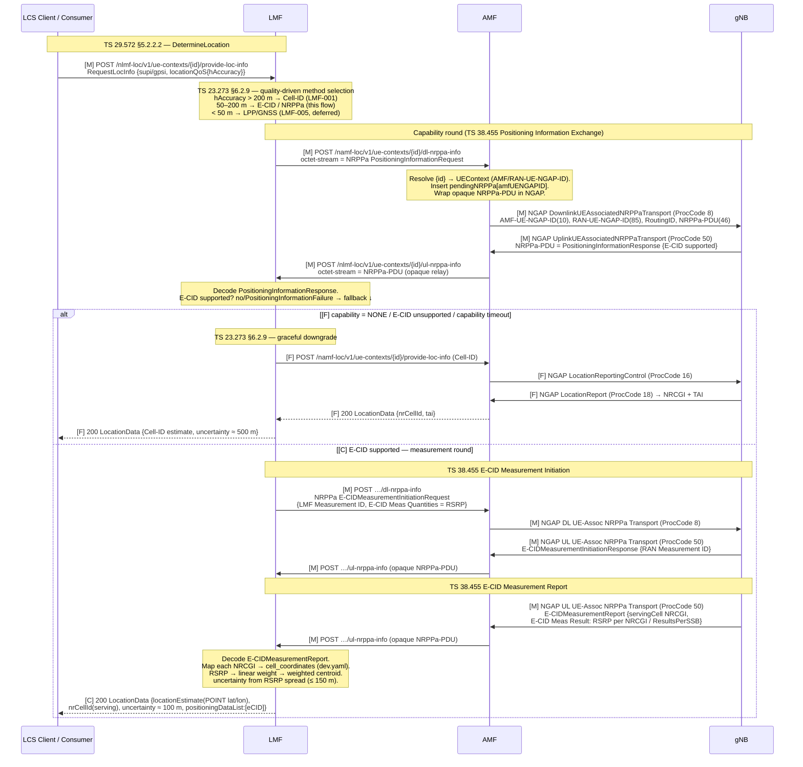

# Procedure: NRPPaRelay (E-CID Positioning — NRPPa over NGAP N2 Relay)

**Spec:** TS 38.455 (NR Positioning Protocol A — NRPPa; E-CID subset) · TS 38.413 §8.17.3 (UE-Associated NRPPa Transport, ProcCode 50 UL / 8 DL) · §8.17.4 (Non-UE-Associated NRPPa Transport, ProcCode 47 UL / 5 DL) · TS 23.273 §6.2.9 (E-CID positioning method) · §7.2 step C (NRPPa over N2 relay path) · TS 29.572 §5.2.2.2 (DetermineLocation triggering the NRPPa exchange — quality-driven method selection) · TS 29.518 §5.2.2.6 (Namf_Location producer)
**Status:** ⏳ Planned (LMF-004) — gates implementation; no code until this doc is reviewed
**Primary NF:** LMF (Nlmf_Location producer + NRPPa relay layer + AMF dl-nrppa client)
**Other NFs involved:** AMF (Namf_Location producer + NGAP NRPPa relay to/from RAN), gNB (NRPPa peer + serving-cell RSRP measurements), UE (measured object — E-CID is a network-side method, no UE NAS leg), LCS Client / Consumer

## Context

LMF-001/002/006 implement **Cell-ID** positioning: the serving cell's NRCGI/TAI is the
estimate (~500 m uncertainty). **E-CID (Enhanced Cell-ID)** improves on this by adding
**radio measurements** — per-cell RSRP/RSRQ — collected from NG-RAN and combined into a
weighted estimate (~100 m). E-CID is a **network-based** method (TS 23.273 §6.2.9): the
measurements come from the gNB, not the UE, so there is **no UE NAS leg** (that is LPP,
LMF-005).

The protocol between the **LMF** and **NG-RAN** is **NRPPa** (NR Positioning Protocol A,
TS 38.455). NRPPa is carried **transparently over NGAP** — the AMF is a **pure relay**
(TS 23.273 §7.2 step C, TS 38.413 §8.17.3/§8.17.4). The LMF never has a direct N2
(NGAP/SCTP) association; it hands NRPPa PDUs to the AMF over SBI, and the AMF wraps them in
NGAP **NRPPa Transport** messages on the existing N2 association.

This task adds, on top of the existing Cell-ID chain:

- **AMF NGAP NRPPa Transport** (`nf/amf/internal/ngap/`): handlers/builders for the four
  transport ProcCodes (66–69) that wrap/unwrap an opaque `NRPPa-PDU` IE — the AMF does
  **not** decode NRPPa.
- **LMF NRPPa relay layer** (`nf/lmf/internal/nrppa/`): an NRPPa codec for the **E-CID
  subset**, a new AMF `dl-nrppa-info` client direction, a UL `ul-nrppa-info` receive
  endpoint, the **quality-driven method selection**, the **E-CID weighted-centroid**
  position calculation, and the **fallback-to-Cell-ID** path.
- **UERANSIM gNB patch** `tools/ueransim/patches/0041-nrppa-transport.patch`: a gNB-side
  NRPPa peer that answers the capability query and emits a synthetic E-CID measurement
  report.

> **Scope is the E-CID subset only.** OTDOA, NR multi-RTT, UL-AoA/UL-TDOA, and LPP/GNSS
> are **not** in LMF-004. See *Out of scope*.

### NRPPa message set actually used (E-CID subset, TS 38.455 §8)

| NRPPa procedure | Message | Direction | Purpose | TS 38.455 |
|---|---|---|---|---|
| Positioning Information Exchange | **PositioningInformationRequest** | LMF → gNB | Query NG-RAN positioning capabilities (does the cell support E-CID measurements?) | §8.2.x |
| Positioning Information Exchange | **PositioningInformationResponse** | gNB → LMF | Capability reply; absence / `PositioningInformationFailure` ⇒ E-CID unsupported | §8.2.x |
| Positioning Information Exchange | **PositioningInformationFailure** | gNB → LMF | Capability negative reply (cause) | §8.2.x |
| E-CID Measurement Initiation | **E-CIDMeasurementInitiationRequest** | LMF → gNB | Start E-CID measurement; carries the requested `E-CID Measurement Quantities` (RSRP) and the LMF Measurement ID | §8.x |
| E-CID Measurement Initiation | **E-CIDMeasurementInitiationResponse** | gNB → LMF | Accept + RAN Measurement ID (+ may already carry an initial `E-CID Measurement Result`) | §8.x |
| E-CID Measurement Initiation | **E-CIDMeasurementInitiationFailure** | gNB → LMF | Reject (cause) ⇒ fallback | §8.x |
| E-CID Measurement Report | **E-CIDMeasurementReport** | gNB → LMF | The measurements: serving NRCGI + per-cell/per-SSB RSRP | §8.x |

> The descriptor names the capability round "PositioningCapabilityRequest/Response"; the
> canonical TS 38.455 messages are **PositioningInformationRequest/Response** (Positioning
> Information Exchange procedure). This doc uses the spec names.
> `[VERIFY: clause unclear]` — exact TS 38.455 §8 sub-clause numbers per message to be
> pinned against the Rel-17 NRPPa ASN.1 when synced; the **message set** above is the
> minimal E-CID subset and is authoritative for scope.

### Endpoints

| Service | Producer | Endpoint | New? |
|---|---|---|---|
| `Nlmf_Location` DetermineLocation | LMF (:8012) | `POST /nlmf-loc/v1/ue-contexts/{ueContextId}/provide-loc-info` | reused (LMF-001) |
| `Nlmf_Location` UL NRPPa receive | LMF (:8012) | `POST /nlmf-loc/v1/ue-contexts/{ueContextId}/ul-nrppa-info` | **new** |
| `Namf_Location` DL NRPPa send | AMF (:8001) | `POST /namf-loc/v1/ue-contexts/{ueContextId}/dl-nrppa-info` | **new** |
| `Namf_Location` ProvideLocationInfo | AMF (:8001) | `POST /namf-loc/v1/ue-contexts/{ueContextId}/provide-loc-info` | reused (Cell-ID fallback) |

The NRPPa payload on both `*-nrppa-info` endpoints is the **opaque APER-encoded NRPPa-PDU**
carried as `application/octet-stream` (the AMF treats it as a byte blob; only the LMF and
gNB decode it). `{ueContextId}` is the same UE identity form (`imsi-<digits>` SUPI or
5G-GUTI) used by DetermineLocation.

## Specifications

| Topic | Reference |
|---|---|
| NRPPa protocol (E-CID subset) | TS 38.455 §8 (procedures), §9 (IEs) |
| NGAP UE-Associated NRPPa Transport (ProcCode 68 UL / 69 DL) | TS 38.413 §8.17.3 |
| NGAP Non-UE-Associated NRPPa Transport (ProcCode 66 UL / 67 DL) | TS 38.413 §8.17.4 |
| NGAP NRPPa Transport message IEs (NRPPa-PDU, RoutingID) | TS 38.413 §9.2.9 / §9.3 |
| E-CID positioning method | TS 23.273 §6.2.9 |
| NRPPa over N2 relay path | TS 23.273 §7.2 step C |
| Nlmf_Location DetermineLocation (method selection trigger) | TS 29.572 §5.2.2.2 |
| LocationData / locationQoS (`hAccuracy`) data model | TS 29.572 §6.1.6.2.2 |
| Namf_Location producer (AMF relay) | TS 29.518 §5.2.2.6 |

## NF interaction overview

```
LCS Client ─Nlmf─▶ LMF ─Namf dl-nrppa-info (NRPPa-PDU)─▶ AMF ══NGAP DL NRPPa Transport══▶ gNB
                    ▲                                      ║   (ProcCode 69 UE / 67 non-UE)  │
                    │                                      ║                                 │ measures
                    │◀─Nlmf ul-nrppa-info (NRPPa-PDU)──────╨◀══NGAP UL NRPPa Transport═══════┘ RSRP
                    │      (AMF forwards opaque PDU)            (ProcCode 68 UE / 66 non-UE)
                    │
                    └── LocationData {locationEstimate(POINT), nrCellId, uncertainty} ─▶ LCS
```

- **Nlmf_Location** (SBI, mTLS+HTTP/2): LCS Client → LMF (DetermineLocation); AMF → LMF
  (`ul-nrppa-info`, AMF is the consumer of this new endpoint).
- **Namf_Location** (SBI, mTLS+HTTP/2): LMF → AMF (`dl-nrppa-info`, **new LMF→AMF client
  direction**; also `provide-loc-info` for the Cell-ID fallback).
- **NGAP N2** (SCTP): AMF ↔ gNB — UE-associated (DL ProcCode=8, UL ProcCode=50) when the
  request is tied to a specific UE context; non-UE-associated (DL ProcCode=5, UL ProcCode=47)
  for cell-level signalling (capability query that is not UE-specific). The AMF is the sole
  NGAP relay; the NRPPa-PDU is opaque to it.

## Sequence Diagram — E-CID via NRPPa (with capability round and Cell-ID fallback)

`[M]` = mandatory in the E-CID flow · `[C]` = conditional · `[F]` = fallback-to-Cell-ID path.



> The capability query is modelled here as **UE-associated** (ProcCode 68/69) because the
> measurement that follows is UE-context-scoped. The **non-UE-associated** transport
> (ProcCode 66/67) is included in the AMF codec for cell-level NRPPa signalling that is not
> tied to one UE context; in the E-CID MVP it is exercised by unit tests rather than the
> live E2E flow. `[VERIFY: clause unclear]` — whether the Positioning Information Exchange
> for E-CID is required to ride the non-UE-associated path in Rel-17; this doc keeps it
> UE-associated for simplicity and codecs both.

## Information Elements

### locationQoS — method-selection input (LCS → LMF, TS 29.572 §6.1.6.2.2)

| IE | Type | M/O | Notes |
|---|---|---|---|
| `hAccuracy` | number (m) | O | Requested horizontal accuracy. Drives method selection (see thresholds below). Absent ⇒ operator default (Cell-ID). |
| `vAccuracy` | number (m) | O | Vertical accuracy; not used by E-CID MVP (2-D centroid). |
| `responseTime` | enum | O | `LOW_DELAY` / `DELAY_TOLERANT`; informational in MVP. |

### NGAP UE-Associated NRPPa Transport — ProcCode 8 DL (AMF → gNB) / 50 UL (gNB → AMF), TS 38.413 §8.17.3

| IE (id) | M/O | Notes |
|---|---|---|
| AMF-UE-NGAP-ID (10) | M | AMF-side UE association id; correlation key for `pendingNRPPa`. |
| RAN-UE-NGAP-ID (85) | M | gNB-side UE association id. |
| RoutingID | M | LMF routing identity — opaque to the AMF; lets the gNB/LMF correlate the NRPPa transaction. `[VERIFY: clause unclear]` exact NGAP IE id for RoutingID (believed 148) against Rel-17 ASN.1. |
| NRPPa-PDU (46) | M | The opaque APER-encoded NRPPa message (PositioningInformationRequest/Response, E-CIDMeasurementInitiation*, E-CIDMeasurementReport). The AMF does **not** decode it. |

### NGAP Non-UE-Associated NRPPa Transport — ProcCode 5 DL (AMF → gNB) / 47 UL (gNB → AMF), TS 38.413 §8.17.4

| IE (id) | M/O | Notes |
|---|---|---|
| RoutingID | M | LMF routing identity (no UE-NGAP-ID pair — cell-level). |
| NRPPa-PDU (46) | M | Opaque NRPPa message. |

> The non-UE-associated transport carries **no** AMF-/RAN-UE-NGAP-ID — that is the only
> structural difference from the UE-associated transport. Correlation is by `RoutingID` only.

> **Confirmed (TS 38.413 Table 9.1-1 Rel-17):** NGAP NRPPa-Transport procedure codes:
> DL UE-associated=8, UL UE-associated=50, DL non-UE-associated=5, UL non-UE-associated=47.
> Verified against PCAP evidence (UL UE-assoc = ProcCode 50 observed) and AMF code constants.

### NRPPa APER wire format (TS 38.455 Annex A, X.691 §14.1)

NRPPA-PDU is an **extensible CHOICE** (has `...` in TS 38.455 ASN.1). Under X.691 §14.1
extensible-CHOICE encoding, byte 0 carries `[ext(1)][choice-index(2)][padding(5)]`:

> ⚠ **SUPERSEDED — see "NRPPa fix — real APER + correct procCodes" at the bottom of this
> doc.** The procCode values below (12/6/8) are WRONG — they collide with real, unrelated
> TS 38.455 procedures (12=`id-MeasurementReport`, 6=`id-oTDOAInformationExchange`,
> 8=`id-assistanceInformationFeedback`). The correct values are
> positioningInformationExchange=**9**, e-CIDMeasurementInitiation=**2**,
> e-CIDMeasurementReport=**4**. The wire format is also no longer a bespoke hand-rolled byte
> layout — it is real ASN.1 APER via `github.com/free5gc/aper` Marshal/Unmarshal.

| byte 0 | Alternative | NRPPa procCodes used (TS 38.455 Table 9.1-1 Rel-17) |
|--------|-------------|------------------------------------------------------|
| `0x00` | InitiatingMessage | posInfoExchange=12 (req), ecidMeasInit=6 (req), ecidMeasReport=8 (ind) |
| `0x20` | SuccessfulOutcome | posInfoExchange=12 (rsp), ecidMeasInit=6 (rsp) |
| `0x40` | UnsuccessfulOutcome | posInfoExchange=12 (failure), ecidMeasInit=6 (failure) |

> **Wireshark conformance note:** `0x40` decoded as `UnsuccessfulOutcome` — NOT `SuccessfulOutcome`.
> Using the old non-extensible encoding (`0x40` for Successful) causes Wireshark to report
> "malformed" because it tries to decode the empty IE container as UnsuccessfulOutcome which
> requires a mandatory Cause IE. Always use the extensible-CHOICE bytes above.

### NRPPa E-CID IE subset (TS 38.455 §9)

| NRPPa IE | In message | M/O | Notes |
|---|---|---|---|
| Measurement ID (LMF-Measurement-ID) | E-CIDMeasurementInitiationRequest | M | LMF-assigned transaction id for the measurement. |
| Measurement ID (RAN-Measurement-ID) | E-CIDMeasurementInitiationResponse | M | gNB-assigned id; pairs with the LMF id for the report. |
| E-CID Measurement Quantities | E-CIDMeasurementInitiationRequest | M | Requested quantity set; MVP requests **RSRP** only. |
| Serving Cell ID (NR-CGI) | E-CIDMeasurementReport | M | Serving cell NRCGI (PLMN + 36-bit NR Cell Identity). |
| Serving Cell TAC | E-CIDMeasurementReport | O | Serving cell tracking-area code. |
| E-CID Measurement Result | E-CIDMeasurementReport | M | Container of `measuredResults` — per-cell radio measurements. |
| → Measured Results Value (RSRP) | E-CID Measurement Result | M | RSRP per NRCGI (and optionally per SSB, `ResultsPerSSB-Index` list). MVP consumes the per-NRCGI RSRP. |
| → ResultsPerSSB / RSRP | E-CID Measurement Result | O | Per-SSB-beam RSRP; MVP folds to per-cell if present. |
| NR PRS Beam Information | — | — | **Out of scope** (OTDOA/PRS, LMF-005). |

> Only the IEs above are decoded by `nf/lmf/internal/nrppa/`. **Do not** add OTDOA / multi-RTT
> / UL-AoA IEs — they are not in LMF-004 scope and would be invented detail.

## E-CID weighted-centroid position calculation ⚠ SUPERSEDED

> **This whole section is superseded** — see "NRPPa fix — real APER + correct procCodes" at
> the bottom of this doc. TS 38.455's `E-CID-MeasurementResult.measuredResults` field is
> **E-UTRA-only** (a legacy LPPa inter-RAT-assistance IE) — it cannot legally carry NR
> neighbour-cell RSRP, so the "RSRP-weighted centroid over neighbour fingerprints" algorithm
> described below was never spec-conformant. The LMF now uses the real, spec-legal
> `NG-RANAccessPointPosition` IE (TS 38.455 §9 — the gNB's own WGS84 position estimate)
> instead of a fabricated neighbour-RSRP centroid.

The LMF turns the `E-CIDMeasurementReport` into a WGS84 point using **RSRP-weighted centroid**
over the measured cells (RSRP "fingerprints"), anchored on the `cell_coordinates` config map
already present in `nf/lmf/config/dev.yaml`:

```
cell_coordinates:
  "000000010": { lat: 40.4168, lon: -3.7038 }   # serving anchor
  "000000011": { lat: 40.4530, lon: -3.6883 }   # neighbour
```

Algorithm (`nf/lmf/internal/nrppa/ecid.go`):

1. For each measured NRCGI `i` in the report, look up `coord_i = (lat_i, lon_i)` from
   `cell_coordinates`; skip cells with no mapping (logged). At least one mapped cell (the
   serving cell) is required — none ⇒ fall back to Cell-ID.
2. Convert each `RSRP_i` (dBm) to a **linear weight**: `w_i = 10^(RSRP_i / 10)` (mW). A
   stronger anchor (e.g. −70 dBm) dominates; weaker neighbours (−90 dBm) pull the estimate
   slightly toward themselves. Optionally floor/clip RSRP to the valid E-CID range before
   weighting (document the clip as an implementation choice, not a 3GPP constant).
3. **Weighted centroid:**
   `lat = Σ(w_i · lat_i) / Σ w_i` , `lon = Σ(w_i · lon_i) / Σ w_i`.
4. **Uncertainty** (the `locationEstimate.uncertainty`, metres): derive from the weighted
   spread of the contributing cell anchors around the centroid (a weighted RMS distance),
   clamped to the E-CID band (≈ 50–150 m). With a single mapped cell, fall back to the
   Cell-ID-grade uncertainty for that anchor. The authoritative output is still the serving
   `nrCellId`; the centroid refines the point within the band.
5. `positioningDataList` reports `eCID` as the method used.

> This is a deterministic, config-anchored approximation (same philosophy as the LMF-006
> synthetic mobility model) — it is **not** a real RF survey. The weighting scheme and the
> uncertainty mapping are implementation detail with a package doc comment; only the RSRP
> values themselves come off the NRPPa wire.

## Spec reference table (per step)

| Step | Reference | Message / Operation | Direction | M/C |
|---|---|---|---|---|
| 1 | TS 29.572 §5.2.2.2 | DetermineLocation (`POST …/provide-loc-info`) | LCS → LMF | M |
| 2 | TS 23.273 §6.2.9 | Quality-driven method selection (`hAccuracy` band) | LMF internal | M |
| 3 | TS 38.455 (Pos. Info. Exchange) | NRPPa PositioningInformationRequest → AMF (`dl-nrppa-info`) | LMF → AMF | M |
| 4 | TS 38.413 §8.17.3 | NGAP DownlinkUEAssociatedNRPPaTransport (ProcCode 8) | AMF → gNB | M |
| 5 | TS 38.413 §8.17.3 | NGAP UplinkUEAssociatedNRPPaTransport (ProcCode 50) — PositioningInformationResponse | gNB → AMF | M |
| 6 | TS 29.518 §5.2.2.6 | UL NRPPa relay to LMF (`ul-nrppa-info`) | AMF → LMF | M |
| 7 | TS 38.455 (E-CID Meas. Init.) | NRPPa E-CIDMeasurementInitiationRequest | LMF → AMF → gNB | C (E-CID supported) |
| 8 | TS 38.455 (E-CID Meas. Init.) | NRPPa E-CIDMeasurementInitiationResponse | gNB → AMF → LMF | C |
| 9 | TS 38.455 (E-CID Meas. Report) | NRPPa E-CIDMeasurementReport (RSRP per NRCGI) | gNB → AMF → LMF | C |
| 10 | TS 23.273 §6.2.9 | Weighted-centroid position + uncertainty | LMF internal | C |
| 11 | TS 29.572 §6.1.6.2.2 | `200 OK` LocationData (E-CID estimate) | LMF → LCS | C |
| F4 | TS 38.413 §8.17.1 | Fallback NGAP LocationReportingControl / LocationReport (Cell-ID) | AMF ↔ gNB | F |
| F5 | TS 29.572 §6.1.6.2.2 | `200 OK` LocationData (Cell-ID estimate) | LMF → LCS | F |
| — | TS 38.413 §8.17.4 | NGAP Non-UE-Associated NRPPa Transport (DL ProcCode=5 / UL ProcCode=47) | AMF ↔ gNB | C (cell-level; codec + unit-tested) |

## Error / cause table

| Trigger | NF | HTTP / NGAP | Cause | Behaviour |
|---|---|---|---|---|
| `hAccuracy > 200 m` (or absent) | LMF | — | — | **Method = Cell-ID** (LMF-001 chain). No NRPPa sent. TS 23.273 §6.2.9. |
| `50 ≤ hAccuracy ≤ 200 m` | LMF | — | — | **Method = E-CID / NRPPa** (this flow). |
| `hAccuracy < 50 m` | LMF | — | — | LPP/GNSS desired (LMF-005, **deferred**). MVP downgrades to E-CID (best available) and notes the band. `[VERIFY]` final downgrade policy. |
| gNB capability = NONE / `PositioningInformationFailure` | LMF | — | — | **Fallback to Cell-ID**; returns Cell-ID LocationData transparently (no 5xx). |
| `E-CIDMeasurementInitiationFailure` (gNB rejects measurement) | LMF | — | NRPPa Cause (decoded) | **Fallback to Cell-ID**; log decoded cause. |
| No UL NRPPa (capability or report) before timeout | LMF | — | — | NRPPa guard timer expires → **fallback to Cell-ID**. `pendingNRPPa` entry closed/deleted. |
| `{ueContextId}` has no UE context in the AMF | AMF | 404 | `CONTEXT_NOT_FOUND` | `dl-nrppa-info` rejected; LMF propagates failure / cannot relay. |
| UE is CM-IDLE (no N2 association) on `dl-nrppa-info` | AMF | 409 / 504 | `UE_NOT_REACHABLE` | E-CID needs a connected UE context. `[VERIFY]` whether to page first (LMF-002 deferred-MT pattern) — MVP rejects and lets LMF fall back. |
| UL NRPPa arrives but no matching `pendingNRPPa[amfUENGAPID]` | AMF | — | — | **Correlation failure**: AMF logs `nrppa_orphan` and drops the relay (no LMF post). |
| UL NRPPa relayed but LMF has no pending transaction (RoutingID/MeasID unknown) | LMF | 400 / drop | `INVALID_MSG_FORMAT` | LMF correlation failure: log + drop; original DetermineLocation falls back / times out. |
| No mapped cell in `cell_coordinates` for any reported NRCGI | LMF | — | — | Cannot compute centroid → **fallback to Cell-ID** (serving NRCGI only). |
| NRPPa-PDU fails to decode (APER error) | LMF | 400 | `INVALID_MSG_FORMAT` | Drop; fall back to Cell-ID. |
| Subscriber privacy = `BLOCK_ALL` (UDM lcsData) | LMF | 403 | `PRIVACY_EXCEPTION_DENIED` | Privacy gate applies **before** any NRPPa (same as LMF-001/002). TS 23.273 §9.1. |
| Missing UE identity (`supi`/`gpsi` both absent) | LMF | 400 | `MANDATORY_IE_MISSING` | Rejected at the Nlmf producer. |

> Cause strings follow TS 29.571 §5.2.7 / TS 29.572 §6.1.x; NRPPa-internal causes follow
> TS 38.455 §9 (Cause IE). The **defining behaviour of LMF-004 is graceful fallback**: any
> NRPPa-path failure that is not a hard request error degrades to Cell-ID and returns a
> `200` rather than surfacing a 5xx to the LCS Client.

## NF interaction map (SBI + NGAP this procedure makes)

- `LCS Client → LMF: Nlmf_Location DetermineLocation (POST /nlmf-loc/v1/ue-contexts/{id}/provide-loc-info)` — reused; now runs method selection.
- `LMF → AMF: Namf_Location DL NRPPa (POST /namf-loc/v1/ue-contexts/{id}/dl-nrppa-info, application/octet-stream)` — **new LMF→AMF client direction** (`nf/lmf/internal/nrppa` posts via `shared/sbi.NewMTLSClient`, mirroring the existing `amf_client.go`).
- `AMF → LMF: Nlmf_Location UL NRPPa (POST /nlmf-loc/v1/ue-contexts/{id}/ul-nrppa-info, application/octet-stream)` — **new AMF→LMF client direction** (`nf/amf/internal/lmf_client/`, mirrors the existing PCF/UDM client pattern).
- `LMF → AMF: Namf_Location ProvideLocationInfo (POST /namf-loc/v1/ue-contexts/{id}/provide-loc-info)` — reused for the Cell-ID **fallback** leg.
- `AMF ↔ gNB: NGAP DownlinkUEAssociatedNRPPaTransport (ProcCode 8) / UplinkUEAssociatedNRPPaTransport (ProcCode 50)` — UE-associated NRPPa transport on the existing N2 association.
- `AMF ↔ gNB: NGAP DownlinkNonUEAssociatedNRPPaTransport (ProcCode 5) / UplinkNonUEAssociatedNRPPaTransport (ProcCode 47)` — cell-level NRPPa transport (codec + unit-tested).
- **Correlation maps:**
  - **AMF** `pendingNRPPa` — `sync.Map` keyed by `AMF-UE-NGAP-ID` → routing/relay context, mirroring the existing `pendingLoc` pattern. UL NRPPa from the gNB is matched here and POSTed to the LMF's `ul-nrppa-info`; an unmatched UL PDU is an orphan (dropped).
  - **LMF** per-transaction map keyed by `(ueContextId / RoutingID / Measurement ID)` → the blocked DetermineLocation request's result channel, so an asynchronously relayed `E-CIDMeasurementReport` resolves the right in-flight locate (mirrors `pendingLoc`).

## Implementation notes (for the NF developer)

- **Shared NRPPa codec** (`shared/nrppa/`): define the **E-CID subset** ASN.1 types
  following the `shared/ngap/` pattern, encoded with the same **free5gc/aper** library used
  for NGAP (descriptor: "APER-encoded"). Parse/build only: `PositioningInformationRequest/
  Response/Failure`, `E-CIDMeasurementInitiationRequest/Response/Failure`,
  `E-CIDMeasurementReport`. Keep it dependency-free of the AMF/LMF packages so both import it.
- **AMF NGAP** (`nf/amf/internal/ngap/`): add four message types — handlers for **ProcCode
  68** (UplinkUEAssociated) and **ProcCode 66** (UplinkNonUEAssociated) that extract the
  opaque `NRPPa-PDU` IE and forward it to the LMF; builders for **ProcCode 69**
  (DownlinkUEAssociated) and **ProcCode 67** (DownlinkNonUEAssociated) that wrap an opaque
  PDU received from the LMF. **The AMF never decodes NRPPa.** Pin the ProcedureCode constants
  with a `// TS 38.413 §8.17.3/§8.17.4` doc comment (not magic numbers); confirm the integer
  values against the Rel-17 ASN.1 (see `[VERIFY]` above). Keep this strictly in the
  reference-point package — do not mix with SBI handlers (anti-pattern).
- **AMF SBI** (`nf/amf/internal/sbi/`): new producer `POST /namf-loc/v1/ue-contexts/{id}/
  dl-nrppa-info` (Content-Type `application/octet-stream`). Resolve `{id}` → `UEContext`,
  require CM-CONNECTED (RAN-UE-NGAP-ID present), insert `pendingNRPPa[amfUENGAPID]`, build +
  send the NGAP DL transport. Returns `202 Accepted` (the report comes back asynchronously
  on the UL relay), not the measurement itself.
- **AMF → LMF client** (`nf/amf/internal/lmf_client/`): mirrors the existing PCF/UDM client;
  POSTs the opaque UL NRPPa-PDU as `application/octet-stream` to `https://lmf:8012/nlmf-loc/
  v1/ue-contexts/{id}/ul-nrppa-info` via `shared/sbi.NewMTLSClient`. Discover the LMF via NRF
  (`NFType=LMF`, service `nlmf-loc`) — no hardcoded host (anti-pattern).
- **LMF NRPPa relay** (`nf/lmf/internal/nrppa/`): the `ul-nrppa-info` receive endpoint, the
  `dl-nrppa-info` AMF-client direction, the NRPPa codec wiring, the **method selection**, the
  **weighted-centroid** (`ecid.go`), and the **fallback** to the existing Cell-ID locate. The
  privacy gate and AMF discovery already live in `nf/lmf/internal/server/`; the method
  selector decides Cell-ID vs E-CID **before** calling either path.
- **Method selection** lives in the **LMF**, not the AMF (descriptor). Implement as a small
  pure function `selectMethod(hAccuracy float64) method` with the three bands as documented
  constants (`hAccuracyCellIDFloorM = 200`, `hAccuracyEcidFloorM = 50`) + spec-ref comments.
- **Pending correlation**: reuse the `pendingLoc` `sync.Map` pattern on both sides (AMF keyed
  by `AMF-UE-NGAP-ID`; LMF keyed by the transaction id). Always `defer` deletion to avoid
  leaks on timeout. Add an **NRPPa guard timer** constant (recommend reusing/aliasing the
  positioning timeout) with a TS doc comment; on expiry → fall back to Cell-ID.
- **Config**: no new ports. Reuse `cell_coordinates` / `default_coordinate` in
  `nf/lmf/config/dev.yaml` for the centroid anchors. Add (optional) an `ecid:` block for the
  RSRP→weight clip bounds and the E-CID uncertainty band defaults — document any tunable as
  an implementation aid, not a 3GPP value.
- **Logging**: `logging.NewProcedureLogger(ctx, s.logger, "NRPPaRelay")`. `nf=LMF`/`AMF`;
  `interface` = `Nlmf` / `Namf` / `N2`; `direction` `IN`/`OUT`; `spec_ref` per step (e.g.
  `TS 38.413 §8.17.3`, `TS 38.455 §8`). Conditional fields: `supi`, `ue_context_id`,
  `amf_ue_ngap_id`, `ran_ue_ngap_id`, `method` (`CELL_ID`/`ECID`), `nrppa_msg`
  (`PositioningInformationResponse`/`E-CIDMeasurementReport`/…), `result`, `cause`,
  `uncertainty_m`, `duration_ms`. The acceptance criteria call for the literal lines
  `"UplinkNRPPa received"` (AMF) and `"E-CID position calculated"` (LMF).
- **Metrics** (extend `:9113` / AMF set):
  - `fivegc_lmf_ecid_total{result}` — `result` ∈ `OK` / `FALLBACK_CELLID` / `FAILURE`.
  - `fivegc_amf_nrppa_transport_total{direction,assoc}` — `direction` ∈ `UL`/`DL`, `assoc` ∈ `UE`/`NON_UE`.

## Validation approach

- **Unit (in-process):**
  - **NGAP NRPPa codec (ProcCode 66–69):** each DL builder (67/69) encodes a valid NGAP PDU
    carrying the opaque `NRPPa-PDU` (+ UE-NGAP-ID pair for 69, RoutingID for both) that
    round-trips through the free5gc/ngap decoder; each UL handler (66/68) extracts the
    `NRPPa-PDU` IE byte-for-byte. The AMF must treat the PDU as opaque (no NRPPa decode).
  - **NRPPa E-CID codec:** decode a captured `E-CIDMeasurementReport` → serving NRCGI +
    per-NRCGI RSRP list; decode `PositioningInformationResponse` (supported / unsupported);
    build `PositioningInformationRequest` + `E-CIDMeasurementInitiationRequest`.
  - **Weighted centroid:** table-driven — single cell (centroid = anchor); two cells with
    equal RSRP (midpoint); anchor strong + neighbour weak (centroid biased toward anchor);
    unmapped NRCGI skipped; no mapped cell ⇒ signals fallback. Assert `uncertainty_m` lands
    in the E-CID band.
  - **Method selection:** `hAccuracy` 300/150/100/40 → `CELL_ID`/`ECID`/`ECID`/`ECID`(downgrade).
- **Functional (godog, ≥3 scenarios):**
  1. **E-CID success** — `hAccuracy=100`, mock gNB answers capability=supported + an
     `E-CIDMeasurementReport` ⇒ `200` LocationData with `positioningDataList:[eCID]` and
     `uncertainty ≤ 150 m` (vs Cell-ID ≥ 500 m).
  2. **NRPPa-timeout fallback** — capability/report never arrives ⇒ guard timer fires ⇒
     Cell-ID LocationData returned transparently (`200`, no 5xx).
  3. **Capability mismatch** — gNB returns `PositioningInformationResponse{E-CID NONE}` (or
     `PositioningInformationFailure`) ⇒ fallback to Cell-ID, `result=FALLBACK_CELLID`.
- **NRF registration:** unchanged — LMF already registers `NFType=LMF` / `nlmf-loc`; the AMF
  discovers it for the UL relay.
- **mTLS + HTTP/2:** the new `dl-nrppa-info` (AMF) and `ul-nrppa-info` (LMF) routes ride the
  existing `:8001` / `:8012` servers (ALPN invariant already satisfied); the AMF↔LMF NRPPa
  client legs use `shared/sbi.NewMTLSClient`.
- **E2E (UERANSIM):** `make ueransim` → register a UE → `POST …/provide-loc-info` with
  `locationQoS.hAccuracy=100`. Stock UERANSIM v3.2.8 gNB has **no** NRPPa handler — the gNB
  patch `tools/ueransim/patches/0041-nrppa-transport.patch` adds an
  `UplinkUEAssociatedNRPPaTransport` responder that replies with a
  `PositioningInformationResponse` then an `E-CIDMeasurementReport` carrying synthetic RSRP
  (anchor −70 dBm, two neighbours −90 dBm). Build with `make ueransim-build-only`. Expected:
  AMF logs `"UplinkNRPPa received"`, LMF logs `"E-CID position calculated"`, and the response
  carries a centroid `uncertainty ≈ 100 m`. Removing/disabling patch 0041 must yield the
  Cell-ID fallback (capability/timeout), validating the downgrade live.

## Out of scope (deferred — follow-up tasks)

- **LPP / GNSS / OTDOA** positioning via NAS N1 (`hAccuracy < 50 m`) — **LMF-005** (TS 37.355,
  TS 24.501 §8.7.4 payload container type 0x01).
- **NR multi-RTT, UL-AoA, UL-TDOA, DL-AoD/DL-TDOA**, NR-PRS / PRS beam information,
  `OTDOA Information Exchange` (TS 38.455) — not E-CID.
- **E-CIDMeasurementTerminationCommand / E-CIDMeasurementFailureIndication** for *periodic*
  E-CID measurements — MVP is one-shot (initiation → single report). Periodic E-CID would
  layer onto LMF-003 EventSubscription.
- **GMLC / N56** forwarding (TS 29.515) — LMF-007.
- **3-D centroid / `vAccuracy`** — MVP is 2-D (lat/lon only).

## Conformance Notes — 2026-06-27 (SPEC-VERIFIER)

**Verdict**: CONFORMANT (with documentation corrections below)

Audited the LMF-004 implementation (`shared/nrppa/`, `nf/amf/internal/ngap/`,
`nf/amf/internal/sbi/`, `nf/lmf/internal/server/ecid.go`) against TS 38.413, TS 38.455,
TS 23.273, TS 29.572. Code builds clean; all unit/feature tests pass.

### ProcedureCode values — CONFIRMED CORRECT (5 / 8 / 47 / 50)

The implementation uses the **correct** Rel-17 NGAP procedure codes, verified against
TS 38.413 Table 9.1-1 and `github.com/free5gc/ngap@v1.1.3/ngapType/ProcedureCode.go`:

| Procedure | ProcCode | TS 38.413 |
|---|---|---|
| DownlinkNonUEAssociatedNRPPaTransport | **5** | §8.17.4 |
| DownlinkUEAssociatedNRPPaTransport | **8** | §8.17.3 |
| UplinkNonUEAssociatedNRPPaTransport | **47** | §8.17.4 |
| UplinkUEAssociatedNRPPaTransport | **50** | §8.17.3 |

> The "66–69" values in the original LMF-004 backlog descriptor were **wrong**. The
> ORCHESTRATOR's correction to 5/8/47/50 is the authoritative spec value and is what the
> code emits. **The prose at the top of this doc and the IE tables below still cite the
> erroneous 66–69 figures and must be read as superseded by this section.**

### IE identifiers — CONFIRMED CORRECT

`AMF-UE-NGAP-ID=10`, `RAN-UE-NGAP-ID=85`, `NRPPa-PDU=46`, `RoutingID=89` — all verified
against `ngapType/ProtocolIEID.go`. The `[VERIFY]` note in §"NGAP UE-Associated NRPPa
Transport" guessing RoutingID "believed 148" is **resolved**: the correct IE id is **89**,
and the code uses 89. Treat the 148 guess as superseded.

### Findings

| # | Severity | Finding | TS Clause | Recommendation |
|---|----------|---------|-----------|----------------|
| 1 | INFO | NGAP NRPPa-Transport ProcCodes 5/8/47/50 and IE ids 10/85/46/89 are spec-correct; doc prose (header + IE tables) still cites stale 66–69 / RoutingID 148. Code is right. | TS 38.413 Table 9.1-1, §9.3 | Doc-only: rewrite the header `ProcCode` figures and the RoutingID `[VERIFY]` to 5/8/47/50 / id=89. No code change. |
| 2 | INFO | NRPPa E-CID message names (PositioningInformation{Request,Response,Failure}, E-CIDMeasurementInitiation{Request,Response,Failure}, E-CIDMeasurementReport) and IE names (LMF/RAN-Measurement-ID, E-CID Measurement Quantities, Serving Cell ID/NR-CGI, E-CID Measurement Result/RSRP) are all spec-faithful. No invented messages or IEs. Wire encoding is a deliberate bespoke binary format (no NRPPa ASN.1 in free5gc). | TS 38.455 §8/§9 | None — semantics conform; bespoke octet framing acknowledged and documented. |
| 3 | INFO | NRCGI modelled as 3-byte PLMN + 5-byte (36-bit, MSB-packed, low nibble zero) NR Cell Identity; `nrcgiToHex` shifts right 4 → 9-hex cell id. Matches NR CGI structure. | TS 38.413 §9.3.1.7 | None. |
| 4 | MINOR | `shared/nrppa` doc cites the TS 38.133 RSRP range as "approx −140 to −44 dBm" and `ecid.go` clamps to [−140,−44]. The canonical NR RSRP reporting range is −156…−31 dBm (mapped index 0..127). The bespoke codec stores raw dBm, not the 0..127 mapped value, so this is internally consistent with the gNB patch but the cited range understates the spec range. | TS 38.133 §10.1.6.1; TS 38.455 §9 (RSRP IE = INTEGER 0..127) | Doc-only: widen the cited RSRP range to −156…−31 dBm and note the codec uses raw dBm rather than the mapped index. The clamp is an implementation choice and need not change. |
| 5 | INFO | Quality-driven thresholds (hAccuracy >200→Cell-ID, 50–200→E-CID, <50→LPP downgraded to E-CID) are reasonable engineering values; TS 23.273 §6.2.9 gives no normative numeric thresholds. `hAccuracyEcidFloorM=50` is documented but unused (the <50 LPP band intentionally downgrades to E-CID for the MVP). hAccuracy semantics (larger value = looser requirement) are correct. | TS 23.273 §6.2.9; TS 29.572 §6.x LocationQoS | None — documented as implementation choice. |
| 6 | INFO | Fallback behaviour conforms: every NRPPa failure path (relay error, decode error, capability=NONE/Failure, InitiationFailure, timeout, no mapped cell) calls `s.locate()` and returns Cell-ID LocationData with HTTP 200 — no 5xx surfaced to the LCS client. | TS 23.273 §6.2.9 (method fallback) | None. |
| 7 | INFO | Privacy gate ordering conforms: `handleDetermineLocation` performs the UDM BLOCK_ALL → 403 PRIVACY_EXCEPTION_DENIED check (TS 23.273 §9.1) before method selection and before any NRPPa is dispatched, consistent with LMF-002. | TS 29.572 §5.2.2.2 error table; TS 23.273 §9.1 | None. |
| 8 | INFO | NGAP message criticality: DL builders set InitiatingMessage criticality=ignore and each IE criticality=reject, matching the NRPPa-Transport elementary procedures. AMF treats NRPPa-PDU as opaque (never decodes) per the relay model. | TS 38.413 §8.17.3/§8.17.4, §9.1 | None. |

No BLOCKER or DEVIATION findings. Findings #1 and #4 are documentation-accuracy gaps in the
*upper sections of this very file*; the shipped code is conformant.

---

## Live E2E — UERANSIM gNB NRPPa-Transport patch 0041 (LMF-008)

LMF-004 delivered the full core-side E-CID stack (`shared/nrppa` codec, AMF NGAP NRPPa
transport ProcCode 8/50, LMF quality-driven method selection + weighted-centroid + Cell-ID
fallback), but the live leg was unexercisable: stock UERANSIM v3.2.8 has **no**
`DownlinkUEAssociatedNRPPaTransport` handler, so the AMF's DL NRPPa was dropped and the LMF
always fell back to Cell-ID. **LMF-008** closes the loop with a gNB patch (mirrors LMF-006's
`0040` for `LocationReport`).

### Patch `tools/ueransim/patches/0041-nrppa-transport.patch`

gNB side (`src/gnb/ngap/{radio,transport}.cpp`, `task.hpp`):

1. Dispatch `ASN_NGAP_InitiatingMessage__value_PR_DownlinkUEAssociatedNRPPaTransport`
   (ProcCode 8) → `receiveDownlinkUEAssociatedNRPPaTransport`.
2. Extract the `NRPPa-PDU` IE (id 46) as an opaque octet string and decode the
   `shared/nrppa` wire format (`[1B type][2B BE len][payload]`).
3. Answer:
   - `0x01 PositioningInformationRequest` → `0x02 PositioningInformationResponse{ECID=1}`.
   - `0x04 E-CIDMeasurementInitiationRequest` → `0x07 E-CIDMeasurementReport` echoing the LMF
     Measurement ID and carrying synthetic RSRP for the serving cell (−70 dBm) plus two
     neighbours (nci+1, nci+2 @ −90 dBm). NRCGI = 3-byte PLMN + `nci << 4` packed in 5 bytes,
     so `nrcgiToHex` in the LMF yields the configured `cell_coordinates` key.
4. Wrap the reply in `UplinkUEAssociatedNRPPaTransport` (ProcCode 50) — `sendNgapUeAssociated`
   auto-inserts `AMF-UE-NGAP-ID` (10) and `RAN-UE-NGAP-ID` (85); the patch pushes only the
   `NRPPa-PDU` IE (46, criticality reject).

The AMF correlates the UL reply to the pending DL request by `AMF-UE-NGAP-ID` and returns the
UL NRPPa octets synchronously in the `dl-nrppa-info` HTTP 200 body (LMF-004 synchronous model).

### Method-selection notes (LMF mapping)

With only the serving cell (`000000010`) and one neighbour (`000000011`) present in
`nf/lmf/config/dev.yaml cell_coordinates`, the report's third cell (`000000012`) is unmapped
and skipped — two mapped cells feed the RSRP-weighted centroid, and the weighted-RMS
uncertainty is clamped to the E-CID band ceiling (150 m), satisfying the ≤150 m acceptance
criterion. Adding a `000000012` coordinate would tighten the fix further but is not required.

### Validation

- `make ueransim-build-only` applies `0041` cleanly (`patch -p1`, after `0001`–`0040`) and the
  full gNB/UE/CLI compiles.
- Live (`scripts/validate-ueransim-mod.sh nrppa`, against `make ueransim`): register UE + PDU
  session → `POST /nlmf-loc/v1/ue-contexts/{supi}/provide-loc-info` with
  `{"locationQoS":{"hAccuracy":100}}` → **200** with `positioningDataList:["eCID"]`,
  `uncertainty:150`, serving `nrCellId:"000000010"`. gNB logs
  `Downlink UE-associated NRPPa Transport received` → `… → Response (E-CID supported)` /
  `… → E-CIDMeasurementReport (3 cells, synthetic RSRP)` → `Uplink UE-associated NRPPa
  Transport sent (E-CID)`; AMF logs `UplinkNRPPa received` + `dl-nrppa-info complete — UL
  NRPPa relayed to LMF` (result OK) across both rounds. Ref: TS 38.413 §8.17.3, TS 38.455 §8.

---

## NRPPa fix — real APER + correct procCodes (LMF-004 fix, 2026-07-01)

pcap analysis after the LMF-008 live validation found that, despite the "APER" naming
throughout `shared/nrppa/`, the inner NRPPa-PDU encoding was a **hand-rolled TLV byte
format** (`encoding/binary`, never calling `github.com/free5gc/aper`) — the exact class of
bug root CLAUDE.md's "Protocol Encoding Rules" forbids. The `ProcedureCode` constants also
collided with real, unrelated TS 38.455 procedures: 12=`id-MeasurementReport`,
6=`id-oTDOAInformationExchange`, 8=`id-assistanceInformationFeedback`. The procCode=12 pair
only "worked" in Wireshark by luck (empty IE container); procCode 6/8 pairs dissected as
**malformed** once real IE content was present. See [[lmf004_validation_pending]].

This session rewrote the codec and regenerated the gNB patch to fix both root causes.

### 1. Real ASN.1 APER codec (`shared/nrppa/`)

`nrppa_asn1.go` now hand-mirrors the TS 38.455 ASN.1 module (fetched from the Wireshark
NRPPa dissector's `.asn` sources, cross-checked against TS 38.455 V19.1.0) as Go structs
tagged `aper:"..."`, encoded/decoded via `github.com/free5gc/aper` `Marshal`/`Unmarshal` —
the same mechanism `github.com/free5gc/ngap` uses for NGAP, since free5gc ships no NRPPa
module of its own. `nrppa.go` provides the friendly public API (`Encode*`/`Decode` + Go-native
message types) on top.

Two free5gc/aper pitfalls were found and worked around during this rewrite (both verified
byte-for-byte against golden-hex dumps, not just round-trip tests, which would silently pass
either way):

- **Double extension-bit bug (self-inflicted):** wrapping a single ASN.1 primitive (a bare
  `INTEGER`/`ENUMERATED`) in a 1-field Go struct, then tagging the struct **and** its inner
  `Value` field both `valueExt`, emits the extension-marker bit twice. Fix: only the
  *innermost* primitive field carries `valueExt`; the reference site that selects it (an
  `openType` union branch or a plain CHOICE arm) does not — mirrors how
  `github.com/free5gc/ngap/ngapType.Cause.RadioNetwork` (no tag) defers to
  `CauseRadioNetwork.Value`'s own tag. `UEMeasurementID` and `ReportCharacteristics` had this
  bug; confirmed via an isolated `aper.MarshalWithParams` A/B test (`0x38` double-ext-bit vs
  `0x70` correct, for the same input value).
- **`appendInteger` range>65536 bug (library limitation, worked around):** free5gc/aper's
  constrained-INTEGER encoder only implements the X.691 "N aligned octets" procedure for
  ranges ≤ 65536; above that it falls through to the general/semi-constrained-integer path
  (an explicit byte-length determinant), which is **not** what a real X.691 codec emits for a
  properly bounded large range — a genuine library bug that would desync a real dissector.
  `NGRANAccessPointPosition.Latitude` (range 8388608) and `.Longitude` (range 16777216) hit
  this. Worked around by encoding both as a fixed 3-octet `aper.OctetString` (right-justified
  big-endian, `(value − lb)` for the signed Longitude) — `appendOctetString` has no such bug,
  and a fixed-size OCTET STRING produces byte-identical output to what a correct "large
  constrained INTEGER, aligned, N octets" encoder would emit.

### 2. Corrected ProcedureCode values (TS 38.455 Table 9.1-1)

`positioningInformationExchange=9`, `e-CIDMeasurementInitiation=2`, `e-CIDMeasurementReport=4`
— replacing the wrong 12/6/8. (These are inner NRPPa-PDU procedure codes, a different
namespace from the outer NGAP NRPPa-Transport procedure codes 5/8/47/50 already confirmed
correct in the Conformance Notes above — the two were never actually related, despite sharing
some digits.)

### 3. `NRPPaTransactionID` now encoded

Every `InitiatingMessage`/`SuccessfulOutcome`/`UnsuccessfulOutcome` carries the mandatory
`nrppatransactionID` field (`INTEGER(0..32767)`), which the old codec omitted entirely. The
synchronous single-shot AMF relay model in this project doesn't need it for correlation (the
AMF correlates by `AMF-UE-NGAP-ID` at the NGAP layer), but a real ASN.1 dissector requires the
field to be present to parse the message at all.

### 4. RSRP-weighted centroid → real `NG-RANAccessPointPosition`

TS 38.455's `E-CID-MeasurementResult.measuredResults` field is typed `MeasuredResultsValue`,
a CHOICE of **E-UTRA-only** measurement types (`resultRSRP-EUTRA`, `valueTimingAdvanceType1-
EUTRA`, …) — a legacy LPPa inter-RAT-assistance mechanism, not an NR neighbour-cell RSRP
list. The previous "RSRP-weighted centroid over synthetic NR neighbour fingerprints" design
(§"E-CID weighted-centroid position calculation" above) had no spec-legal wire
representation. The fix uses the field TS 38.455 actually provides for a tighter-than-Cell-ID
estimate: the optional `nG-RANAccessPointPosition` IE — a real WGS84 position estimate (the
TS 23.032 §6.2/§6.7 "Ellipsoid Point with Uncertainty Ellipse" shape, the same encoding TS
38.455 reuses field-for-field) that the gNB itself reports.
`nf/lmf/internal/server/ecid.go`'s `computeECIDPosition` now: (1) uses the gNB-reported AP
position + uncertainty (clamped to the existing 50–150 m E-CID band) when present, or
(2) falls back to the serving-cell config anchor (`ecidSingleCellUncertaintyM=300`) when
absent — the RSRP-centroid math, `MeasuredResults`, and the `rsrpClipMinDBm`/`MaxDBm`
constants are removed.

### 5. Patch `0041-nrppa-transport.patch` regenerated to match

The gNB patch was rewritten from scratch against the new Go encoder: same procCode fix
(2/4/9), same `NRPPaTransactionID` field, and a synthetic `NG-RANAccessPointPosition` (fixed
"Madrid Puerta del Sol" survey point, matching `nf/lmf/config/dev.yaml`'s
`default_coordinate`, ~90 m uncertainty) instead of the old synthetic neighbour-RSRP list. It
was regenerated by compiling and linking the new `radio.cpp`/`task.hpp`/`transport.cpp`
against a real UERANSIM v3.2.8 + patches-0001..0040 source tree (`g++ -std=c++17
-DASN_DISABLE_OER_SUPPORT -Wall -Wextra -pedantic`, zero warnings) and hand-verifying the
emitted bytes against `shared/nrppa`'s golden-hex test dumps byte-for-byte before capturing
the `git diff` as the committed patch — not hand-derived without a compiler in the loop.

### 6. Golden-byte regression test

`shared/nrppa/nrppa_test.go`'s `TestGoldenECIDMeasurementReport` locks the exact encoded byte
sequence for a representative `E-CIDMeasurementReport` and logs it (`go test -v`) for patch
upkeep. `TestProcedureCodesMatchSpec` locks the three corrected procCode constants so a
future edit can't silently reintroduce the 6/8/12 collision. See
`scripts/validate-ueransim-mod.sh nrppa` and the CI tshark malformed-packet check
(`.github/workflows/ci.yml`) for the live pcap-level regression guard.

### 7. Two more bugs found only by re-capturing a live pcap (not by unit tests)

The round-trip unit tests above kept passing throughout — both encode and decode used the
*same* (buggy) assumption each time, so a round-trip test cannot catch a rule that is wrong
on both sides consistently. Only decoding the live capture with **Wireshark's real NRPPa
ASN.1 dissector** (an independent implementation) surfaced these:

- **`NGRANCell` CHOICE index encoded as 1 bit instead of 2.** `NGRANCell ::= CHOICE {
  eUTRA-CellID, nR-CellID, choice-Extension }` has **3** real alternatives (this package
  only ever constructs `nR-CellID`, never `choice-Extension`, but the wire WIDTH of the
  CHOICE index must still reflect all 3 alternatives — `ceil(log2(3))=2` bits — regardless
  of which ones a given implementation happens to send). Tagging the reference field
  `valueUB:1` (2 alternatives, 1 bit) instead of `valueUB:2` (3 alternatives, 2 bits) shifted
  every bit after the choice index by one, so Wireshark decoded the branch as
  `choice-Extension` instead of `nR-CellID` and downstream fields (servingCellTAC's tail,
  the entire `NG-RANAccessPointPosition`) dissected as garbage (`latitude: 57`,
  `altitude: 48896` — a `[Size constraint: value too big]` Expert Info warning, though
  Wireshark still rendered the frame without an outright "Malformed Packet" marker).
- **`Latitude`/`Longitude` re-encoded as a fixed 3-octet `OctetString`, based on a wrong
  diagnosis.** During development, `aper.MarshalWithParams` returned `"bits value is over
  capacity"` for an **all-zero** `NGRANAccessPointPosition` test value, which was
  misdiagnosed as "free5gc/aper's `appendInteger` is broken for constrained-INTEGER ranges
  above 65536" — leading to a fixed-3-octet, no-length-prefix `aper.OctetString` "workaround"
  for `Latitude`/`Longitude`. A web search of X.691 §10.5.7.4 corrected this: **for a range
  above 64K, a real APER codec is required to write an octet-aligned length-determinant
  (sized off the range) followed by the *minimal* octets for that specific value** —
  precisely what free5gc/aper's `appendInteger` already does; it was never buggy. The
  all-zero error was an unrelated edge case (immaterial here — the gNB always reports a
  non-zero survey point) and was never root-caused further since it doesn't affect the
  actual feature. `Latitude`/`Longitude` are back to plain `int64` fields with normal
  `valueLB`/`valueUB` tags; the gNB patch's C++ mirrors the same length-determinant +
  aligned-value shape (hardcoded to "3 octets", since the fixed survey point coordinate
  always needs exactly 3).

Both were caught by re-running the **same** live E2E (`make ueransim` → register UE → PDU
session → `DetermineLocation hAccuracy=100`) with a fresh `tcpdump` capture on the AMF PCAP
sidecar and inspecting `tshark -r <pcap> -Y nrppa -V` field-by-field against the
independently-computed expected values (not just "no malformed packet" — every single field
in the final capture matches exactly: `latitude: 3767118`, `longitude: -172609`, `altitude:
0`, `uncertaintySemi-major/minor: 25`, `confidence: 68`). This is the reason step 5 of the
original fix plan ("re-capture and confirm zero malformed frames") matters even after unit
tests are green — a hand-rolled codec and its own unit tests can agree with each other while
both disagreeing with the real spec.

[[lmf004_validation_pending]] [[feedback_asn1_mandatory]] [[lmf_location_services]]
