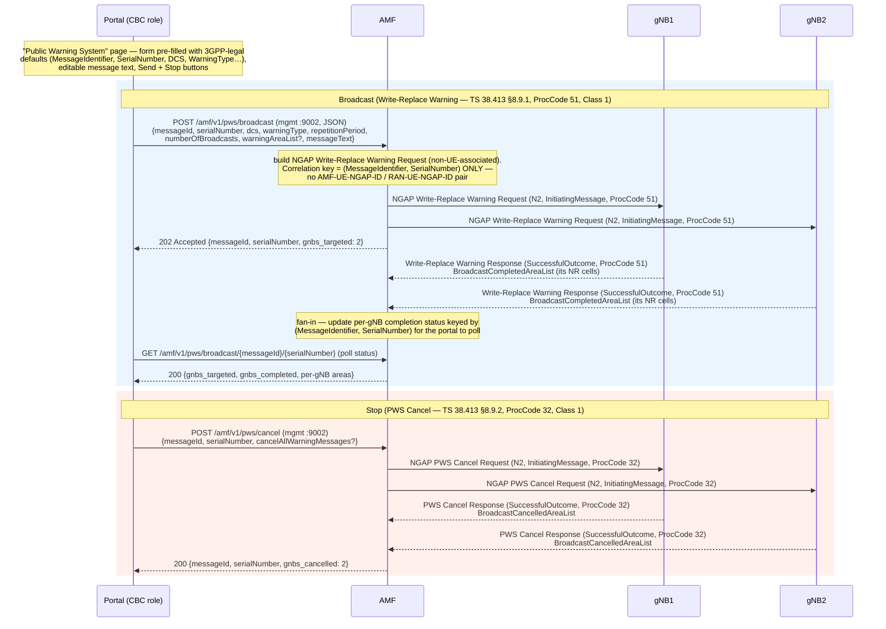

# Public Warning System — CBC control-plane + NGAP Write-Replace Warning / PWS Cancel

**Spec:** TS 23.041 (technical realization of CBS/PWS — Warning Message Contents, Message Identifier
+ Serial Number ranges, Warning Security Information) · TS 38.413 §8.9 (PWS NGAP procedures:
Write-Replace Warning, PWS Cancel, PWS Restart Indication, PWS Failure Indication) ·
TS 23.501 §5.20 (PWS broadcast to all cells in the Warning Area, slice/DNN-agnostic) ·
TS 38.331 (SIB10/11/12 RAN-side broadcast — **out of core scope**) ·
TS 23.038 (CB Data Coding Scheme / GSM 7-bit packing referenced by DataCodingScheme)

## Purpose

The **Public Warning System (PWS)** delivers ETWS (Earthquake and Tsunami Warning System) and
CMAS-style emergency broadcasts to every UE camped on a cell inside a defined **Warning Area**,
independently of any registration, slice, or PDU session (TS 23.501 §5.20). This document covers the
**5GC-side control plane only**: how a warning is authored, encoded into NGAP, fanned out to every
connected gNB, and how per-gNB broadcast completion is tracked. The RAN-side SIB10/11/12 broadcast
(TS 38.331) is explicitly out of scope.

Roles (TS 23.041):

- **CBE / CBC (Cell Broadcast Entity / Centre)** — authors the warning (message identifier, serial
  number, coding scheme, text, warning area) and pushes it toward the core. In 3GPP the CBC is an
  **external** entity.
- **AMF** — receives the warning from the CBC, builds the NGAP **Write-Replace Warning Request**
  (or **PWS Cancel Request**) and delivers it **non-UE-associated (Class 1)** to every gNB whose NG
  association is up, then aggregates the responses.
- **gNB (NG-RAN node)** — schedules the warning on SIB10/11/12 over the air, and reports which of its
  NR cells completed (or cancelled) the broadcast.
- **UE** — receives the SIBs; entirely a RAN/air-interface concern, not modelled by the core.

## Architecture decision — the CBC role is played by the management portal (documented, not invented)

**3GPP does not standardize a single CBC↔AMF wire protocol for 5GC.** TS 23.041 describes the
functional split between CBE, CBC and the core, but the legacy CBC↔MME reference point (**SBc-AP**,
TS 29.168) was defined for EPC and was **not** re-specified as an SBI service for 5GC — the AMF simply
exposes the NGAP PWS procedures toward NG-RAN. There is therefore no standardized message the AMF is
obliged to accept from a CBC.

Consistent with how this codebase already **simulates external roles in-core** — DN-AAA played inside
the SMF (SMF-003, `SecondaryAuthentication.md`), AAA-S played inside the AMF/AUSF (AMF-005 / NSSAA) —
the **CBC role is played directly by the management portal** calling the AMF's internal management API
(`:9002`). No new NF is introduced and **no wire protocol is invented**: the portal→AMF hop is a plain
internal JSON management call (the same `:9002` surface that already drives NW-initiated deregistration,
PDU release, QoS modification), and the **only spec-encoded protocol on the wire is NGAP** (APER over
SCTP) between AMF and gNB. This is documented here so it carries forward into the compliance matrix as a
deliberate simulation, not a gap.

## Specifications

| Topic | Reference |
|---|---|
| PWS functional architecture, Message Identifier / Serial Number ranges, Warning Security Info | TS 23.041 §9.3, §9.4 |
| PWS broadcast to all cells in the Warning Area (slice/DNN-agnostic) | TS 23.501 §5.20 |
| NGAP Write-Replace Warning procedure (Class 1) | TS 38.413 §8.9.1 |
| NGAP PWS Cancel procedure (Class 1) | TS 38.413 §8.9.2 |
| NGAP PWS Restart Indication procedure (Class 2) | TS 38.413 §8.9.3 — *out of MVP scope* |
| NGAP PWS Failure Indication procedure (Class 2) | TS 38.413 §8.9.4 — *out of MVP scope* |
| Write-Replace Warning Request/Response IEs | TS 38.413 §9.2.1.x, §9.3 |
| PWS Cancel Request/Response IEs | TS 38.413 §9.2.1.x, §9.3 |
| CB Data Coding Scheme / GSM 7-bit packing of message contents | TS 23.038 §4, §5 |
| SIB10/11/12 RAN broadcast (out of scope) | TS 38.331 |
| NGAP transport (SCTP, PPID 60) | TS 38.412 §7 |

**ProcedureCodes (both Class 1, non-UE-associated):** WriteReplaceWarning = **51**,
PWSCancel = **32**. Field IDs and procedure codes below are taken from the vendored
`github.com/free5gc/ngap@v1.1.3` `ngapType/ProtocolIEField.go` and are treated as authoritative.

## Sequence Diagram

Legend — mandatory vs conditional per TS 38.413 §8.9:

- **Mandatory** once a broadcast is issued: the Write-Replace Warning Request to each connected gNB
  and one Write-Replace Warning Response per gNB (Class 1 always elicits a response). MessageIdentifier
  + SerialNumber are mandatory in every one of the four messages.
- **Conditional / optional:** WarningAreaList (omit ⇒ broadcast to the whole PLMN area the gNB serves);
  the portal status-poll (a convenience, not a spec message); the PWS Cancel leg (only when the operator
  clicks Stop); `CancelAllWarningMessages` (shortcut alternative to naming areas);
  CriticalityDiagnostics in either response (only on partial IE decode).

## Per-step spec reference

| # | Step | Message / Operation | Direction | Reference | M/O |
|---|------|---------------------|-----------|-----------|-----|
| 1 | Author warning on the PWS portal page (3GPP-legal defaults) | — (UI) | Portal | TS 23.041 §9.4 (IE value ranges) | M |
| 2 | Submit broadcast to AMF mgmt API | `POST /amf/v1/pws/broadcast` | Portal→AMF | internal mgmt (`:9002`), simulated CBC | M |
| 3 | Build + fan out Write-Replace Warning Request to every connected gNB | NGAP Write-Replace Warning Request (ProcCode 51, Class 1) | AMF→gNB(N2) | TS 38.413 §8.9.1 | M |
| 4 | AMF acknowledges submission (target count) | `202 {gnbs_targeted}` | AMF→Portal | internal mgmt | M |
| 5 | Each gNB reports broadcast completion | Write-Replace Warning Response (ProcCode 51, SuccessfulOutcome) w/ BroadcastCompletedAreaList | gNB→AMF(N2) | TS 38.413 §8.9.1 | M |
| 6 | AMF aggregates per-gNB status by (MessageIdentifier, SerialNumber) | status store + poll endpoint | AMF | TS 23.041 §9.3.2 (Serial Number correlation) | M |
| 7 | Operator stops the broadcast | `POST /amf/v1/pws/cancel` | Portal→AMF | internal mgmt | O |
| 8 | Build + fan out PWS Cancel Request | NGAP PWS Cancel Request (ProcCode 32, Class 1) | AMF→gNB(N2) | TS 38.413 §8.9.2 | O (Stop path) |
| 9 | Each gNB reports cancellation | PWS Cancel Response (ProcCode 32, SuccessfulOutcome) w/ BroadcastCancelledAreaList | gNB→AMF(N2) | TS 38.413 §8.9.2 | O (Stop path) |

## Information Elements

Field IDs (the `id-*` numbers) are from `free5gc/ngap@v1.1.3` `ngapType/ProtocolIEField.go`.
Value ranges/semantics are from TS 38.413 §9.3 and TS 23.041 §9.4.

### Write-Replace Warning **Request** (AMF → gNB, InitiatingMessage, ProcCode 51)

| IE | id | Type / range | Presence | MVP default | Reference |
|---|---|---|---|---|---|
| MessageIdentifier | 35 | 16-bit BitString | **M** | operator-set; category-scoped range | TS 23.041 §9.4.1.2.2 |
| SerialNumber | 95 | 16-bit BitString | **M** | geo-scope + message-code + update-number | TS 23.041 §9.4.1.2.1 |
| WarningAreaList | 122 | CHOICE {EUTRACGIListForWarning / NRCGIListForWarning / TAIListForWarning / EmergencyAreaIDList} | O | **TAIListForWarning** covering every configured TAC; omit ⇒ whole gNB area | TS 38.413 §9.3.1.55 |
| RepetitionPeriod | 87 | INTEGER 0..131071 | **M** | 4096 | TS 38.413 §9.3.1.50 · `[VERIFY: NGAP unit is seconds per §9.3.1.50; the descriptor's "1.28 s" is the SBc-AP/CBS unit — confirm which the gNB patch expects before fixing the default's real-world meaning]` |
| NumberOfBroadcastsRequested | 47 | INTEGER 0..65535 | **M** | 1 (0 ⇒ broadcast until cancelled) | TS 38.413 §9.3.1.51 |
| WarningType | 125 | 2-octet OctetString | O (**M for ETWS primary**) | ETWS "Other" test value + emergency-user-alert/popup bits | TS 23.041 §9.4.1.2.6 |
| WarningSecurityInfo | 124 | 50-octet OctetString | O (**M for ETWS primary notification**) | zero-filled **dev placeholder — not a real signature** (KNOWN LIMITATION) | TS 23.041 §9.4.1.2.7 |
| DataCodingScheme | 20 | 8-bit BitString | O | 0x0F — GSM 7-bit default alphabet, uncompressed, language-unspecified (portal default; **0x00 means "German", not unspecified** — TS 23.038 §5 Table 5). Encodes both alphabet and language: GSM7 coding groups 0x00-0x0F/0x20-0x24 name a language directly; UCS2 0x11 = language-indication prefix; 0x48 = UCS2 unspecified; 0xF4 = 8-bit. Portal derives it from Alphabet + Language selectors | TS 23.038 §5 |
| WarningMessageContents | 123 | OctetString 1..9600 | O | CBS Message Information Page structure (1-octet Number-of-Pages + N×(82-octet content, 1-octet length), TS 23.041 §9.4.2.2.5); per-page content is encoded per the alphabet DataCodingScheme selects — GSM 7-bit septets (93 chars/page), 8-bit data (raw octets, 82/page), or UCS2 (2 bytes/char, 41/page). The length octet is always an *octet* count (TS 23.041 §9.3.20), never a character count | TS 23.041 §9.4.1.2.5, §9.4.2.2.5 · TS 23.038 §5, §6.1.2.2.1, §6.2.1 |
| ConcurrentWarningMessageInd | 17 | ENUMERATED | O | omitted | TS 38.413 §9.3.1.x |
| WarningAreaCoordinates | 141 | OctetString 1..1024 | O | omitted | TS 38.413 §9.3.1.x |

### Write-Replace Warning **Response** (gNB → AMF, SuccessfulOutcome, ProcCode 51)

| IE | id | Type | Presence | Reference |
|---|---|---|---|---|
| MessageIdentifier | 35 | 16-bit BitString | **M** | TS 23.041 §9.4.1.2.2 |
| SerialNumber | 95 | 16-bit BitString | **M** | TS 23.041 §9.4.1.2.1 |
| BroadcastCompletedAreaList | 13 | CHOICE (per-cell/TAI list) | O | TS 38.413 §9.3.1.56 |
| CriticalityDiagnostics | 19 | CriticalityDiagnostics | O | TS 38.413 §9.3.1.3 |

### PWS Cancel **Request** (AMF → gNB, InitiatingMessage, ProcCode 32)

| IE | id | Type | Presence | MVP default | Reference |
|---|---|---|---|---|---|
| MessageIdentifier | 35 | 16-bit BitString | **M** | echoes the broadcast being stopped | TS 23.041 §9.4.1.2.2 |
| SerialNumber | 95 | 16-bit BitString | **M** | echoes the broadcast being stopped | TS 23.041 §9.4.1.2.1 |
| WarningAreaList | 122 | CHOICE (as Request) | O | omitted ⇒ cancel everywhere it was broadcast | TS 38.413 §9.3.1.55 |
| CancelAllWarningMessages | 14 | ENUMERATED | O | "stop everything" shortcut | TS 38.413 §9.3.1.x |

### PWS Cancel **Response** (gNB → AMF, SuccessfulOutcome, ProcCode 32)

| IE | id | Type | Presence | Reference |
|---|---|---|---|---|
| MessageIdentifier | 35 | 16-bit BitString | **M** | TS 23.041 §9.4.1.2.2 |
| SerialNumber | 95 | 16-bit BitString | **M** | TS 23.041 §9.4.1.2.1 |
| BroadcastCancelledAreaList | 12 | CHOICE (per-cell/TAI list) | O | TS 38.413 §9.3.1.57 |
| CriticalityDiagnostics | 19 | CriticalityDiagnostics | O | TS 38.413 §9.3.1.3 |

## Error / edge cases

| Trigger | AMF behaviour | Response | Reference |
|---|---|---|---|
| **No gNB currently connected** when broadcast is submitted | Request is accepted and recorded, but there are 0 fan-out targets — nothing goes on the wire | `202 Accepted {gnbs_targeted: 0, note: "no gNB connected"}` (a warning is logged); the status entry exists so a later PWS Cancel can still resolve it | TS 38.413 §8.9.1 (Class 1 needs a peer) |
| **PWS Cancel for an unknown / already-completed** (MessageIdentifier, SerialNumber) | No matching broadcast status entry | `404 Not Found` ProblemDetails (`CONTEXT_NOT_FOUND`-style) | TS 23.041 §9.3.2 (Serial Number correlation) |
| gNB replies **PWS Failure Indication** (Class 2) instead of a success | Not decoded/handled in MVP; logged as unhandled and the per-gNB entry stays "pending" | — (out of MVP scope) | TS 38.413 §8.9.4 |
| gNB reply carries **CriticalityDiagnostics** on partial IE decode | Logged against the (MessageIdentifier, SerialNumber) entry; broadcast still treated as accepted for the areas returned | recorded in status | TS 38.413 §9.3.1.3 |
| gNB SCTP association drops mid-broadcast | The pending per-gNB entry is marked failed on disconnect (reuses the existing `onGNBDisconnect` cleanup path) | reflected in status poll | TS 38.412 §7 |

`[VERIFY: the exact 404 ProblemDetails cause string for an unknown broadcast — the :9002 mgmt surface is internal (not a 3GPP SBI), so choose a value consistent with the existing NW-initiated-release 404 handler rather than a TS 29.571 ApplicationError.]`

## NF interaction map

PWS introduces **no new NF and no new SBI service**. The only wire protocol is NGAP over N2:

- `Portal → AMF: POST /amf/v1/pws/broadcast` — internal mgmt API on `:9002` (plain HTTP JSON,
  `MANAGEMENT_ADDRESS`), simulating the CBC. Same `mgmtMux` that already serves NW-initiated
  deregistration / PDU release / QoS modification in `nf/amf/cmd/amf/main.go`.
- `Portal → AMF: POST /amf/v1/pws/cancel` — internal mgmt API, Stop path.
- `Portal → AMF: GET /amf/v1/pws/broadcast/{messageId}/{serialNumber}` — status poll (read-only).
- `AMF → gNB: NGAP Write-Replace Warning Request (N2, ProcCode 51, non-UE-associated)` — one per
  connected gNB.
- `AMF → gNB: NGAP PWS Cancel Request (N2, ProcCode 32, non-UE-associated)` — Stop path.
- `gNB → AMF: Write-Replace Warning Response / PWS Cancel Response (N2, SuccessfulOutcome)`.

No NRF discovery, no UDM/PCF/SMF involvement — PWS is deliberately slice/DNN/subscription-agnostic
(TS 23.501 §5.20).

## Implementation notes

**Target packages:**
- **NGAP builders/decoders:** `nf/amf/internal/ngap/` — add `pws.go` next to `codec.go`. Follow the
  existing `BuildPaging` (codec.go:1323) pattern exactly: construct a `ngapType.NGAPPDU` with
  `Present: NGAPPDUPresentInitiatingMessage`, `ProcedureCode.Value = ngapType.ProcedureCodeWriteReplaceWarning`
  (51) / `ProcedureCodePWSCancel` (32), `Criticality` per Table 9.1-1, then Marshal with
  `github.com/free5gc/aper` via `ngap.Encoder`. Add response extractors mirroring the
  `extract…Response` helpers (e.g. `paging_test.go` / `pdu_session_modify_test.go` decode shape).
  **NGAP MUST be ASN.1 APER (free5gc/ngap + free5gc/aper)** per CLAUDE.md Protocol Encoding Rules — no
  bespoke binary. Add `ProcWriteReplaceWarning = 51` / `ProcPWSCancel = 32` to the local
  `ProcedureCode` constants in `ngap.go` alongside `ProcHandoverNotification` etc.
- **Fan-out + status:** add `SendWriteReplaceWarning` / `SendPWSCancel` on the NGAP `Server` reusing the
  **exact broadcast pattern of `SendPaging`** (ngap.go:1638): `s.mu.RLock()` → snapshot `s.gnbs` into a
  slice → `s.mu.RUnlock()` → `writeNGAP(g.Conn, pdu)` per gNB (this already sets **SCTP PPID 60** —
  mandatory, TS 38.412 §7). Unlike paging, do **not** filter by SupportedTAs TAC — PWS goes to **every**
  connected gNB (§5.20). Correlation is by `(MessageIdentifier, SerialNumber)` only; there is **no**
  AMF-UE-NGAP-ID / RAN-UE-NGAP-ID (these are non-UE-associated Class 1 messages), so do **not** route
  through `UEContext`.
- **Response handling:** extend the NGAP dispatch in `ngap.go` to recognise the two new
  `SuccessfulOutcome` procedure codes and route them to a PWS status store (a small in-memory map keyed
  by `(MessageIdentifier, SerialNumber)` on the `Server`, guarded by its own mutex; Redis persistence
  is optional and not required for MVP). Mark the per-gNB entry from the `BroadcastCompletedAreaList` /
  `BroadcastCancelledAreaList`. Hook the existing `onGNBDisconnect` path to mark in-flight entries
  failed.
- **Mgmt API:** add three handlers to `mgmtMux` in `nf/amf/cmd/amf/main.go` (the `:9002` block that
  already registers `POST /amf/v1/ue-contexts/{supi}/push-policies` etc., using Go 1.22 method+pattern
  routing): `POST /amf/v1/pws/broadcast`, `POST /amf/v1/pws/cancel`,
  `GET /amf/v1/pws/broadcast/{messageId}/{serialNumber}`. **Detach any goroutine that outlives the
  request from `r.Context()`** (`context.WithoutCancel` + timeout) — the AMF CLAUDE.md §9 invariant:
  these handlers return 202 while responses are still arriving.
- **Portal:** add a "Public Warning System" page under `tools/mgmt-portal/` (chi + React, the portal's
  own stack — not an NF) that renders the form with 3GPP-legal defaults for every Request IE, a Send and
  a Stop button, and polls the status endpoint for a live per-gNB completion table.
- **UERANSIM gNB patch:** add a patch (`tools/ueransim/patches/`) that decodes the incoming
  Write-Replace Warning / PWS Cancel Request, **logs the decoded warning**, and replies with the
  SuccessfulOutcome carrying `BroadcastCompletedAreaList` / `BroadcastCancelledAreaList` for its NR
  cells. Per the CLAUDE.md UERANSIM patch rule, the gNB-side encode **must also be ASN.1 APER** so
  Wireshark dissects the NGAP PDU cleanly.
- **Logging:** `logging.NewProcedureLogger(ctx, "PublicWarningSystem")`; `nf=AMF`, `interface=N2`,
  `direction=OUT`/`IN`, `spec_ref="TS 38.413 §8.9.1"` (or §8.9.2 for cancel), conditional fields
  `message_type`, and PWS-specific context via structured attrs (`message_id`, `serial_number`,
  `gnbs_targeted`, `gnbs_completed`). No new mandatory 3GPP timers.

## Known limitations (carry into compliance-matrix)

- **No standardized 3GPP CBC↔AMF protocol for 5GC.** The portal plays the CBC via the AMF internal
  mgmt API (`:9002`); this reuses the established in-core simulated-external-role precedent (DN-AAA,
  AAA-S). SBc-AP (TS 29.168) is EPC-only and is intentionally not implemented.
- **WarningSecurityInfo is a zero-filled dev placeholder**, not a real ETWS primary-notification
  digital signature (TS 23.041 §9.4.1.2.7 / TS 33.501). Not suitable for a real handset's security
  check.
- **GSM 7-bit alphabet packing of WarningMessageContents (TS 23.038) is implemented** (2026-07-28,
  `shared/gsm7`) — the AMF encodes per-page content according to the alphabet DataCodingScheme
  selects (GSM7 septet-packed / 8-bit raw / UCS2), not raw unpacked octets. Two documented gaps
  remain: (1) the GSM7 national-language single/locking-shift tables (TS 23.038 §6.2.1.2) are not
  implemented — only the basic + extension tables are; (2) the "message preceded by language
  indication" text framing (DCS 0x10/0x11-0x1F) decodes the correct alphabet but does not
  parse/strip the embedded ISO 639 language-code prefix.
- **PWS Restart Indication (§8.9.3) and PWS Failure Indication (§8.9.4) are not implemented.** MVP scope
  is Write-Replace Warning + PWS Cancel only; these Class 2 procedures are logged-as-unhandled if a gNB
  ever sends them.
- **Live UE leg not exercised.** UERANSIM UEs do not surface received ETWS/CMAS SIBs; the validated
  live path is AMF→gNB request emission + gNB decode/log + gNB→AMF completion response. The UE air-side
  is out of scope (TS 38.331).

## Validation approach

- **Unit (in-process):** golden-vector tests for `SendWriteReplaceWarning` / `SendPWSCancel` builders —
  the encoded PDU round-trips through the `free5gc/ngap` decoder; assert `ProcedureCode` = 51 / 32,
  `InitiatingMessage`, and that MessageIdentifier(35), SerialNumber(95), DataCodingScheme(20),
  WarningMessageContents(123) are present and byte-exact. Response extractors decode a captured
  SuccessfulOutcome and surface `BroadcastCompletedAreaList` / `BroadcastCancelledAreaList`. Mirrors
  `paging_test.go` / `pdu_session_modify_test.go`.
- **Functional (godog, in-process — no UERANSIM), ≥4 scenarios:**
  1. broadcast success → status shows all targeted gNBs completed;
  2. PWS cancel success → status shows cancelled areas;
  3. cancel of an unknown (MessageIdentifier, SerialNumber) → 404;
  4. broadcast submitted with **no gNB connected** → 202 with `gnbs_targeted: 0`.
- **Live E2E (`make ueransim`):** POST `/amf/v1/pws/broadcast`; expect a gNB log line with the decoded
  warning and an AMF `BroadcastCompletedAreaList` log; POST `/amf/v1/pws/cancel` → gNB cancel log +
  AMF `BroadcastCancelledAreaList`.
- **PCAP:** the `pcap-analyzer` subagent / `3gpp-pcap-validator` skill confirms Wireshark cleanly
  dissects the `NGAP-PDU` as WriteReplaceWarningRequest / Response (and PWSCancel), zero malformed
  frames, **SCTP PPID = 60** on the DL DATA chunks.

## REPORT — procedure-planner
- task_id: AMF-007
- status: DONE
- file_created: docs/procedures/PublicWarningSystem.md
- steps_in_flow: 9  ·  messages: 6 (2 mgmt in + 4 NGAP: WRW Req/Rsp, PWS Cancel Req/Rsp)  ·  error_cases: 5
- verify_items:
  - `[VERIFY]` RepetitionPeriod unit — NGAP §9.3.1.50 says seconds; the descriptor's "1.28 s" is the SBc-AP/CBS unit. Confirm which the gNB patch expects.
  - `[VERIFY]` exact 404 ProblemDetails cause string for an unknown broadcast on the internal `:9002` mgmt surface.
- acceptance_criteria_coverage: full
  - "portal plays CBC via AMF mgmt API, no new NF / no invented wire protocol" → Architecture decision section + NF interaction map
  - "AMF builds Write-Replace Warning (ProcCode 51) / PWS Cancel (ProcCode 32), non-UE-associated, fanned to every connected gNB, correlated by (MessageIdentifier, SerialNumber)" → sequence diagram steps 3/8 + per-step table + Implementation notes (SendPaging broadcast reuse)
  - "gNB decodes, logs, replies with BroadcastCompleted/CancelledAreaList" → sequence steps 5/9 + response IE tables
  - error cases (no gNB / unknown cancel / PWS Failure out-of-scope / CriticalityDiagnostics) → Error cases table
  - full IE tables for both request+response messages → Information Elements section
  - validation (unit golden-vector, ≥4 godog, live E2E, pcap) → Validation approach

## Conformance Notes — 2026-07-27

**Verdict**: CONFORMANT-WITH-NOTES (task AMF-007; audited against TS 38.413 §8.9 + TS 23.041)

Audited: `nf/amf/internal/ngap/pws.go`, `ngap.go`, `codec.go`, `nf/amf/cmd/amf/main.go`,
`tools/ueransim/patches/0070-pws-write-replace-warning.patch`, plus unit + 5 godog functional
scenarios (all pass in-process). ProcedureCodes and all 12 IE reference-field IDs were verified
byte-for-byte against `github.com/free5gc/ngap@v1.1.3` `ngapType/ProcedureCode.go` +
`ProtocolIEID.go`, and the ngapType struct APER constraints against the spec IE sizes.

### Verified conformant
- **ProcedureCodes**: WriteReplaceWarning = 51, PWSCancel = 32 (`ProcedureCodeWriteReplaceWarning`
  / `ProcedureCodePWSCancel`). Local `ProcWriteReplaceWarning=51` / `ProcPWSCancel=32` match.
  Both emitted as `InitiatingMessage` with message-level criticality **reject** (Class 1,
  TS 38.413 Table 9.1-1). ✓
- **IE ids** (free5gc-confirmed): MessageIdentifier=35, SerialNumber=95, WarningAreaList=122,
  RepetitionPeriod=87, NumberOfBroadcastsRequested=47, WarningType=125, WarningSecurityInfo=124,
  DataCodingScheme=20, WarningMessageContents=123; Response BroadcastCompletedAreaList=13;
  Cancel CancelAllWarningMessages=14; Cancel-Resp BroadcastCancelledAreaList=12. ✓
- **IE encodings**: MessageIdentifier/SerialNumber 16-bit BitString (sizeLB/UB 16), WarningType
  2-oct OctetString (sizeLB/UB 2), WarningSecurityInfo 50-oct OctetString (sizeLB/UB 50),
  DataCodingScheme 8-bit BitString, WarningAreaList → TAIListForWarning CHOICE with 3-octet TAC.
  gNB patch replies BroadcastCompletedAreaList→tAIBroadcastNR / BroadcastCancelledAreaList→
  tAICancelledNR (NR variants the AMF decoder reads). Big-endian 16-bit round-trips between AMF
  encode/decode and the gNB `SetBitString(...<<16, 16)` path — no endianness bug. ✓
- **Non-UE-associated correlation**: neither request carries AMF-UE-NGAP-ID/RAN-UE-NGAP-ID;
  bookkeeping keyed solely by `PWSKey{MessageIdentifier, SerialNumber}`. ✓
- **mgmt API**: `POST /amf/v1/pws/broadcast` → 202 with defaults-fill (202 even with 0 gNB);
  `POST /amf/v1/pws/cancel` → 202 known / 404 unknown (`ErrPWSBroadcastNotFound`). ✓
- **APER + PPID**: builders use `libngap.Encoder` (free5gc APER), fan-out via `writeNGAP` (SCTP
  PPID 60, TS 38.412 §7); gNB patch uses stock `NewMessagePdu<>`/`sendNgapNonUe`. No bespoke
  format. ✓
- **Documented MVP gaps** present in doc + matrix: WarningSecurityInfo zero-filled placeholder,
  no GSM-7 packing, no PWS Restart/Failure Indication. ✓

### Findings
| # | Severity | Finding | TS Clause | Recommendation |
|---|----------|---------|-----------|----------------|
| 1 | MINOR | `BuildPWSCancelRequest` encodes the `CancelAllWarningMessages` IE with criticality `ignore` (pws.go:316) | TS 38.413 §9.2.1 (PWS Cancel Request IE table assigns this IE criticality **reject**) | Change to `CriticalityPresentReject`. Non-malformed and functionally harmless (the gNB understands the IE), so wire-visible only on a non-comprehending peer — fix for strict conformance. |
| 2 | NOTE | Default MessageIdentifier `0x1112` (=4370) is labelled "ETWS primary-notification-scoped" in main.go, but 4370 is the CMAS Presidential/Extreme range; ETWS identifiers are 0x1100–0x1107 | TS 23.041 §9.4.1.2.2 | Comment-only; wire value is a legal 16-bit identifier. Relabel the comment or pick an ETWS-range default if ETWS semantics are intended. |
| 3 | NOTE | RepetitionPeriod default 4096 with unresolved unit (NGAP seconds vs legacy SBc-AP 1.28 s) — carried as a `[VERIFY]` in the doc/code | TS 38.413 §9.3.1.50 | Value is a legal INTEGER(0..131071); confirm real-world granularity the gNB SIB scheduler expects before hardening. |

No BLOCKER findings: no malformed frame, no wrong ProcedureCode, no wrong IE id, no bespoke
encoding, PPID 60 present.

## Post-audit fixes — 2026-07-27 (live pcap)

The first live capture (`make ueransim` + `POST /amf/v1/pws/broadcast`) surfaced a real BLOCKER
that the round-trip unit tests could not catch (encode and decode shared the same wrong
assumption, so a Go-only round-trip always "passed"): **`WarningMessageContents` was sent as raw
text with no framing.** TS 23.041 §9.4.2.2.5 structures this IE as a **CBS Message Information
Page** container — 1 octet Number-of-Pages, then that many `(82-octet zero-padded content,
1-octet used-length)` pages — and Wireshark's NGAP/CBS dissector reads the first octet as that
page count. Sending plain text made the first text byte (`'l'` = 0x6C = 108) misread as "108
pages" (max legal is 15), which tshark flagged as an **Expert Info (Error/Malformed): Malformed
Packet**. This is exactly the class of defect CLAUDE.md's Protocol Encoding Rules exist to catch
— it wasn't a cosmetic gap, it broke Wireshark dissection of a real captured frame.

Fixed in-place (not deferred):
- `nf/amf/internal/ngap/pws.go` gained `encodeWarningMessageContentPages` / exported
  `DecodeWarningMessageContentPages`, wired into `BuildWriteReplaceWarningRequest`. `pws_test.go`
  updated (byte-exact wire assertion → decode-and-compare) plus a new
  `TestEncodeDecodeWarningMessageContentPages` covering empty/one-page/two-page/15-page-truncation.
- `tools/ueransim/patches/0070-pws-write-replace-warning.patch` (gNB `radio.cpp`) updated to parse
  the same page structure for its log line, instead of treating the IE as a raw C string.
  Regenerated from a fresh `dev/clone-fork.sh` tree (pre-0070 baseline commit → apply original
  0070 → apply the fix → `git diff`) so the patch stays a clean, correctly-headed unified diff;
  `make ueransim-build-only` recompiles cleanly.
- Live re-capture (`pws-verify3.pcap`, both the broadcast and the cancel leg) confirms **zero
  expert-info warnings across every frame** and `Number of Pages: 1` decodes correctly.

Finding #1 from the initial audit (`CancelAllWarningMessages` criticality `ignore` → should be
`reject` per TS 38.413 §9.2.1) was also applied — `pws.go`'s `BuildPWSCancelRequest` now sets
`CriticalityPresentReject` for that IE, with an inline comment citing the clause.

Findings #2 (MessageIdentifier default mislabelled as ETWS when 4370 is CMAS range) and #3
(RepetitionPeriod unit `[VERIFY]`) remain open as documented, comment-only follow-ups — neither
affects wire conformance.

## Post-audit fixes — 2026-07-28 (Wireshark alphabet decode)

The framing fix above (2026-07-27) made the CBS Message Information Page container itself
well-formed, but a live capture at the default DataCodingScheme still would not display readable
text in Wireshark: DCS 0x00 declares the **GSM 7-bit default alphabet** (septet-packed per
TS 23.038 §6.1.2.2.1), while the encoder was still writing raw unpacked ASCII octets into the page
— an alphabet/wire mismatch, not a framing bug. Also found in the same pass: DCS **0x00 means
"German"**, not "language unspecified", per the CBS-specific coding-group table in TS 23.038 §5
Table 5 (which differs from the SMS DCS table — CBS groups 0000-0011 are the language table, not
"General Data Coding"); the portal's and AMF mgmt-API's "language-unspecified" default comment was
simply wrong.

Fixed:
- New package `shared/gsm7` (`gsm7.go` + `tables.go`): GSM 7-bit default alphabet basic + extension
  character tables (transcribed directly from the primary-source TS 23.038 V9.1.1 §6.2.1/§6.2.1.1
  tables), septet pack/unpack (`PackSeptets`/`UnpackSeptets`, verified bit-for-bit against the
  spec's own "two characters in two octets" / "eight characters in seven octets" worked examples),
  and `AlphabetFromCBSDCS` implementing the full CBS DCS coding-group table (TS 23.038 §5) —
  language groups (0000-0011), general data coding (01xx), UDH (1001), data-coding/message-class
  (1111), with the spec's own reserved-groups-default-to-GSM7 fallback.
- `nf/amf/internal/ngap/pws.go`: `encodeWarningMessageContentPages`/`DecodeWarningMessageContentPages`
  now take the DCS byte and dispatch to `encodeGSM7Pages` (93 septets/page), `encode8BitPages`
  (unchanged raw-octet path, 82/page), or `encodeUCS2Pages` (41 chars/page, 2 bytes BE). The
  CBS-Message-Information-Length trailing octet stays an *octet* count in every case (TS 23.041
  §9.3.20) — for GSM7, decode derives the septet count as `floor(octetCount*8/7)`, matching what a
  real dissector (Wireshark) does; this has one inherent corner-case ambiguity at 8-septet
  boundaries that is a property of the CBS wire format itself, documented on `UnpackSeptets`.
- `nf/amf/cmd/amf/main.go` + `tools/mgmt-portal/web/src/pages/PublicWarning.tsx`: default
  DataCodingScheme changed `0x00 → 0x0F` (GSM7, language unspecified); portal's DCS field became a
  3-preset dropdown (GSM7 0x0F / 8-bit 0xF4 / UCS2 0x48) instead of a bare number input an operator
  could set to a DCS/text-encoding mismatch by accident.
- `tools/ueransim/patches/0070-pws-write-replace-warning.patch` (gNB `radio.cpp`): reads the
  DataCodingScheme IE (previously ignored) and GSM7-unpacks / UCS2-decodes the page content to
  match, instead of always treating page bytes as a raw C string — regenerated the same way as the
  2026-07-27 framing fix (pristine clone → commit after patches 0001-0060 → overlay updated
  radio.cpp/task.hpp/transport.cpp → `git diff` against that baseline), verified to apply cleanly
  from a fresh clone and compile via `make ueransim-build-only`.
- `shared/gsm7/gsm7_test.go` + `nf/amf/internal/ngap/pws_test.go`: unit tests per alphabet (packing
  worked examples, round-trip incl. extension-table/non-ASCII characters, unmappable-character
  fallback to `?`, and the full `AlphabetFromCBSDCS` coding-group table), plus per-page-boundary
  round-trip tests (93 septets/page GSM7, 41 chars/page UCS2, 82 octets/page 8-bit).

Known limitations (see also the "Known limitations" section above): no national-language
single/locking-shift tables; UCS2 decode in the UERANSIM gNB test tool is BMP-only (no surrogate
pairs) since it exists only to produce a readable log line, not a byte-exact decode.

## Language selection — 2026-07-28

The CBS Data Coding Scheme conveys the message language two ways (TS 23.038 §5), and the portal now
exposes both via an **Alphabet + Language** pair of selectors that derive the DCS byte (shown
read-only for transparency):

1. **GSM 7-bit language coding groups** (groups 0000 → DCS 0x00-0x0F, 0010 → DCS 0x20-0x24): the
   language is named *directly in the DCS byte* — German(0x00) … Polish(0x0E), Unspecified(0x0F),
   Czech(0x20), Hebrew(0x21), Arabic(0x22), Russian(0x23), Icelandic(0x24). No message-content
   change; a receiving entity reads the language straight off the DCS.
2. **UCS2 language-indication prefix** (DCS 0x11): the message content is preceded by the two ISO
   639 characters of the language, GSM7 septet-packed into 2 octets (14 bits + 2 zero pad bits),
   before the UCS2 body. This is the only way to tag a language for non-Latin scripts (CJK, Arabic
   script, …) that need UCS2. `AlphabetFromCBSDCS(0x11)` → UCS2; `encodeUCS2Pages` prepends the
   prefix on page 0 (reducing that page to 40 UCS2 chars); the decoder and the gNB patch strip it
   and recover the language.

Portal mapping: alphabet ∈ {GSM 7-bit, UCS2, 8-bit}; the Language dropdown lists the coding-group
languages under GSM 7-bit, all languages (incl. Japanese/Chinese/Korean) under UCS2, and is
disabled (Unspecified) under 8-bit. `computeDcs(alphabet, language)`:
`GSM7 → coding-group DCS (0x0F if unspecified)`, `UCS2 → 0x11 with ISO 639 prefix (0x48 if
unspecified)`, `8-bit → 0xF4`. The AMF mgmt API gained a `language` field (ISO 639) used only when
the DCS is 0x11; `shared/gsm7/language.go` holds `LanguageNameFromCBSDCS` (DCS → name, for logs)
and `EncodeUCS2LanguagePrefix`/`DecodeUCS2LanguagePrefix`. Both the AMF `PublicWarningSystem` log
and the gNB patch now emit a `language[…]` field. Remaining gaps: the GSM7 language-indication
prefix (DCS 0x10) and the national-language single/locking-shift tables (TS 23.038 §6.2.1.2) are
still not implemented — GSM7 languages use the coding groups, which cover the spec's assigned set.

## CBC persistence + re-drive — 2026-07-28

**Problem:** the AMF's PWS registry (`Server.pws`, keyed by `(MessageIdentifier, SerialNumber)`) is
in-memory only. On an AMF restart it is lost — the broadcast list emptied and a later PWS Cancel of
a pre-restart warning returned 404. Persisting it *in the AMF* is the wrong fix and semantically
messy: the per-gNB completion map is keyed by the gNB's SCTP remote address, which changes when the
gNB re-associates after the restart.

**3GPP-correct placement:** in the PWS architecture (TS 23.041) the **CBC (Cell Broadcast Centre) is
the store of record** for active warning messages; the AMF is a stateless relay that forwards
Write-Replace Warning / PWS Cancel to the RAN. On a restart the CBC re-drives (TS 23.007 §16;
TS 38.413 §8.9 PWS restart handling relays RAN restarts back so the CBC re-sends). In this codebase
the **portal plays the CBC** and already owns Postgres, so persistence belongs there — not in the AMF.

**Implementation (portal / CBC):**
- New `pws_broadcasts` table (`store.Migrate`) — the durable list of warnings the CBC has broadcast,
  with full content (DCS, language, warning type, text, area TACs) and a cancelled flag. Upsert is
  Write-Replace (same id+serial replaces, resets cancelled + created_at).
- `POST /api/v1/pws/broadcast` persists on AMF acceptance; `POST /api/v1/pws/cancel` marks the store
  cancelled (even when the AMF 404s post-restart); `GET /api/v1/pws/broadcast` returns the **merge**
  of the CBC store (authoritative content + cancelled) with the AMF's live per-gNB status — each
  entry gains `live` (AMF has runtime state), `stored`, and the content fields the AMF status omits.
- `POST /api/v1/pws/resend` re-drives a stored warning from the DB back through the AMF broadcast
  API — the CBC re-broadcast that re-establishes it at the gNBs after an AMF/gNB restart.
- Portal UI: a warning the AMF no longer knows (`live:false`) shows a **Stored — resend to
  re-establish** badge + a **Resend** button; cards now show the message text, language, and DCS.

The AMF keeps its transient in-memory registry unchanged (correct — it is the relay's live view of
per-gNB completion). No AMF code changed for this; it is purely a CBC-layer (portal) addition.

**Verified live (2026-07-28):** broadcast → persisted + `live:true` completed 1/1 → `docker restart
amf` → AMF list `[]` but portal still lists the warning `live:false stored:true` with content intact
→ `POST /pws/resend` → re-established `live:true` completed 1/1, gNB logs the decoded warning. Unit
tests cover the merge (live-overlay / stored-only / AMF-only / newest-first) and the
request↔store round-trip incl. AMF-default fill.

**Remaining gap:** the NGAP **PWS Restart Indication** / **PWS Failure Indication** (gNB→AMF, TS
38.413 §8.9.3/§8.9.4) — a gNB signalling *its own* restart so the CBC reloads that area — is still
not implemented (would need a gNB patch + AMF handler + a portal notification). The AMF-restart case,
which is what a dev stack actually hits, is now covered by CBC persistence + manual/one-click resend.
