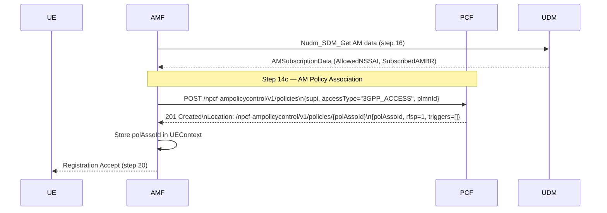

# AM Policy Association (TS 29.507 §4.2.2 — Npcf_AMPolicyControl)

## Purpose

At UE registration AMF creates an AM Policy Association with PCF (N15 interface,
`npcf-ampolicycontrol`). PCF returns the RFSP index (Radio Frequency Selection Priority),
service area restrictions, and UE-AMBR override if configured. The AMF stores the
`polAssoId` to release it at deregistration and to trigger updates when the UE moves.

This procedure is distinct from Npcf_UEPolicyControl (URSP delivery, TS 29.525):
- **npcf-ampolicycontrol** (TS 29.507) → AM policies: RFSP, service area, UE-AMBR
- **npcf-ue-policy-control** (TS 29.525) → UE policies: URSP rules

## Specifications

| Topic | Reference |
|---|---|
| Architecture | TS 23.501 §5.6.2 |
| Procedure flow | TS 23.502 §4.2.2.2.2 step 14c |
| Stage 3 | TS 29.507 §4.2.2 |
| Data model | TS 29.507 §6.1.1.2 (PolicyAssociationRequest / PolicyAssociation) |

## Sequence Diagram

## Information Elements

### PolicyAssociationRequest (AMF → PCF, POST body)

| IE | Type | M/O | Description |
|---|---|---|---|
| `supi` | string | M | UE's SUPI |
| `pei` | string | O | UE permanent equipment identifier |
| `accessType` | enum | M | `3GPP_ACCESS` or `NON_3GPP_ACCESS` |
| `plmnId` | object | O | PLMN id of serving network (`mcc`, `mnc`) |
| `notificationUri` | URI | O | Callback for policy update notifications |

### PolicyAssociation (PCF → AMF, response body)

| IE | Type | Description |
|---|---|---|
| `polAssoId` | string | Assigned association ID (ULID) |
| `rfsp` | integer | Radio Frequency Selection Priority (1-256); optional |
| `triggers` | array | Policy control request triggers; empty if none |
| `servAreaRes` | object | Service area restrictions; omitted if unrestricted |
| `ueAmbr` | object | UE-AMBR override; omitted if no override |

## Error Cases

| Condition | HTTP Status | Cause |
|---|---|---|
| Missing `supi` | 400 | `MANDATORY_IE_MISSING` |
| Missing `accessType` | 400 | `MANDATORY_IE_MISSING` |
| Unknown `polAssoId` in DELETE | 404 | `POLICY_ASSOCIATION_NOT_FOUND` |

## Implementation Notes

- Association stored in PCF's in-memory `amPolicies` map (keyed by `polAssoId`).
- `polAssoId` = ULID.
- Default response: `rfsp=1`, empty `triggers`, no `servAreaRes` (unrestricted).
- DELETE `/npcf-ampolicycontrol/v1/policies/{polAssoId}` returns 204.
- AMF calls this non-fatally in Phase3 (step 14c); failure does not block Registration Accept.
- AMF stores `AMPolicyAssocID` in UEContext and releases it on deregistration.
