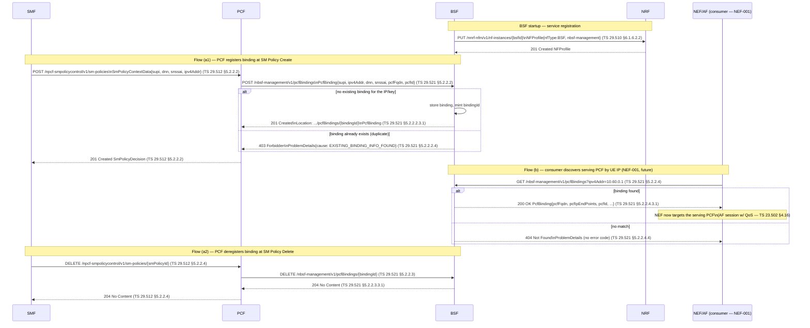

# Binding Support Function — Nbsf_Management (TS 23.501 §6.2.16 / TS 29.521 §5)

## Purpose

The **Binding Support Function (BSF)** is the 5GC registry of **PCF-for-a-PDU-session
bindings**. For every UE PDU session, exactly one PCF is the serving policy authority. When
a consumer outside the SM-policy path — typically the **NEF** (on behalf of an **AF**) — wants
to influence that session (e.g. set up an AF session with required QoS, TS 23.502 §4.16), it
only knows the **UE's IP address**, not which PCF is serving that UE. The BSF closes that gap:
the PCF **registers** a binding `(UE IP, DNN, S-NSSAI) → serving PCF` when it creates the SM
policy association, and a consumer **discovers** the serving PCF by querying the BSF with the
UE IP. The PCF **deregisters** the binding when the SM policy association is deleted.

Today there is **no binding registry** in the core: the PCF's SM policy association lives only
in PCF memory, and nothing maps a UE IP to a PCF. Without it, NEF/AF discovery of the serving
PCF (the prerequisite for NEF-001 — Network Exposure / AF session with QoS) is impossible. This
task adds the BSF NF and the **Nbsf_Management** service (Register / Deregister / Discovery),
plus the PCF client integration that drives the registry from the SM policy lifecycle.

> **Scope boundary.** This increment delivers: (1) the **BSF NF** (SBA server, NRF
> registration, in-memory + Postgres binding store); (2) **Nbsf_Management**
> Register / Deregister / Discovery; (3) **PCF client integration** — register on
> `SmPolicyControl_Create`, deregister on `SmPolicyControl_Delete`. The **NEF/AF
> consumption** of discovery (Nbsf_Management_Discovery from the NEF, AF session with QoS) is
> **NEF-001 and is out of scope here** — but the Discovery operation is built and tested so
> NEF-001 can consume it directly. The BSF is **SBA-only**: no N1/N2/N4 path is touched.

## Specifications

| Topic | Reference |
|---|---|
| BSF functional description | TS 23.501 §6.2.16 |
| Nbsf_Management service (Stage 3) | TS 29.521 §5 |
| Nbsf_Management — Register (create) | TS 29.521 §5.2.2.2 |
| Nbsf_Management — Deregister (delete) | TS 29.521 §5.2.2.3 |
| Nbsf_Management — Discovery (read) | TS 29.521 §5.2.2.4 |
| Data type `PcfBinding` | TS 29.521 §6.2.6 |
| AF session with required QoS (consumer, future NEF-001) | TS 23.502 §4.16 |
| SBA framework / ProblemDetails | TS 29.500 §5.2.7, TS 29.571 §5.2.7 |
| NRF registration (`NFType` BSF) | TS 29.510 §6.1.6.2.2 |

## Sequence Diagram

Both flows share the same registry. Flow (a) is driven by the PCF off the SM policy lifecycle;
flow (b) is the consumer-side discovery (built now, consumed by NEF-001 later).

## Resources & Operations

API root: `{apiRoot}/nbsf-management/v1`. All over HTTP/2 + mTLS (TS 29.500 §4.4.1).

| Op | Method | Route | Body → Response | Spec |
|---|---|---|---|---|
| Register | POST | `/nbsf-management/v1/pcfBindings` | `PcfBinding` → **201** + `Location: …/pcfBindings/{bindingId}` + `PcfBinding` | TS 29.521 §5.2.2.2 |
| Deregister | DELETE | `/nbsf-management/v1/pcfBindings/{bindingId}` | — → **204 No Content** | TS 29.521 §5.2.2.3 |
| Discovery | GET | `/nbsf-management/v1/pcfBindings?ipv4Addr=…` | — → **200** `PcfBinding` / **404** | TS 29.521 §5.2.2.4 |

### Discovery query parameters (TS 29.521 §5.2.2.4.3.1)

At least one binding-identifying parameter is required; combinations narrow the match.

| Query param | Type | Notes |
|---|---|---|
| `ipv4Addr` | string (IPv4) | Primary discovery key for IPv4 UEs (e.g. `10.60.0.1`) |
| `ipv6Prefix` | string (IPv6 prefix) | Discovery key for IPv6 UEs |
| `macAddr48` | string | For 5G-LAN / Ethernet PDU sessions |
| `dnn` | string | Narrows multi-session matches by Data Network Name |
| `snssai` | `Snssai` (`sst[,sd]`) | Narrows by slice |
| `supi` | string | Subscriber permanent identity |
| `gpsi` | string | Generic public subscription identifier (MSISDN) |
| `ipDomain` | string | Disambiguates overlapping IPv4 pools across DNNs/UPFs (TS 29.521 §6.2.6) |

> **Overlapping-IP note.** UE IPv4 pools are per-DNN and may overlap across DNNs
> (`internet` 10.60.0.0/24 vs other DNNs). When `ipv4Addr` alone is ambiguous, the consumer
> SHALL also supply `ipDomain` (and/or `dnn`/`snssai`) to resolve a single binding; otherwise
> the BSF returns the first/most-specific match. In the current single-`internet`-pool setup
> `ipv4Addr` alone is unambiguous.

## Information Elements — `PcfBinding` (TS 29.521 §6.2.6)

| IE | Type | M/C/O | Description / Spec |
|---|---|---|---|
| `supi` | string | O | SUPI of the UE the session belongs to |
| `gpsi` | string | O | GPSI (MSISDN) of the UE |
| `ipv4Addr` | string (IPv4) | C | UE IPv4 address. Present for IPv4/IPv4v6 sessions |
| `ipv6Prefix` | string (IPv6 prefix) | C | UE IPv6 prefix. Present for IPv6/IPv4v6 sessions |
| `addIpv6Prefixes` | array(IPv6 prefix) | O | Additional IPv6 prefixes (multi-homing) |
| `ipDomain` | string | O | IP address domain — disambiguates overlapping pools |
| `macAddr48` | string | C | UE MAC address for Ethernet/5G-LAN PDU sessions |
| `dnn` | string | **M** | Data Network Name of the PDU session |
| `snssai` | `Snssai` | **M** | S-NSSAI of the PDU session (`sst`, optional `sd`) |
| `pcfFqdn` | string (FQDN) | C | FQDN of the serving PCF (SBI discovery) |
| `pcfIpEndPoints` | array(`IpEndPoint`) | C | IP endpoint(s) of the serving PCF (IP + port + transport) |
| `pcfId` | string (NfInstanceId) | O | NF instance ID of the serving PCF (NRF correlation) |
| `pcfDiamHost` | string (Diameter identity) | O | PCF Diameter host (Rx/N5 legacy interop) |
| `pcfDiamRealm` | string (Diameter identity) | O | PCF Diameter realm (Rx/N5 legacy interop) |
| `recoveryTime` | string (date-time) | O | PCF recovery timestamp — stale-binding detection across PCF restart |
| `paraCom` | `ParameterCombination` | O | Parameter combination for the binding |
| `bindLevel` | `BindingLevel` enum | O | `NF_SET` \| `NF_INSTANCE` — granularity of the binding |
| `suppFeat` | string (SupportedFeatures) | O | Negotiated optional features (TS 29.521 §6.1.8) |

> **At least one of** `pcfFqdn` / `pcfIpEndPoints` MUST be present so the consumer can reach
> the serving PCF (TS 29.521 §6.2.6). This implementation always sets `pcfFqdn` and `pcfId`
> from the registering PCF's NF profile; `pcfIpEndPoints` is set when available.
>
> **Modelling subset.** The store persists the fields the Register/Discovery flow uses
> (`supi`, `gpsi`, `ipv4Addr`, `ipv6Prefix`, `ipDomain`, `dnn`, `snssai`, `pcfFqdn`,
> `pcfIpEndPoints`, `pcfId`, `recoveryTime`, `bindLevel`). The Diameter fields
> (`pcfDiamHost`/`pcfDiamRealm`) are accepted and stored but unused on the SBI-only path.

## Error / Cause Cases

| Operation | Condition | HTTP Status | Cause (ProblemDetails) | Spec |
|---|---|---|---|---|
| Register | Mandatory IE absent (`dnn`/`snssai` or no IP/MAC key) | **400** | `MANDATORY_IE_MISSING` | TS 29.521 §5.2.2.2.4, TS 29.500 §5.2.7.2 |
| Register | Malformed JSON body | **400** | `MANDATORY_IE_INCORRECT` | TS 29.500 §5.2.7.2 |
| Register | Binding already exists for the same key (duplicate) | **403** | `EXISTING_BINDING_INFO_FOUND` | TS 29.521 §5.2.2.2.4 |
| Deregister | Unknown `bindingId` | **404** | (no specific code; `ProblemDetails`) | TS 29.521 §5.2.2.3.4 |
| Discovery | No binding matches the query | **404** | (no specific code; `ProblemDetails`) | TS 29.521 §5.2.2.4.4 |
| Discovery | No query parameter supplied | **400** | `MANDATORY_IE_MISSING` | TS 29.521 §5.2.2.4.4 |
| Any | Store backend failure | **500** | `SYSTEM_FAILURE` | TS 29.500 §5.2.7.2 |

> **`403 EXISTING_BINDING_INFO_FOUND`.** Per TS 29.521 §5.2.2.2, when the BSF already holds a
> binding matching the registration's key (same UE IP within the same `ipDomain`/DNN), it
> rejects the new Register with `403` and `EXISTING_BINDING_INFO_FOUND`. The reject body MAY
> include the existing `PcfBinding`. The PCF treats this as a benign duplicate (the prior
> binding for the session was not cleaned up) — see Implementation Notes for the idempotent
> register behaviour.

## NF Interactions (SBI calls this procedure makes)

- **BSF → NRF**: `Nnrf_NFManagement_NFRegister`
  (`PUT /nnrf-nfm/v1/nf-instances/{bsfId}` — `NFProfile{nfType: BSF, nfServices:[nbsf-management]}`)
  at startup, plus periodic `NFHeartBeat` (PATCH). `NFTypeBSF` already exists in
  `nf/nrf/internal/registry/registry.go` (`NFType = "BSF"`), so no NRF enum change is needed.
- **PCF → BSF**: `Nbsf_Management_Register`
  (`POST /nbsf-management/v1/pcfBindings`) on `SmPolicyControl_Create` — PCF is the BSF client.
- **PCF → BSF**: `Nbsf_Management_DeRegister`
  (`DELETE /nbsf-management/v1/pcfBindings/{bindingId}`) on `SmPolicyControl_Delete`.
- **(future, NEF-001) NEF → BSF**: `Nbsf_Management_Discovery`
  (`GET /nbsf-management/v1/pcfBindings?ipv4Addr=…`) — out of scope here; the route exists and
  is tested so NEF-001 consumes it unchanged.
- **PCF discovers BSF** via NRF (`Nnrf_NFDiscovery`, `target-nf-type=BSF`) — no hardcoded BSF
  hostname (root CLAUDE.md anti-pattern). Fail-open when no BSF is registered (see notes).

## Implementation Notes

State machine / store
- New NF under `nf/bsf/` from `nf/_template/` (read its CLAUDE.md first). `cmd/bsf/main.go`:
  config → logger → server → NRF registration → signals → shutdown. Logic in `internal/`.
- `internal/server/server.go`: HTTP/2 + mTLS SBI server, three handlers
  (`handleRegisterBinding` POST, `handleDeregisterBinding` DELETE, `handleDiscoverBinding` GET).
- `internal/store`: `Store` interface (`Create`, `Delete`, `FindByQuery`) with `InMemory` and
  `Postgres` implementations (mirrors the UDR/AMF store pattern). `bindingId` = `uuid.NewString()`.
- Postgres: table `pcf_binding (binding_id PK, supi, gpsi, ipv4_addr, ipv6_prefix, ip_domain,
  dnn, snssai_sst, snssai_sd, pcf_fqdn, pcf_id, pcf_ip_end_points JSONB, recovery_time,
  bind_level, created_at)`. Index on `(ipv4_addr, ip_domain)` and `(supi, dnn)` for discovery.
  Migration `001_pcf_binding.sql`.
- Redis (optional cache, parity with other NFs): key `bsf:binding:ipv4:{ipv4Addr}` → bindingId
  for O(1) discovery; authoritative copy stays in Postgres.

PCF client integration (acceptance criterion 2)
- New `internal/server/bsf_client.go` (`BSFClient` interface + `HTTPBSFClient`). The PCF
  discovers the BSF via NRF; `s.bsfClient` is `nil` when no BSF is registered.
- `handleCreateSmPolicy` (`nf/pcf/internal/server/server.go:247`): after minting `smPolicyId`
  and resolving QoS, if `s.bsfClient != nil` and the context has a UE IP (`ipv4Addr` from the
  `SmPolicyContextData`), build a `PcfBinding{supi, ipv4Addr, dnn, snssai, pcfFqdn, pcfId}` and
  `POST /nbsf-management/v1/pcfBindings`. Store the returned `bindingId` alongside the policy in
  the `s.policies[smPolicyId]` map so deletion can address it. **Best-effort / non-fatal**: a
  BSF error (including `403 EXISTING_BINDING_INFO_FOUND`) is logged and does not fail the SM
  policy create — zero regression when the BSF is absent.
- `handleDeleteSmPolicy` (`server.go:398`): look up the stored `bindingId` for `smPolicyId`;
  if present and `s.bsfClient != nil`, `DELETE /nbsf-management/v1/pcfBindings/{bindingId}`.
  Best-effort; a `404` is logged and ignored (binding already gone).
- **Idempotent register**: on `403 EXISTING_BINDING_INFO_FOUND` the PCF logs at info and reuses
  the existing binding (does not retry) — covers a stale binding from a prior unclean release.

Logging (root CLAUDE.md format)
- BSF logs: `nf=BSF`, `procedure=BindingRegister|BindingDeregister|BindingDiscovery`,
  `interface=Nbsf`, `direction=IN`, `spec_ref="TS 29.521 §5.2.2.x"`, conditional `supi`,
  `binding_id`, `ipv4Addr`, `dnn`, `result` (`OK`/`REJECT`), `cause`.
- PCF client logs: `procedure=SmPolicyCreate|SmPolicyDelete`, `interface=Nbsf`, `direction=OUT`,
  `binding_id`, `spec_ref="TS 29.521 §5.2.2.2"` (register) / `§5.2.2.3` (deregister).

Validation approach (criterion: served + registered/removed + discovery returns serving PCF)
- **Unit tests** (in-process, no stack): `store` Create/Delete/FindByQuery incl. duplicate-key
  → `EXISTING_BINDING_INFO_FOUND`, discovery miss → 404, missing query param → 400; handler
  201+Location header on Register, 204 on Deregister, 200 `PcfBinding` / 404 on Discovery.
- **godog functional** (`nf/bsf/tests/features/binding-support.feature`, in-process server):
  Register-then-Discover-by-IP returns the same `pcfFqdn`/`pcfId`; Deregister-then-Discover
  → 404; duplicate Register → 403; PCF SmPolicyCreate-then-Delete drives Register/Deregister
  against a fake BSF (PCF-side test reusing `nf/pcf/internal/server`).
- **No live UERANSIM**: Nbsf is SBA-only (no N1/N2/N4 path), so there is nothing for a UE/gNB
  to exercise. The PCF→BSF leg is covered by the PCF functional test with a fake BSF; the
  full NRF-discovered live leg becomes meaningful with NEF-001.

[VERIFY: `403` cause string is `EXISTING_BINDING_INFO_FOUND` per TS 29.521 §5.2.2.2.4 —
confirm exact spelling against the Rel-17 `TS29521_Nbsf_Management.yaml` `enum` before coding.]
