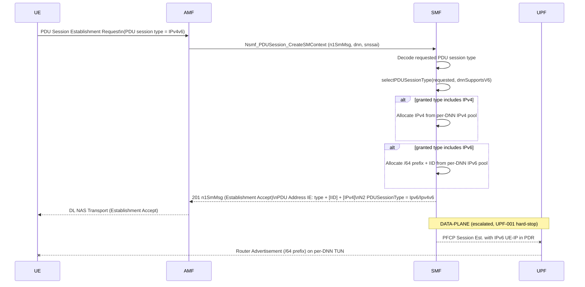

# IPv6 / IPv4v6 PDU Session Prefix Delegation (TS 23.501 §5.8.2 — SMF + UPF)

## Purpose

A PDU session may be of type **IPv4**, **IPv6**, **IPv4v6**, Ethernet or Unstructured.
Until now the SMF allocated only IPv4 and hardcoded the selected PDU session type to IPv4
in both the N1 (5GSM Establishment Accept) and N2 (`PDUSessionResourceSetupRequestTransfer`)
information. This procedure adds **IPv6 and IPv4v6** support:

- the SMF reads the **requested** PDU session type from the 5GSM Establishment Request;
- it selects the granted type from the requested type + the DNN's configured capability
  (TS 23.501 §5.8.2.2);
- for IPv6 / IPv4v6 it allocates a **/64 prefix** from a per-DNN IPv6 pool and an **interface
  identifier (IID)**;
- it returns the address material in the **PDU Address IE** (TS 24.501 §9.11.4.10) and sets
  the matching N2 `PDUSessionType` (TS 38.413 §9.3.1.51);
- the UE completes IPv6 address configuration via **stateless autoconfiguration**: the UPF
  advertises the /64 prefix in a **Router Advertisement** on the per-DNN N6 TUN.

> **Scope boundary (this change).** The control-plane half — requested-type parsing, /64 +
> IID allocation, the PDU Address IE encoding and the N2 `PDUSessionType` IE — is implemented
> in the SMF + `shared/nas`. The **data-plane half** — installing the UE IPv6 address in the
> UPF PFCP PDR and the **Router Advertisement** of the /64 on the TUN — sits on the **hard-stop
> PFCP session-management path / UPF data-plane** (AGENTS.md). It is **escalated** (see
> `dev/SESSION_LOG.md`, `requires_human: true`) and tracked alongside UPF-001. The IPv4 path is
> unchanged; IPv6 is gated behind an explicit per-DNN IPv6 prefix in config, so the default
> (UERANSIM IPv4) flow is byte-for-byte identical.

## Specifications

| Topic | Reference |
|---|---|
| IP address management / prefix delegation | TS 23.501 §5.8.2.2 |
| PDU session establishment flow | TS 23.502 §4.3.2.2.1 |
| PDU Address IE encoding | TS 24.501 §9.11.4.10 |
| PDU session type IE (5GSM) | TS 24.501 §9.11.4.11 |
| 5GSM cause #50 "PDU session type IPv4 only allowed" / #51 IPv6 only | TS 24.501 §9.11.4.2 |
| N2 PDUSessionType IE | TS 38.413 §9.3.1.51 |
| IPv6 stateless autoconfiguration (RA) | RFC 4862, TS 23.501 §5.8.2.2.2 |

## Sequence Diagram

## Information Elements

### Requested PDU session type (UE → SMF, in 5GSM Establishment Request)

Nibble TV IE, high nibble `0x9`, low nibble = type value (TS 24.501 §9.11.4.11):
`001` IPv4 · `010` IPv6 · `011` IPv4v6 · `100` Ethernet · `101` Unstructured.
Already decoded into `PDUSessionEstablishmentRequest.PDUSessionType` (previously ignored).

### Selected PDU session type (SMF → UE)

`selectPDUSessionType(requested, dnnSupportsV6)`:

| Requested | DNN has IPv6 prefix | Granted | Note |
|---|---|---|---|
| IPv4 (or absent) | any | IPv4 | default |
| IPv6 | yes | IPv6 | |
| IPv6 | no | IPv4 | downgrade (operator: could reject with cause #50) |
| IPv4v6 | yes | IPv4v6 | |
| IPv4v6 | no | IPv4 | downgrade (cause #50 path) |
| Ethernet / Unstructured | — | IPv4 | not supported by this slice → fall back |

### PDU Address IE (SMF → UE, TS 24.501 §9.11.4.10, IEI `0x29`)

Octet 3: bits 1-3 = PDU session type value; bits 4-8 spare (0).
**Address bytes carry only the interface identifier for IPv6 — never the /64 prefix**
(the prefix arrives via RA):

| Granted type | Octet 3 | Address bytes |
|---|---|---|
| IPv4 | `0x01` | IPv4 (4 octets) |
| IPv6 | `0x02` | IPv6 interface identifier (8 octets) |
| IPv4v6 | `0x03` | IPv6 IID (8 octets) **then** IPv4 (4 octets) |

### N2 PDUSessionType IE (SMF → gNB, TS 38.413 §9.3.1.51)

`PDUSessionResourceSetupRequestTransfer` IE 134 — set to `Ipv4` (0) / `Ipv6` (1) / `Ipv4v6` (2)
to match the granted type. (free5gc `ngapType.PDUSessionTypePresentIpv4/Ipv6/Ipv4v6`.)

## Error / edge cases

- **DNN has no IPv6 prefix configured** → silently downgrade to IPv4 (no IPv6 pool to draw
  from). The full operator behaviour (reject with 5GSM cause #50 "PDU session type IPv4 only
  allowed") is documented but the slice downgrades; the granted type is logged.
- **IPv6 pool exhausted** (no free /64 left) → `INSUFFICIENT_RESOURCES` (HTTP 500
  `SYSTEM_FAILURE` on the SBI), session not created, IPv4 (if any) released.
- **IPv6-only session, data plane not yet wired** → the NAS Establishment Accept is complete
  and spec-correct, but no user-plane forwarding/RA exists until the escalated UPF-001 work
  lands. Logged explicitly as `dataplane=pending-upf-001`.

## NF interactions

- **SMF (this change):** requested-type decode, `selectPDUSessionType`, IPv6 `/64` + IID
  allocation, PDU Address IE, N2 `PDUSessionType` IE, session-state fields.
- **shared/nas:** spec-correct PDU Address IE builder (IID for IPv6, IID+IPv4 for IPv4v6) and
  a QoS Establishment-Accept encoder variant that takes explicit address material.
- **UPF (escalated, UPF-001):** IPv6 UE-IP in the PFCP PDR + Router Advertisement of the /64
  on the per-DNN TUN.

## Validation approach

- **Unit (`shared/nas`):** PDU Address IE byte-exact encoding for IPv4 (no regression), IPv6
  (type `0x02` + 8-byte IID), IPv4v6 (type `0x03` + 8 + 4); `selectPDUSessionType` truth table.
- **Unit (SMF):** IPv6 `/64` pool allocation + release; establishment selects the granted type
  from the requested type and DNN capability; IPv4 default path unchanged.
- **Functional (godog):** Establishment Request IPv6/IPv4v6 → Accept carries the matching
  PDU session type and PDU Address IE; IPv4-only DNN downgrades a v6 request to IPv4.
- **E2E:** deferred — UERANSIM v3.2.8 + the UPF RA path are part of the escalated data-plane
  half; not run for the control-plane slice.
</content>
</invoke>
