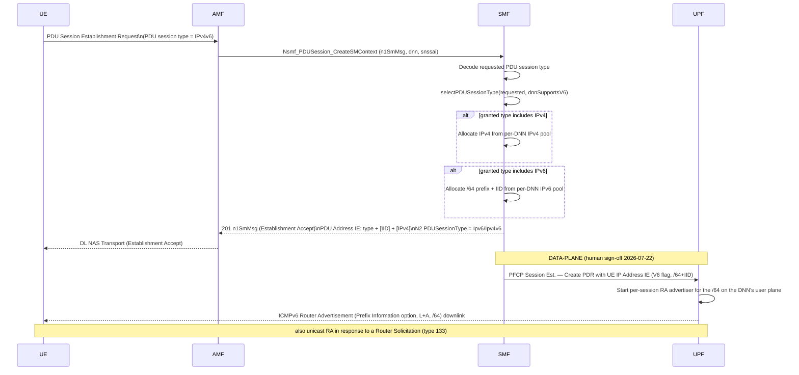

# IPv6 / IPv4v6 PDU Session Prefix Delegation (TS 23.501 §5.8.2 — SMF + UPF)

## Purpose

A PDU session may be of type **IPv4**, **IPv6**, **IPv4v6**, Ethernet or Unstructured.
Until now the SMF allocated only IPv4 and hardcoded the selected PDU session type to IPv4
in both the N1 (5GSM Establishment Accept) and N2 (`PDUSessionResourceSetupRequestTransfer`)
information. This procedure adds **IPv6 and IPv4v6** support:

- the SMF reads the **requested** PDU session type from the 5GSM Establishment Request;
- it selects the granted type from the requested type + the DNN's configured capability
  (TS 23.501 §5.8.2.2);
- for IPv6 / IPv4v6 it allocates a **/64 prefix** from a per-DNN IPv6 pool and an **interface
  identifier (IID)**;
- it returns the address material in the **PDU Address IE** (TS 24.501 §9.11.4.10) and sets
  the matching N2 `PDUSessionType` (TS 38.413 §9.3.1.51);
- the UE completes IPv6 address configuration via **stateless autoconfiguration**: the UPF
  advertises the /64 prefix in a **Router Advertisement** on the per-DNN N6 TUN.

> **Scope boundary.** The control-plane half — requested-type parsing, /64 + IID allocation, the
> PDU Address IE encoding and the N2 `PDUSessionType` IE — was implemented in Session 5 in the
> SMF + `shared/nas`. The **data-plane half** — installing the UE IPv6 address in the UPF PFCP
> PDR (UE IP Address IE, V6 flag) and the **Router Advertisement** of the /64 — was on the
> hard-stop PFCP session-management path / UPF data-plane; it is **now implemented under explicit
> human sign-off (2026-07-22)** (same PFCP-path exception precedent as UPF-001). See the
> "Data-plane design" section below. The IPv4 path is unchanged; IPv6 is gated behind an explicit
> per-DNN IPv6 prefix in config, so the default (UERANSIM IPv4) flow is byte-for-byte identical.

## Specifications

| Topic | Reference |
|---|---|
| IP address management / prefix delegation | TS 23.501 §5.8.2.2 |
| PDU session establishment flow | TS 23.502 §4.3.2.2.1 |
| PDU Address IE encoding | TS 24.501 §9.11.4.10 |
| PDU session type IE (5GSM) | TS 24.501 §9.11.4.11 |
| 5GSM cause #50 "PDU session type IPv4 only allowed" / #51 IPv6 only | TS 24.501 §9.11.4.2 |
| N2 PDUSessionType IE | TS 38.413 §9.3.1.51 |
| IPv6 stateless autoconfiguration (RA) | RFC 4862, TS 23.501 §5.8.2.2.2 |

## Sequence Diagram

```mermaid
sequenceDiagram
    participant UE
    participant AMF
    participant SMF
    participant UPF

    UE->>AMF: PDU Session Establishment Request\n(PDU session type = IPv4v6)
    AMF->>SMF: Nsmf_PDUSession_CreateSMContext (n1SmMsg, dnn, snssai)
    SMF->>SMF: Decode requested PDU session type
    SMF->>SMF: selectPDUSessionType(requested, dnnSupportsV6)
    alt granted type includes IPv4
        SMF->>SMF: Allocate IPv4 from per-DNN IPv4 pool
    end
    alt granted type includes IPv6
        SMF->>SMF: Allocate /64 prefix + IID from per-DNN IPv6 pool
    end
    SMF-->>AMF: 201 n1SmMsg (Establishment Accept)\nPDU Address IE: type + [IID] + [IPv4]\nN2 PDUSessionType = Ipv6/Ipv4v6
    AMF-->>UE: DL NAS Transport (Establishment Accept)

    Note over SMF,UPF: DATA-PLANE (human sign-off 2026-07-22)
    SMF->>UPF: PFCP Session Est. — Create PDR with UE IP Address IE (V6 flag, /64+IID)
    UPF->>UPF: Start per-session RA advertiser for the /64 on the DNN's user plane
    UPF-->>UE: ICMPv6 Router Advertisement (Prefix Information option, L+A, /64) downlink
    Note over UPF,UE: also unicast RA in response to a Router Solicitation (type 133)
```

## Data-plane design (SMF PFCP Create PDR + UPF Router Advertisement)

### 1. UE IP Address IE in the PFCP Create PDR (SMF → UPF, TS 29.244 §8.2.62)

The SMF's `sendPFCPSessionEstablishment` builds the Create PDR's PDI UE IP Address IE from the
granted PDU session type. The flags octet (TS 29.244 §8.2.62): bit 1 **V6**, bit 2 **V4**.

| Granted type | Flags | IPv4 field | IPv6 field |
|---|---|---|---|
| IPv4 | `0x02` (V4) | UE IPv4 | — |
| IPv6 | `0x01` (V6) | — | /64 network ∥ IID (full 128-bit UE address) |
| IPv4v6 | `0x03` (V4+V6) | UE IPv4 | /64 network ∥ IID |

The IPv6 address carried is the full 128-bit address = the delegated /64 prefix network address
with the SMF-assigned interface identifier (`::1`) — the same IID returned in the N1 PDU Address IE.
go-pfcp: `pfcpie.NewUEIPAddress(flags, v4String, v6String, 0, 0)`. IPv6-only sessions now also
trigger `sendPFCPSessionEstablishment` (previously gated off when the IPv4 pool address was nil).

### 2. UPF parse + per-session RA advertiser

The UPF's `handleSessionEstablishment` already reads `UEIPAddress().IPv4Address`; it additionally
reads `.IPv6Address` and stores it on the `Session` (`UEIPv6 net.IP`). The Network Instance IE
(DNN) already present in the PDI selects the per-DNN user-plane path.

When a session carries a V6 UE address, the UPF starts a **per-session Router Advertisement
advertiser** (RFC 4861 §6.2, TS 23.501 §5.8.2.2.2):

- Builds a spec-correct **ICMPv6 Router Advertisement** (type 134, code 0) with:
  - Cur Hop Limit, M=0/O=0 (SLAAC), Router Lifetime, Reachable/Retrans = 0.
  - a **Prefix Information option** (type 3, length 4): prefix length 64, **L (on-link)=1**,
    **A (autonomous)=1**, Valid/Preferred Lifetime, the delegated /64 (RFC 4861 §4.6.2).
  - a **Source Link-Layer Address** option is omitted (point-to-point PDU session link).
- IPv6 header: source = the UPF link-local router address (`fe80::1`), destination = all-nodes
  multicast `ff02::1` for periodic RAs (unicast to the UE's link-local/solicited address for a
  solicited RA), Hop Limit 255, Next Header 58 (ICMPv6), ICMPv6 checksum over the pseudo-header.
- **Direction (3GPP-correct):** the RA is sent **downlink toward the UE** over the user plane
  (GTP-U encapsulation to the gNB) once the DL tunnel (DL TEID + gNB IP) is learned at PFCP
  Session Modification — per TS 23.501 §5.8.2.2.2 the RA recipient is the UE, not the N6 DN. The
  advertiser emits periodically (bounded `MaxRtrAdvInterval`, RFC 4861 §6.2.1) and unicast on
  demand when a **Router Solicitation** (ICMPv6 type 133) is decapsulated from the uplink. This
  refines the Session-5 acceptance-criterion wording "on the per-DNN TUN": the prefix is
  associated with the DNN's user plane, but the RA is delivered to the UE (spec-faithful), so it
  is not written to the N6 TUN (which faces the DN). A live IPv6-capable UE now exists —
  `tools/ueransim/patches/0060-ipv6-pdu-session.patch` removes UERANSIM's artificial IPv4-only
  guards — so the RA frame formation is validated both by unit tests + an offline capture, and
  live (UE kernel SLAAC using the advertised prefix, `docs/CLAUDIA_5GC_MANUAL.md` §3.22).

### 3. RA framing codec

A new UPF package `nf/upf/internal/ra/` (or equivalent) provides the RFC 4861 ICMPv6 RA +
Prefix Information option builder with the ICMPv6 pseudo-header checksum, plus a Router
Solicitation parser (type 133). Byte-exact unit tests cover the RA header, the Prefix Information
option (L+A flags, /64, lifetimes) and the checksum.

## Information Elements

### Requested PDU session type (UE → SMF, in 5GSM Establishment Request)

Nibble TV IE, high nibble `0x9`, low nibble = type value (TS 24.501 §9.11.4.11):
`001` IPv4 · `010` IPv6 · `011` IPv4v6 · `100` Ethernet · `101` Unstructured.
Already decoded into `PDUSessionEstablishmentRequest.PDUSessionType` (previously ignored).

### Selected PDU session type (SMF → UE)

`selectPDUSessionType(requested, dnnSupportsV6)`:

| Requested | DNN has IPv6 prefix | Granted | Note |
|---|---|---|---|
| IPv4 (or absent) | any | IPv4 | default |
| IPv6 | yes | IPv6 | |
| IPv6 | no | IPv4 | downgrade (operator: could reject with cause #50) |
| IPv4v6 | yes | IPv4v6 | |
| IPv4v6 | no | IPv4 | downgrade (cause #50 path) |
| Ethernet / Unstructured | — | IPv4 | not supported by this slice → fall back |

### PDU Address IE (SMF → UE, TS 24.501 §9.11.4.10, IEI `0x29`)

Octet 3: bits 1-3 = PDU session type value; bits 4-8 spare (0).
**Address bytes carry only the interface identifier for IPv6 — never the /64 prefix**
(the prefix arrives via RA):

| Granted type | Octet 3 | Address bytes |
|---|---|---|
| IPv4 | `0x01` | IPv4 (4 octets) |
| IPv6 | `0x02` | IPv6 interface identifier (8 octets) |
| IPv4v6 | `0x03` | IPv6 IID (8 octets) **then** IPv4 (4 octets) |

### N2 PDUSessionType IE (SMF → gNB, TS 38.413 §9.3.1.51)

`PDUSessionResourceSetupRequestTransfer` IE 134 — set to `Ipv4` (0) / `Ipv6` (1) / `Ipv4v6` (2)
to match the granted type. (free5gc `ngapType.PDUSessionTypePresentIpv4/Ipv6/Ipv4v6`.)

## Error / edge cases

- **DNN has no IPv6 prefix configured** → silently downgrade to IPv4 (no IPv6 pool to draw
  from). The full operator behaviour (reject with 5GSM cause #50 "PDU session type IPv4 only
  allowed") is documented but the slice downgrades; the granted type is logged.
- **IPv6 pool exhausted** (no free /64 left) → `INSUFFICIENT_RESOURCES` (HTTP 500
  `SYSTEM_FAILURE` on the SBI), session not created, IPv4 (if any) released.
- **IPv6-only / IPv4v6 session, data plane (SMF-002, done)** → the SMF installs the UE IPv6
  address in the PFCP Create PDR (UE IP Address IE, V6 or V4+V6 flags) and the UPF starts a
  per-session Router Advertisement advertiser for the delegated `/64`. IPv6-only sessions now
  trigger `sendPFCPSessionEstablishment` (previously gated off when there was no IPv4 pool
  address). The RA emission is exercised by unit tests plus the live "no DL tunnel yet → skipped,
  once known → RA sent" round trip in `nf/upf/internal/pfcp/ipv6_ra_test.go`, and end-to-end on a
  patched UERANSIM UE (`tools/ueransim/patches/0060-ipv6-pdu-session.patch`) which performs real
  kernel SLAAC on receipt.

## NF interactions

- **SMF:** requested-type decode, `selectPDUSessionType`, IPv6 `/64` + IID allocation, PDU
  Address IE, N2 `PDUSessionType` IE, session-state fields (control plane), plus the
  granted-type-aware PFCP UE IP Address IE (`buildUEIPAddressIE`, data plane, SMF-002).
- **shared/nas:** spec-correct PDU Address IE builder (IID for IPv6, IID+IPv4 for IPv4v6) and
  a QoS Establishment-Accept encoder variant that takes explicit address material.
- **UPF (SMF-002, done):** parses the V6 UE IP Address IE + Network Instance (DNN) from the
  PDI, stores `Session.UEIPv6`/`Session.DNN`, and runs a per-session RFC 4861 Router
  Advertisement advertiser (`nf/upf/internal/ra`) delivered downlink over GTP-U (N3) — periodic
  (bounded `ra.MaxRtrAdvInterval`) once the DL tunnel is known, plus an immediate unicast RA
  when a Router Solicitation is decapsulated from the uplink.

## Validation approach

- **Unit (`shared/nas`):** PDU Address IE byte-exact encoding for IPv4 (no regression), IPv6
  (type `0x02` + 8-byte IID), IPv4v6 (type `0x03` + 8 + 4); `selectPDUSessionType` truth table.
- **Unit (SMF):** IPv6 `/64` pool allocation + release; establishment selects the granted type
  from the requested type and DNN capability; IPv4 default path unchanged;
  `buildUEIPAddressIE` byte-exact flags/fields for IPv4 (0x02, unchanged), IPv6-only (0x01),
  IPv4v6 (0x03) (`nf/smf/internal/server/ipv6_test.go`).
- **Unit (UPF):** RFC 4861 RA header/Prefix-Information-option/checksum byte-exact tests and
  Router Solicitation parsing (`nf/upf/internal/ra/ra_test.go`); PFCP parsing of the V6 UE IP
  Address IE + DNN, RA advertiser skip-until-DL-tunnel-known, immediate solicited RA, and
  advertiser shutdown on session deletion (`nf/upf/internal/pfcp/ipv6_ra_test.go`).
- **Functional (godog):** Establishment Request IPv6/IPv4v6 → Accept carries the matching
  PDU session type and PDU Address IE; IPv4-only DNN downgrades a v6 request to IPv4.
- **E2E:** deferred — UERANSIM v3.2.8 has no IPv6 support on N1/N2, so the full UE-side SLAAC
  flow cannot be exercised live; the UPF→gNB RA delivery path is validated by the unit/PFCP
  round-trip tests above.
</content>
</invoke>

## Conformance Notes — 2026-07-22 (SMF-002 data plane, SPEC-VERIFIER)

**Verdict**: CONFORMANT-WITH-NOTES (no BLOCKER)

Audited the uncommitted data-plane diff (SMF `buildUEIPAddressIE`/`ueIPv6Address` + establishment
gate; UPF `internal/ra`, PFCP V6 + Network Instance parse + RA advertiser, GTP-U `SendDownlink`/RS
hook) against TS 23.501 §5.8.2.2/§5.8.2.2.2, TS 29.244 §8.2.62, RFC 4861 §4.1/§4.2/§4.6.2/§6.2,
RFC 4443 §2.3, RFC 4862. Independently cross-checked the go-pfcp UE IP Address IE marshaller and
the ICMPv6 pseudo-header checksum (recompute over pseudo-header + message → 0).

### Findings
| # | Severity | Finding | TS / RFC Clause | Recommendation |
|---|----------|---------|-----------------|----------------|
| 1 | NOTE | UE IP Address IE flags correct: V6=bit1(0x01), V4=bit2(0x02), IPv4v6=0x03; go-pfcp encodes the V4 field before the V6 field and includes each only when its flag is set — matches the spec octet order. Full 128-bit V6 address (/64 network ∥ IID ::1) carried. | TS 29.244 §8.2.62 | None — conformant. |
| 2 | NOTE | IPv4-only path unchanged: flags 0x02, IPv4 field only, empty V6 — byte-for-byte identical to pre-IPv6 encoding. No regression. | TS 29.244 §8.2.62 | None. |
| 3 | NOTE | RA header conformant: type 134, code 0, M=0/O=0 (SLAAC-only), Cur Hop Limit 64, Router Lifetime 1800s, Reachable/Retrans 0; IPv6 Hop Limit 255. | RFC 4861 §4.2; TS 23.501 §5.8.2.2.2 | None. |
| 4 | NOTE | Prefix Information option conformant: type 3, length 4 (32 bytes), Prefix Length 64, L+A flags byte 0xC0, Reserved1/Reserved2 zero, 16-byte /64 prefix. | RFC 4861 §4.6.2 | None. |
| 5 | NOTE | ICMPv6 checksum computed over IPv6 pseudo-header (src, dst, upper-layer length, next header 58 zero-padded) + message with checksum field zeroed; independently verified (recompute → 0). | RFC 4443 §2.3; RFC 8200 §8.1 | None. |
| 6 | NOTE | Router Solicitation parse conformant: IPv6 version + next-header 58 + ICMPv6 type 133 detection, source address extracted from IPv6 header bytes 8–23. | RFC 4861 §4.1 | None. |
| 7 | NOTE | RA delivered **downlink over N3 GTP-U to the UE** (not written to the N6 TUN). Spec-faithful: the RA recipient is the UE, reached via the access network — writing to N6 would (wrongly) send it to the DN. | TS 23.501 §5.8.2.2.2 | None — this is the correct design decision. |
| 8 | MINOR | Solicited RA always unicasts to the RS source address; the RFC 4861 §6.2.6 unspecified-source case (RS from `::` → RA must be multicast to all-nodes, never unicast to `::`) is not special-cased. Low impact — delivery is via the session GTP-U tunnel regardless, but the inner IPv6 dst would be malformed for an unspecified-source RS. | RFC 4861 §6.2.6 | Fall back to all-nodes multicast (`ff02::1`) when the RS source is `::`. |
| 9 | RESOLVED (2026-07-23) | PDI UE IP Address is installed as a full `/128` (prefix ∥ ::1), not the `/64`, and IP6PL is unset — but this no longer matters because IPv6 N6 downlink forwarding (added 2026-07-23, manual §3.22b) matches the UE by **delegated /64 prefix**, not the exact `/128`. `SessionTable.GetByUEIPv6Prefix`/`byUEIPv6Net` key on `ueV6Prefix(UEIPv6)` (the /64), so any UE-formed SLAAC or RFC 4941 privacy IID within that /64 routes correctly. Validated live: pure-IPv6 + IPv4v6 sessions egress to `fd00:6::1` at 0% loss. | TS 29.244 §8.2.62 (IP6PL) | Done via UPF-side prefix matching; setting IP6PL in the PFCP IE remains an optional signalling nicety. |
| 10 | NOTE | Periodic RA uses a fixed 30 s ticker (= MaxRtrAdvInterval) with no randomization (RFC 4861 §6.2.1) and no accelerated initial burst (§6.2.4). Within legal bounds; mitigated by the immediate solicited RA on RS. Router Lifetime 1800 s ∈ [MaxRtrAdvInterval, 9000]. | RFC 4861 §6.2.1/§6.2.4 | Optional hardening — randomize the interval and send up to MAX_INITIAL_RTR_ADVERTISEMENTS at start. |
| 11 | NOTE | RA emission gated until the DL tunnel (DL TEID + gNB IP) is learned at PFCP Session Modification; first periodic RA skipped until then. Correct — no DL tunnel means no way to encapsulate downlink. | TS 23.501 §5.8.2.2.2 | None. |
| 12 | NOTE | Control-plane PDU Address IE (TS 24.501 §9.11.4.10) not touched by this diff; the Session-5 verification stands. | TS 24.501 §9.11.4.10 | None. |
