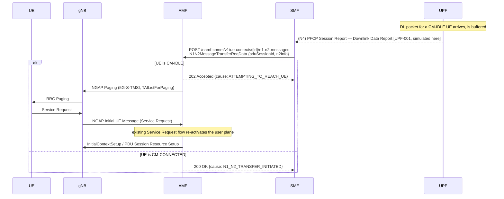

# Procedure: CN Paging + Network-Triggered Service Request

**Spec:** TS 23.501 §5.3.3 (Paging) · TS 23.502 §4.2.3.3 (Network Triggered Service Request) · TS 38.413 §8.5 / §9.2.8 (NGAP Paging)
**Status:** 🟢 Implemented (control-plane core)
**Primary NF:** AMF
**Other NFs involved:** SMF (N11 producer of the trigger), UPF (DL-data detection — see scope note), gNB, UE

## Context

When downlink data (or signalling) arrives for a UE that is **CM-IDLE**, the network must
page the UE so it returns to CM-CONNECTED and the user plane is re-activated. The flow:

1. The UPF buffers the DL packet and reports it to the SMF over **N4** (PFCP Session Report,
   Downlink Data Report).
2. The SMF asks the AMF to reach the UE via **Namf_Communication_N1N2MessageTransfer** (N11).
3. The AMF, seeing the UE is CM-IDLE, sends **NGAP Paging** to every gNB covering the UE's
   registration area (the TAI list).
4. The UE receives paging and performs a **Service Request**; the AMF re-activates the user
   plane (existing Service Request flow). Buffered DL data then flows.

### Scope note — UPF DL-data detection

Step 1 (the UPF buffering DL data and emitting a PFCP Session Report) lives on the **PFCP
session-management path**, which is a hard-stop area in this repo (tracked separately as
**UPF-001**, PFCP Usage/Session Reporting). This task implements the **control-plane core**:
the SMF-side trigger is exposed as an internal management endpoint that *simulates* the UPF
Downlink Data Notification, then drives the real N1N2MessageTransfer → Paging → reactivation
chain. The genuine N4 PFCP DDN is the remaining piece (UPF-001).

## Sequence

## IEs (key)

### NGAP Paging (TS 38.413 §9.2.8) — non-UE-associated, ProcedureCode = 24 (id-Paging)

| IE | M/O | Notes |
|---|---|---|
| UE Paging Identity | M | `5G-S-TMSI` = AMFSetID(10b) + AMFPointer(6b) + 5G-TMSI(32b). Ref: TS 23.003 §2.10 |
| Paging DRX | O | UE-specific DRX |
| TAI List for Paging | M | The TAIs of the UE's registration area; gNBs in these TAIs page the UE |

### N1N2MessageTransfer request — `N1N2MessageTransferReqData` (TS 29.518 §6.1.6.2.x)

| IE | M/O | Notes |
|---|---|---|
| `pduSessionId` | C | PDU session the DL data belongs to |
| `n1MessageContainer` | O | N1 (NAS) payload to deliver to the UE |
| `n2InfoContainer` | O | N2 (PDU session resource setup) info to re-activate the UP |
| `ppi` / `arp` | O | Paging policy / allocation-retention priority |

### N1N2MessageTransfer response — `N1N2MessageTransferRspData`

| `cause` | HTTP | Meaning |
|---|---|---|
| `N1_N2_TRANSFER_INITIATED` | 200 | UE reachable (CM-CONNECTED); message delivered/queued |
| `ATTEMPTING_TO_REACH_UE` | 202 | UE CM-IDLE; paging triggered |
| `UE_NOT_REACHABLE` (ProblemDetails) | 404 | No UE context for the identifier |

## Error scenarios to test

| Scenario | Expected |
|---|---|
| N1N2MessageTransfer for an unknown UE | 404 ProblemDetails `CONTEXT_NOT_FOUND` |
| Target UE is CM-IDLE | 202 `ATTEMPTING_TO_REACH_UE` + NGAP Paging emitted to the registration TAI list |
| Target UE is CM-CONNECTED | 200 `N1_N2_TRANSFER_INITIATED`, no paging |
| No gNB covers the UE's TAI | Paging is best-effort broadcast to connected gNBs; logged |

## Validation approach

- **Unit (in-process):** `BuildPaging` encodes to a valid NGAP PDU that round-trips through
  the free5gc/ngap decoder; the 5G-S-TMSI and TAIListForPaging IEs are present and correct.
- **Functional (in-process, no UERANSIM):** drive the AMF `n1-n2-messages` endpoint —
  CM-IDLE → 202 + paging callback invoked; CM-CONNECTED → 200; unknown → 404. SMF trigger
  unit-tested against a mock AMF.
- **E2E (UERANSIM):** `make ueransim`, idle the UE (`nr-cli … deregister`/AN release), POST
  the SMF DL-data trigger, observe NGAP Paging in the AMF log and the UE returning via
  Service Request. (Buffered-data forwarding depends on UPF-001.)
