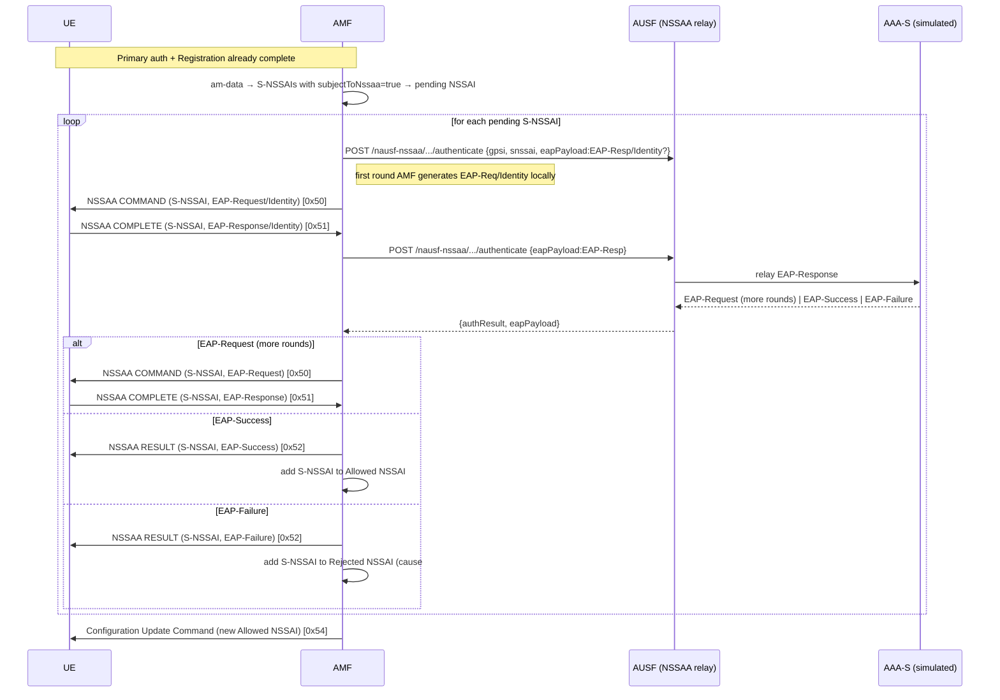

# Network Slice-Specific Authentication and Authorization (NSSAA)

**Spec:** TS 23.501 §5.15.10 · TS 23.502 §4.2.9 · TS 24.501 §5.4.7 / §8.2.31–§8.2.33 ·
TS 33.501 §16 · TS 29.509 (Nausf) · TS 29.526 (Nnssaaf, mapped onto AUSF here)

## Purpose

Some S-NSSAIs require a **slice-level** EAP authentication with an external **AAA Server
(AAA-S)** in addition to primary (5G-AKA / EAP-AKA') authentication. The subscription marks
such slices with `subjectToNetworkSliceSpecificAuthenticationAndAuthorization = true`. After
a successful Registration, the AMF runs NSSAA for every such S-NSSAI before it is placed in
the **Allowed NSSAI**. The AMF is an **EAP pass-through authenticator**: it relays opaque EAP
packets between the UE (over N1 NAS) and the AAA-S, gates the Allowed/Rejected NSSAI on the
EAP result, and handles AAA-initiated **re-authentication** and **revocation**.

In Rel-16+ the AMF reaches the AAA-S via the **NSSAAF** (Nnssaaf_NSSAA). This implementation
has no separate NSSAAF NF; per the backlog (AMF-005) the EAP relay is routed **through the
AUSF**, which fronts a simulated AAA-S. The N1 NAS encoding, the AMF state machine, and the
Allowed/Rejected-NSSAI gating are spec-correct and independent of that placement.

## Specifications

| Topic | Reference |
|---|---|
| NSSAA architecture & roaming | TS 23.501 §5.15.10 |
| NSSAA / re-auth / revocation procedures | TS 23.502 §4.2.9.2 / §4.2.9.3 / §4.2.9.4 |
| NAS NSSAA messages (Command/Complete/Result) | TS 24.501 §8.2.31, §8.2.32, §8.2.33 |
| NSSAA NAS procedure & abnormal cases | TS 24.501 §5.4.7 |
| EAP message IE | TS 24.501 §9.11.2.2 (LV-E) |
| S-NSSAI IE (5GMM) | TS 24.501 §9.11.2.8 (LV) |
| Rejected NSSAI / reject cause "failed NSSAA" | TS 24.501 §9.11.3.46 (cause #3) |
| Security aspects (EAP pass-through) | TS 33.501 §16 |
| EAP packet format | RFC 3748 §4 |

## NAS messages (TS 24.501 §8.2.31–§8.2.33)

All three carry exactly two mandatory IEs, **S-NSSAI first, then EAP message**, no IEIs:

| Message | Type | Direction | IEs |
|---|---|---|---|
| NETWORK SLICE-SPECIFIC AUTHENTICATION COMMAND  | `0x50` | AMF → UE | S-NSSAI (LV) · EAP message (LV-E) |
| NETWORK SLICE-SPECIFIC AUTHENTICATION COMPLETE | `0x51` | UE → AMF | S-NSSAI (LV) · EAP message (LV-E) |
| NETWORK SLICE-SPECIFIC AUTHENTICATION RESULT   | `0x52` | AMF → UE | S-NSSAI (LV) · EAP message (LV-E) |

- **S-NSSAI (§9.11.2.8, LV):** length octet + value. Value = `SST` (len 1) or `SST||SD` (len 4).
- **EAP message (§9.11.2.2, LV-E):** 2-octet length + EAP packet (RFC 3748: code, id, length, data).
- The COMMAND carries EAP-Request (first round: EAP-Request/Identity, code `0x01`).
- The COMPLETE carries the UE's EAP-Response (code `0x02`).
- The RESULT carries the terminal EAP-Success (`0x03`) or EAP-Failure (`0x04`).

These messages always travel **ciphered + integrity-protected** (SHT `0x02`) inside the NGAP
DownlinkNASTransport / UplinkNASTransport, since NSSAA runs after the NAS security context is
active (post-SMC). They are 5GMM messages — **not** wrapped in DL/UL NAS Transport (`0x68`/`0x67`).

## Sequence Diagram



## AMF state machine (per UE, per S-NSSAI)

```
PENDING        → COMMAND sent, awaiting COMPLETE
AWAITING_AAA   → COMPLETE received, EAP relayed to AUSF, awaiting result
SUCCESS        → EAP-Success → S-NSSAI ∈ Allowed NSSAI
FAILURE        → EAP-Failure → S-NSSAI ∈ Rejected NSSAI (cause #3)
```

The AMF holds an ordered queue of pending S-NSSAIs on the UE context. One NSSAA runs at a
time; the next COMMAND is emitted only after the previous slice reaches SUCCESS/FAILURE.

## AAA-initiated re-authentication & revocation (TS 23.502 §4.2.9.3 / §4.2.9.4)

- **Re-authentication:** the AAA-S asks to re-run NSSAA for an already-authorized S-NSSAI.
  Modelled as an AMF inbound trigger `POST /namf-nssaa/v1/ue-contexts/{supi}/reauth` (mgmt,
  simulates the Nnssaaf re-auth notification). The AMF restarts the NSSAA round for that slice.
- **Revocation:** the AAA-S revokes authorization. Trigger `.../revoke`. The AMF removes the
  S-NSSAI from the Allowed NSSAI, adds it to the Rejected NSSAI (cause #3), and:
  - if at least one allowed S-NSSAI remains → Configuration Update Command with the new
    Allowed NSSAI;
  - if no allowed S-NSSAI remains → network-initiated deregistration (cause #62
    "No network slices available") — out of scope here, logged + flagged.

## Error / abnormal cases (TS 24.501 §5.4.7.x)

| Case | Handling |
|---|---|
| UE has no S-NSSAI subject to NSSAA | NSSAA skipped; Allowed NSSAI from Registration unchanged |
| EAP-Failure from AAA-S | S-NSSAI → Rejected NSSAI, reject cause #3; RESULT carries EAP-Failure |
| AUSF/AAA unreachable | S-NSSAI treated as failed (Rejected, cause #3); logged `result=FAILURE` |
| NSSAA COMPLETE for an unknown/again-pending S-NSSAI | message ignored (logged Warn) |
| All S-NSSAIs rejected | flag for network-initiated deregistration cause #62 |
| Re-auth/revoke for a slice the UE never had | 404 from the trigger endpoint |

## NF interactions

| Step | Interface | From → To | Operation |
|---|---|---|---|
| EAP relay | Nausf (N12-like) | AMF → AUSF | `POST /nausf-nssaa/v1/{supi}/authenticate` |
| AAA relay | (internal) | AUSF → AAA-S (simulated) | EAP pass-through |
| NSSAA NAS | N1 | AMF ↔ UE | COMMAND / COMPLETE / RESULT |
| Config update | N1 | AMF → UE | Configuration Update Command (new Allowed NSSAI) |
| Re-auth/revoke | (mgmt) | AAA-S → AMF | `POST /namf-nssaa/v1/ue-contexts/{supi}/{reauth|revoke}` |

## Scope boundary (this increment)

**Delivered (control-plane core + tests):**
- `shared/nas`: byte-correct encode/decode for COMMAND/COMPLETE/RESULT (S-NSSAI LV + EAP LV-E).
- AMF: subscription `subjectToNssaa` flag plumbed UDR→UDM→AMF; per-UE NSSAA state machine;
  Allowed/Rejected NSSAI gating; re-auth/revocation triggers; Configuration Update on change.
- AUSF: `nausf-nssaa` EAP relay fronting a **simulated AAA-S** (Identity → Success/Failure,
  policy-driven), proving the EAP round-trip through AUSF.
- Unit tests (NAS byte-exact, state machine) + godog scenarios (happy path, failure, skip,
  revocation).

**Not in this increment (documented, like EAP-AKA'/URSP):**
- Live UERANSIM E2E — UERANSIM v3.2.8 has **no NSSAA peer** (cannot answer a COMMAND). The
  network-side state machine + NAS encoding are validated by unit + functional tests, not a
  live UE round-trip.
- A standalone NSSAAF NF and a real external AAA-S (EAP-TLS/EAP-TTLS) — the AAA-S is simulated
  behind AUSF.
- Network-initiated deregistration on "all slices rejected" is flagged/logged, not executed.
```
