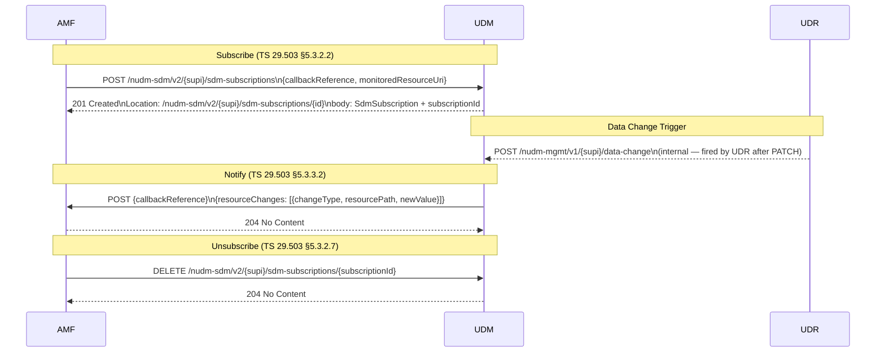

# Nudm_SDM Subscribe / Notify (TS 29.503 §5.3.2 / §5.3.3)

## Purpose

Allow NF consumers (AMF, SMF) to subscribe to UDM for notifications when subscription
data changes in the UDR. Prevents NFs from holding stale cached subscriber data across
AMBR/NSSAI updates applied by the operator (e.g., via management portal).

## Specifications

| Topic | Reference |
|---|---|
| Architecture | TS 23.501 §5.2.3.3 |
| Procedure | TS 23.502 §4.2.2.2.2 step 14d |
| Stage 3 | TS 29.503 §5.3.2 (Subscribe), §5.3.3 (Notify) |
| Data model | TS 29.503 §6.1.6.2.11 (SdmSubscription), §6.1.6.2.13 (ModificationNotification) |

## Sequence Diagram

## Information Elements

### SdmSubscription (request/response body for POST)

| IE | Type | M/O | Description |
|---|---|---|---|
| `nfInstanceId` | string (UUID) | O | Consumer NF instance UUID |
| `callbackReference` | URI | M | Callback URI for Nudm_SDM_Notify |
| `monitoredResourceUri` | URI | O | Specific resource to monitor |
| `implicitUnsubscribe` | bool | O | Auto-delete on deregistration |
| `subscriptionId` | string | O (in response) | Assigned by UDM |

### ModificationNotification (callback POST body)

| IE | Type | Description |
|---|---|---|
| `resourceChanges` | array of ChangeItem | Describes what changed |

### ChangeItem

| IE | Type | Description |
|---|---|---|
| `changeType` | enum (ADD/REMOVE/REPLACE) | Nature of change |
| `resourcePath` | string | JSON Pointer to changed field |
| `newValue` | any | New value after the change |
| `originalValue` | any | Previous value (optional) |

## Error Cases

| Condition | HTTP Status | Cause |
|---|---|---|
| Missing `callbackReference` | 400 | `MANDATORY_IE_MISSING` |
| Subscriber not found in UDR | 404 | `RESOURCE_URI_STRUCTURE_NOT_FOUND` |
| Invalid subscription ID in DELETE | 404 | `SUBSCRIPTION_NOT_FOUND` |

## Implementation Notes

- Subscriptions keyed per SUPI, stored in memory (sync.Map). Thread-safe.
- `subscriptionId` is a ULID.
- Notification is asynchronous (goroutine); does not block the trigger call.
- UDR fires the internal trigger via `POST /nudm-mgmt/v1/{supi}/data-change` after any
  PATCH to subscription data, making UDM the fan-out hub.
- Notification client uses the same mTLS config as other outbound SBI calls in production.

## Acceptance Criteria

1. `POST /nudm-sdm/v2/{supi}/sdm-subscriptions` returns 201 with Location + subscriptionId.
2. A data-change trigger via `POST /nudm-mgmt/v1/{supi}/data-change` fires a callback POST
   to all active subscribers for that SUPI within 2 s.
3. `DELETE /nudm-sdm/v2/{supi}/sdm-subscriptions/{id}` returns 204 and stops future notifications.
4. Missing `callbackReference` in POST returns 400 `MANDATORY_IE_MISSING`.
