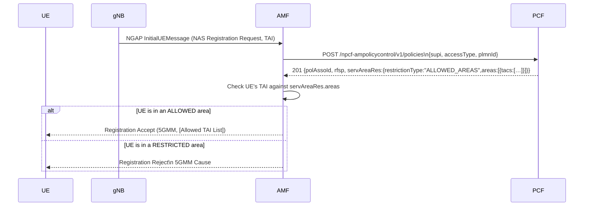

# Service Area Restriction (TS 23.501 §5.3.4 — AMF + PCF)

## Purpose

The AMF enforces Service Area Restriction (SAR) to prevent UEs from registering in, or
being handed over to, Tracking Areas that are not allowed by the PCF's AM policy. When a
UE attempts to register from a restricted TA, the AMF rejects the registration with 5GMM
cause #73 (Serving network not authorized). The allowed-TA list may be included in the
Registration Accept to help the UE avoid re-registering unnecessarily.

## Specifications

| Topic | Reference |
|---|---|
| Architecture | TS 23.501 §5.3.4 |
| Procedure flow | TS 23.502 §4.2.2.2.2 step 14c |
| Stage 3 AM policy data model | TS 29.507 §6.1.1.2.5 (ServiceAreaRestriction) |
| Registration Reject cause | TS 24.501 §6.1.3.2 cause #73 |
| Registration Accept Allowed NSSAI / TAI list | TS 24.501 §8.2.7 |

## Sequence Diagram

## Information Elements

### ServiceAreaRestriction (PCF → AMF, inside PolicyAssociation)

| IE | Type | Description |
|---|---|---|
| `restrictionType` | enum | `ALLOWED_AREAS` or `NOT_ALLOWED_AREAS` |
| `areas` | array | List of Area objects |
| `areas[*].tacs` | array\<string\> | TAC values in hex (e.g., `"000001"`) |
| `areas[*].areaCode` | integer | Optional area identifier |
| `maxNumOfTAs` | integer | Max number of TAs per area (optional) |

### 5GMM Cause for Reject (TS 24.501 §8.2.8.2 IEI 0x58)

| Cause | Value | Description |
|---|---|---|
| Serving network not authorized | 73 (0x49) | UE registering from a non-allowed TA |

## Error Cases

| Condition | AMF action |
|---|---|
| UE TAI not in allowed areas | Send Registration Reject, cause #73 |
| PCF returns servAreaRes with empty areas | Treat as unrestricted (no restriction enforced) |
| PCF unavailable (AM policy call failed) | No restriction enforced (non-fatal) |
| Handover to restricted TA | Reject HandoverRequest/PathSwitchRequest |

## Implementation Notes

- `ServiceAreaRestriction` is an optional field in the PCF `PolicyAssociation` response.
  When absent, no restriction is enforced.
- The current dev PCF returns no `servAreaRes` (unrestricted) — add it to per-subscriber
  configuration when needed (future UDR integration point).
- AMF checks the UE's TAI (from NGAP `UserLocationInformation`) against the PCF-returned
  `servAreaRes` before sending Registration Accept. The check happens after Phase3 PCF call.
- On rejection: AMF sends a NAS Registration Reject (cause #73) and does NOT assign a GUTI.
- The allowed-TA list in Registration Accept (IEI 0x45) is optional; if PCF provides
  `ALLOWED_AREAS`, AMF should include them so the UE avoids re-registering.
- Cause 0x49 = 73 decimal per TS 24.501 Table 9.11.3.2.1.1 (5GMM cause values).
