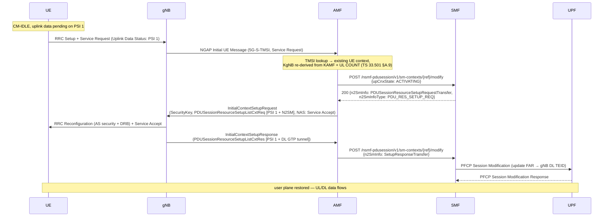

# Procedure: UE-Triggered Service Request with User-Plane Re-activation

**Spec:** TS 23.502 §4.2.3.2 (UE Triggered Service Request) · TS 24.501 §5.6.1 / §8.2.16 (Service Request / Accept) · TS 38.413 §8.3.1 (Initial Context Setup) · TS 29.502 §5.2.2.3.2 (Nsmf_PDUSession_UpdateSMContext)
**Status:** 🟢 Implemented (live-validated with UERANSIM)
**Primary NF:** AMF
**Other NFs involved:** SMF (N11 UP re-activation), UPF (via SMF PFCP FAR update), gNB, UE

## Context

A CM-IDLE UE with pending uplink data sends a **Service Request** to return to
CM-CONNECTED and re-activate the user plane of its established PDU sessions.
Two AMF-side pieces are required for the spec'd flow:

1. **Registration area (TAI list)** — the UE only initiates a Service Request if its
   current TAI is inside the registration area assigned at registration
   (TS 24.501 §5.6.1). The AMF therefore includes the **TAI list IE (IEI 0x54,
   TS 24.501 §9.11.3.9)** in every Registration Accept, built from
   `served_tacs` (nf/amf/config/dev.yaml) plus the UE's current TAC.
   Without it UERANSIM cancels the procedure:
   `Service Request canceled, current TAI is not in the TAI list`.

2. **N2SM info in InitialContextSetupRequest** (TS 23.502 §4.2.3.2 step 12) —
   for each PDU session flagged in the SR's **Uplink Data Status** IE, the AMF asks
   the SMF for the session's `PDUSessionResourceSetupRequestTransfer`
   (`Nsmf_PDUSession_UpdateSMContext`, `upCnxState=ACTIVATING`) and carries it in the
   **PDUSessionResourceSetupListCxtReq** IE (id=71) of the InitialContextSetupRequest.
   The gNB re-establishes the GTP-U resources and returns its DL tunnel info in the
   **PDUSessionResourceSetupListCxtRes** of the ICS Response, which the AMF forwards
   to the SMF (same UpdateSMContext path as normal establishment) → the SMF pushes a
   PFCP Session Modification (FAR update) to the UPF → DL forwarding resumes.
   Previously the AMF omitted the session list and relied on the UE re-establishing
   sessions itself — a functional workaround, not the spec'd procedure.

## Sequence

## Key IEs

| Message | IE | Ref | Notes |
|---|---|---|---|
| Registration Accept | 5GS tracking area identity list (0x54) | TS 24.501 §9.11.3.9 | type-00 partial list: one PLMN + non-consecutive TACs; `served_tacs` ∪ current TAC |
| Service Request | Uplink data status (0x40) | TS 24.501 §9.11.3.57 | bitmask of PSIs with pending UL data — only these are re-activated |
| Service Request | PDU session status (0x50) | TS 24.501 §9.11.3.44 | decoded, informational |
| InitialContextSetupRequest | PDUSessionResourceSetupListCxtReq (id=71) | TS 38.413 §9.2.2.1 | position 7, between GUAMI and AllowedNSSAI; per-item S-NSSAI + raw SMF transfer |
| InitialContextSetupResponse | PDUSessionResourceSetupListCxtRes (id=72) | TS 38.413 §9.2.2.2 | per-item `PDUSessionResourceSetupResponseTransfer` (gNB DL GTP tunnel) |
| InitialContextSetupResponse | FailedToSetupListCxtRes (id=55) | TS 38.413 §9.2.2.2 | logged per PSI, non-fatal |

## Error cases

| Case | Behaviour |
|---|---|
| TMSI unknown (AMF restart) | Service Reject cause 0x09 "UE identity cannot be derived" (TS 24.501 §5.6.1.5.2) |
| SMF ACTIVATING call fails for one PSI | session skipped with warning; ICS still sent (UE may re-establish that session itself) |
| Signalling-only SR (no Uplink Data Status) | no CxtReq list — ICS carries Service Accept only |
| gNB reports FailedToSetupListCxtRes | logged per PSI; no SMF notification for that session |
| Unknown smContextRef at SMF (ACTIVATING) | 404 CONTEXT_NOT_FOUND |

## UERANSIM interop notes

- Stock UERANSIM v3.2.8's gNB drops any initial NAS message without a Requested
  NSSAI ("AMF selection failed") — Service Request could never reach the AMF.
  Patch `tools/ueransim/patches/0051-gnb-amf-selection-no-nssai.patch` adds a
  fallback to any NG-Setup-connected AMF.
- UERANSIM's UE ignores the PDU session reactivation result IE in Service Accept
  (`// todo` in `receiveServiceAccept`), so the AMF sends an empty Service Accept;
  the UE learns the UP is active from the gNB-side resource setup.

## Validation

See `docs/validation-commands.md` §7 and the unit tests listed in
`nf/amf/tests/features/service_request_steps_test.go`.
