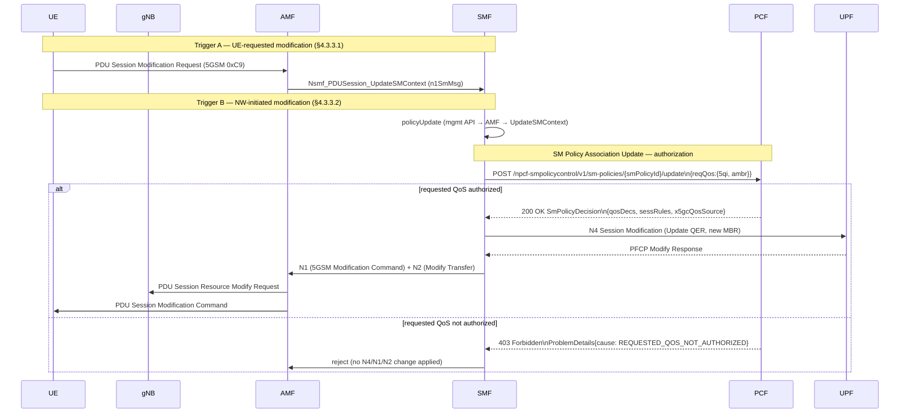

# SM Policy Association Update (TS 29.512 §5.2.2.3 — Npcf_SMPolicyControl_Update)

## Purpose

During a PDU Session Modification — UE-requested (TS 23.502 §4.3.3.1) or NW-initiated
(§4.3.3.2) — the SMF consults the PCF to **authorize** the requested QoS change before
applying it. The PCF, as the policy authority, either grants the change (returning an
updated `SmPolicyDecision`) or rejects it when the requested 5QI / Session-AMBR exceeds
the subscriber's authorized policy. This closes the gap where the SMF previously accepted
every modification as-is without policy control.

This is the **Update** operation of the existing SM Policy Association (created at session
establishment via `POST /npcf-smpolicycontrol/v1/sm-policies`, TS 29.512 §5.2.2.2). It does
not create or terminate the association.

> **Resource note.** TS 29.512 models the Update as a *custom operation* on the individual
> SM Policy resource: `POST {apiRoot}/npcf-smpolicycontrol/v1/sm-policies/{smPolicyId}/update`
> with a `SmPolicyUpdateContextData` body and a `SmPolicyDecision` response (§5.2.2.3.1).
> The backlog task (PCF-002) refers to this loosely as "PATCH … sm-policies/{id}"; the
> spec-correct operation is the custom `…/update` POST implemented here. No PATCH verb is
> defined for this resource in TS 29.512.

## Specifications

| Topic | Reference |
|---|---|
| Architecture | TS 23.503 §6.2.1.x (policy decisions), TS 23.501 §5.7 (QoS model) |
| Procedure flow (UE-requested) | TS 23.502 §4.3.3.1 |
| Procedure flow (NW-initiated) | TS 23.502 §4.3.3.2 |
| Stage 3 — Update operation | TS 29.512 §5.2.2.3 |
| Data model — request | TS 29.512 §5.6.2.5 (`SmPolicyUpdateContextData`) |
| Data model — response | TS 29.512 §5.6.2.6 (`SmPolicyDecision`) |
| 5QI characteristics | TS 23.501 Table 5.7.4-1 |

## Sequence Diagram

## Information Elements

### SmPolicyUpdateContextData (SMF → PCF, POST body)

| IE | Type | M/O | Description |
|---|---|---|---|
| `repPolicyCtrlReqTriggers` | array | O | Triggers that fired (e.g. `RES_MO_RE` — resources for modification requested). TS 29.512 §5.6.3.6 |
| `reqQos` | object | O | Requested QoS change reported by the SMF (additive convenience object): `{ "5qi": int, "ambr": { "uplink": str, "downlink": str } }` |
| `accuUsageReports` | array | O | Accumulated usage (not used here; URR is UPF-001) |

> `reqQos` is an additive, explicitly-named object carrying the requested 5QI / Session-AMBR.
> TS 29.512 conveys a UE-requested resource change via `repPolicyCtrlReqTriggers=[RES_MO_RE]`
> plus the QoS rule the UE asked for; this implementation reports the requested values
> directly in `reqQos` for clarity. Documented as a modelling simplification.

### SmPolicyDecision (PCF → SMF, 200 response body)

| IE | Type | Description |
|---|---|---|
| `sessRules` | map | Session rules incl. authorized `sessAmbr` (uplink/downlink) |
| `qosDecs` | map | QoS decisions incl. authorized `5qi` and `arp` |
| `x5gcQosSource` | string | Additive: which input drove the decision (`PCF_OVERRIDE` / `UDM_SUBSCRIPTION` / `OPERATOR_DEFAULT`) |

### ProblemDetails (PCF → SMF, 403 response body)

| IE | Type | Description |
|---|---|---|
| `status` | int | `403` |
| `cause` | string | `REQUESTED_QOS_NOT_AUTHORIZED` (additive cause; mechanism per TS 29.512 §4.2.4 — PCF is the policy authority) |
| `detail` | string | Human-readable reason (e.g. "5qi 1 not in authorized set") |

## Authorization Policy

The PCF authorizes an update against operator-configured limits (`config/dev.yaml`
`default_sm_policy:`):

| Config key | Meaning | Empty / 0 value |
|---|---|---|
| `authorized_5qi` | List of 5QI values permitted on an update | empty ⇒ any valid 5QI allowed |
| `max_session_ambr_mbps` | Ceiling for requested Session-AMBR (UL or DL) | 0 ⇒ no ceiling |

Decision:
1. If `reqQos.5qi` is set and `authorized_5qi` is non-empty and the value is **not** in the
   set ⇒ **reject** (`REQUESTED_QOS_NOT_AUTHORIZED`).
2. If `reqQos.ambr` uplink or downlink exceeds `max_session_ambr_mbps` (when > 0) ⇒ **reject**.
3. Otherwise **grant**: the response `qosDecs`/`sessRules` reflect the requested values
   (still subject to any per-subscriber override stored in the PCF, which wins).

## Error Cases

| Condition | HTTP Status | Cause |
|---|---|---|
| Unknown `smPolicyId` | 404 | `CONTEXT_NOT_FOUND` |
| Malformed body | 400 | `INVALID_BODY` |
| Requested 5QI not in authorized set | 403 | `REQUESTED_QOS_NOT_AUTHORIZED` |
| Requested Session-AMBR over ceiling | 403 | `REQUESTED_QOS_NOT_AUTHORIZED` |

## Implementation Notes

- PCF: `handleUpdateSmPolicy` on `POST /npcf-smpolicycontrol/v1/sm-policies/{smPolicyId}/update`.
  Looks up the stored policy by `smPolicyId` (in-memory `policies` map). Per-subscriber/DNN
  override precedence from `handleCreateSmPolicy` is reused so an override still wins.
- SMF: `updateSMPolicy(ctx, sess, reqQos)` mirrors `createSMPolicy` — POST to
  `…/sm-policies/{smPolicyId}/update`. **Fail-open** when `peers.pcf` is empty or the PCF is
  unreachable (returns `authorized=true` with the requested values), consistent with the
  establishment-time fallback (no regression when PCF absent).
- SMF consults PCF on **both** modification paths in `handleUpdateSMContext`:
  - NW-initiated (`policyUpdate`): rejects with `403 PROBLEM` and applies **no** change when
    the PCF denies; otherwise applies the granted QoS.
  - UE-requested (`n1SmMsg` 0xC9): reports the modification to the PCF and applies the
    granted decision (pass-through when no specific change is requested).
- UERANSIM v3.2.8 issues a bare 0xC9 with no QoS params; the UE-requested consult therefore
  exercises the report+grant path. NW-initiated rejection is covered by unit + functional tests.
