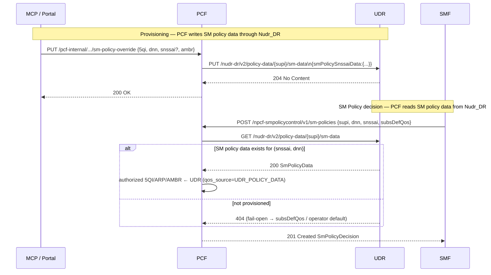

# UDR Policy Data Resource (TS 29.504 §5.2.13 / TS 29.519 — Nudr_DataRepository)

## Purpose

The UDR is the data repository for **policy data** (TS 29.519), retrieved and provisioned by
the PCF over the N36 reference point using Nudr_DataRepository (TS 29.504). Today the UDR
exposes only the **UE Policy Set** (URSP) resource; the **SM Policy Data** resource is missing,
so the PCF cannot source per-subscriber/per-DNN SM policy (authorized 5QI / ARP / Session-AMBR)
from the repository — its QoS overrides live only in PCF process memory and are lost on restart.

This task makes **SM Policy Data** a first-class Nudr_DR resource (GET/PUT/PATCH), adds **PATCH**
to the existing UE Policy Set resource for parity, and routes the **PCF** reads and writes of
SM policy data through Nudr_DR so the policy decision is repository-backed and survives a PCF
restart.

> **Resource-path note.** TS 29.519 nests policy data under `/policy-data/ues/{ueId}/sm-data`.
> The existing UDR follows a simplified house style that places the SUPI directly after
> `policy-data` (`/nudr-dr/v2/policy-data/{supi}/ue-policy-set`, already in use by the URSP
> resource). The SM Policy Data resource added here keeps that house style:
> `/nudr-dr/v2/policy-data/{supi}/sm-data`. The backlog (UDR-001) refers to it loosely as
> "sm-policy"; the spec resource name is **SmPolicyData**.

## Specifications

| Topic | Reference |
|---|---|
| Nudr_DataRepository (Stage 3) | TS 29.504 §5.2.13 (policy data) |
| Policy data model — `SmPolicyData` | TS 29.519 §5.6.2.4 |
| Policy data model — `SmPolicySnssaiData` | TS 29.519 §5.6.2.5 |
| Policy data model — `SmPolicyDnnData` | TS 29.519 §5.6.2.6 |
| UE Policy Set | TS 29.519 §5.7, TS 29.525 |
| PCF SM Policy decision | TS 29.512 §5.2.2.2, TS 23.503 §6.2.1 |

## Sequence Diagram

## Resources & Operations

| Method | Route | Body / Response | Spec |
|---|---|---|---|
| GET | `/nudr-dr/v2/policy-data/{supi}/sm-data` | → `SmPolicyData` (200) / 404 | TS 29.519 §5.6.2.4 |
| PUT | `/nudr-dr/v2/policy-data/{supi}/sm-data` | `SmPolicyData` → 204 | TS 29.504 §5.2.13 |
| PATCH | `/nudr-dr/v2/policy-data/{supi}/sm-data` | `SmPolicyData` (merge) → 204 | TS 29.504 §5.2.13 |
| GET | `/nudr-dr/v2/policy-data/{supi}/ue-policy-set` | → `PolicySubscription` (200) / 404 | existing |
| PUT | `/nudr-dr/v2/policy-data/{supi}/ue-policy-set` | `PolicySubscription` → 204 | existing |
| PATCH | `/nudr-dr/v2/policy-data/{supi}/ue-policy-set` | partial `PolicySubscription` → 204 | TS 29.504 §5.2.13 |
| DELETE | `/nudr-dr/v2/policy-data/{supi}/ue-policy-set` | → 204 | existing |

## Information Elements — `SmPolicyData` (TS 29.519 §5.6.2.4)

| IE | Type | M/O | Description |
|---|---|---|---|
| `smPolicySnssaiData` | map[snssaiKey → `SmPolicySnssaiData`] | M | Per-S-NSSAI policy data. Key = `"sst"` or `"sst-sd"` (e.g. `"1-000001"`) |

### `SmPolicySnssaiData` (§5.6.2.5)

| IE | Type | M/O | Description |
|---|---|---|---|
| `snssai` | `Snssai` | M | The S-NSSAI this entry applies to (`sst`, optional `sd`) |
| `smPolicyDnnData` | map[dnn → `SmPolicyDnnData`] | O | Per-DNN policy data |

### `SmPolicyDnnData` (§5.6.2.6 — pragmatic subset)

| IE | Type | M/O | Description |
|---|---|---|---|
| `dnn` | string | M | Data Network Name |
| `5qi` | int | O | Authorized default 5QI for the DNN |
| `arpPriorityLevel` | int | O | Authorized ARP priority level (1–15) |
| `ambrUplink` | string | O | Authorized Session-AMBR uplink (e.g. `"100 Mbps"`) |
| `ambrDownlink` | string | O | Authorized Session-AMBR downlink |

> **Modelling note.** TS 29.519 `SmPolicyDnnData` carries many fields (gbrUl/gbrDl, adcSupport,
> subscCats, online/offline charging, …). This implementation persists the subset the PCF uses
> to make the SM policy QoS decision (authorized 5QI / ARP / Session-AMBR per DNN). The resource
> shape (`smPolicySnssaiData` → `smPolicyDnnData`) follows the spec; unused fields are omitted.

## PCF integration (criterion 2 — "PCF reads/writes policy data through Nudr_DR")

- **Write** — `handleSetQoSOverride` (PCF internal mgmt API) write-throughs the override to UDR so a
  configured QoS policy is persisted in the repository (survives a PCF restart). The write is
  **read-modify-write**: the PCF reads the current `SmPolicyData`, replaces only its own bucket
  (`udrSmPolicyBucketKey="0"`) with the rebuilt overrides — or removes that bucket on
  `handleDeleteQoSOverride` — and writes the result back, so directly-provisioned per-S-NSSAI slices
  are preserved (the PCF does not own the whole document). Best-effort: a UDR read/write failure is
  logged, non-fatal (in-memory override still applied).
- **Read** — `handleCreateSmPolicy` queries `GetSmPolicyData(supi)` when no in-memory override
  matches, resolving the authorized QoS for the session's `(snssai, dnn)`. This is a new precedence
  tier reported as `x5gcQosSource = UDR_POLICY_DATA`, sitting **above** the UDM subscription default
  (`subsDefQos`) and operator config.

### QoS decision precedence (PCF `SmPolicyControl_Create`, highest first)

1. DNN-scoped in-memory override (`supi|dnn`)
2. Subscriber-wide in-memory override (`supi`)
3. **UDR SM Policy Data** (`(snssai, dnn)` from Nudr_DR) ← new
4. Subscribed default QoS from SMF (`subsDefQos` — UDM sm-data)
5. Operator config defaults

Because the write path keeps the in-memory override (tier 1/2) and also persists to UDR (tier 3),
the live decision is byte-identical to before for an active PCF; after a restart, tier 3 restores
the same decision from the repository. **Zero regression when UDR is absent**: the PCF read is
fail-open (a nil client, a 404, or any error falls through to `subsDefQos`/defaults).

## Error Cases

| Condition | HTTP Status | Cause |
|---|---|---|
| GET sm-data, none provisioned | 404 | `DATA_NOT_FOUND` |
| Malformed PUT/PATCH body | 400 | `MANDATORY_IE_INCORRECT` |
| Store backend failure | 500 | `SYSTEM_FAILURE` |
| PATCH ue-policy-set, subscriber has no policy | 404 | `DATA_NOT_FOUND` |

## Implementation Notes

- UDR: `SmPolicyData`/`SmPolicySnssaiData`/`SmPolicyDnnData` added to `shared/types` (re-exported by
  the UDR store, mirroring `PolicySubscription`). New store methods `GetSmPolicyData`,
  `PutSmPolicyData`, `PatchSmPolicyData` on the `Store` interface, implemented for both `InMemory`
  and `Postgres` (new `subscription_sm_policy` JSONB table, migration `004_sm_policy_data.sql`).
- PATCH merges at the `smPolicySnssaiData` map granularity (provided S-NSSAI entries replace the
  existing entry for that key; absent keys are preserved) — a 404 if no row exists yet.
- PCF: `UDRClient` gains `GetSmPolicyData` + `PutSmPolicyData`; `HTTPUDRClient` implements them
  against the new routes. The SM policy create read and the override write-through are both guarded
  by `s.udrClient != nil` and are non-fatal.
- Validation: in-process (UDR store + handlers, PCF read/write precedence). No N1/N2/N4 path is
  touched — the live PDU-session decision is unchanged for the default 5qi=9 session.
