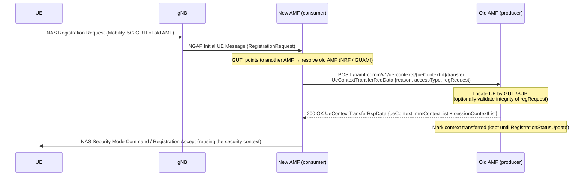

# Procedure: UE Context Transfer (Namf_Communication)

**Spec:** TS 23.502 §4.2.2.2.2 step 6 / §4.2.2.2.3 (Registration with AMF change) · TS 29.518 §5.3.2
**Status:** 🟢 Implemented (server side — old/source AMF)
**Primary NF:** AMF (old AMF — the Namf_Communication service producer)
**Other NFs involved:** AMF (new AMF — the consumer), gNB, UE

## Context

When a UE moves to a new AMF and identifies itself with a 5G-GUTI that was assigned by a
different (old) AMF, the new AMF retrieves the UE's MM context (including the NAS security
context) and the list of established PDU session contexts from the old AMF before
completing the (Mobility) Registration. This avoids re-authenticating the UE and re-running
the full registration from scratch.

This task implements the **producer (old AMF) side** of `Namf_Communication_UEContextTransfer`:
the inbound SBI server on `namf-comm` (port 8001) that answers the new AMF's request.

```
POST /namf-comm/v1/ue-contexts/{ueContextId}/transfer
```

`{ueContextId}` is the UE identifier supplied by the new AMF — the 5G-GUTI the UE presented
(`5g-guti-<…>`) or, where known, the SUPI (`imsi-<digits>`).

## Sequence



## IEs (key)

### Request — `UeContextTransferReqData` (TS 29.518 §6.1.6.2.2)

| IE | M/O | Notes |
|---|---|---|
| `reason` | M | `TransferReason`: `INIT_REG`, `MOBI_REG`, `MOBI_REG_UE_VALIDATED` |
| `accessType` | O | `AccessType`: `3GPP_ACCESS` (default) / `NON_3GPP_ACCESS` |
| `plmnId` | O | Serving PLMN of the new AMF |
| `regRequest` | O | `N1MessageContainer` — the NAS Registration Request, so the old AMF can verify the integrity (MAC) of the message and confirm the requester is serving the genuine UE |
| `supportedFeatures` | O | Negotiated optional features |

### Response — `UeContextTransferRspData` (TS 29.518 §6.1.6.2.3)

| IE | M/O | Notes |
|---|---|---|
| `ueContext` | M | `UeContext` — see below |
| `supportedFeatures` | O | |

`UeContext` (TS 29.571 §5.x / TS 29.518 §6.1.6.2.x), the fields populated here:

| Field | Notes |
|---|---|
| `supi` | UE permanent identity (when authenticated) |
| `mmContextList[]` | One `MmContext` per access. Carries `accessType`, `nasSecurityMode` (`integrityAlgorithm` NIAx + `cipheringAlgorithm` NEAx), `nasDownlinkCount`, `nasUplinkCount`, `ueSecurityCapability`, and (dev) the `kamf` key material |
| `sessionContextList[]` | One `PduSessionContext` per established PDU session: `pduSessionId`, `smContextRef`, `sNssai`, `dnn`, `accessType`, `smfInstanceId` |
| `pcfId` | Serving PCF, when an association exists |

## Error scenarios to test

| Scenario | HTTP | Cause (ProblemDetails) |
|---|---|---|
| UE context not found for the given GUTI/SUPI | 404 | `CONTEXT_NOT_FOUND` |
| `reason` IE missing | 400 | `MANDATORY_IE_MISSING` |
| Malformed JSON body | 400 | `MANDATORY_IE_MISSING` |
| Integrity check of `regRequest` fails (UE not validated) | 403 | `INTEGRITY_CHECK_FAIL` *(future — integrity replay is best-effort in this build)* |

## Post-transfer behaviour

- The old AMF marks the UE context as **transferred** (`UEContext.Transferred = true`) but
  **keeps** it. Per TS 23.502 §4.2.2.2.2 step 21, the context is only released when the new
  AMF confirms success via `Namf_Communication_RegistrationStatusUpdate` (not in scope here)
  or when the old AMF's own implicit-detach timers expire.

## Validation approach

- **Functional (in-process, no UERANSIM):** seed a UE context in a `context.Manager`, start
  the `internal/sbi` server, POST a transfer request, assert 200 + security context +
  session list, and assert the context is marked transferred. Error cases (404, 400) covered.
- **Conformance:** IE names / `TransferReason` enum / ProblemDetails causes checked against
  TS 29.518 §6.1.6 and TS 29.571 §5.2.7 (`CONTEXT_NOT_FOUND`, `MANDATORY_IE_MISSING`).
- **mTLS + HTTP/2:** server sets `TLSConfig` (with `NextProtos: ["h2"]`) before
  `http2.ConfigureServer` and requires + verifies client certs (TS 29.500 §4.4, TS 33.501 §13).
